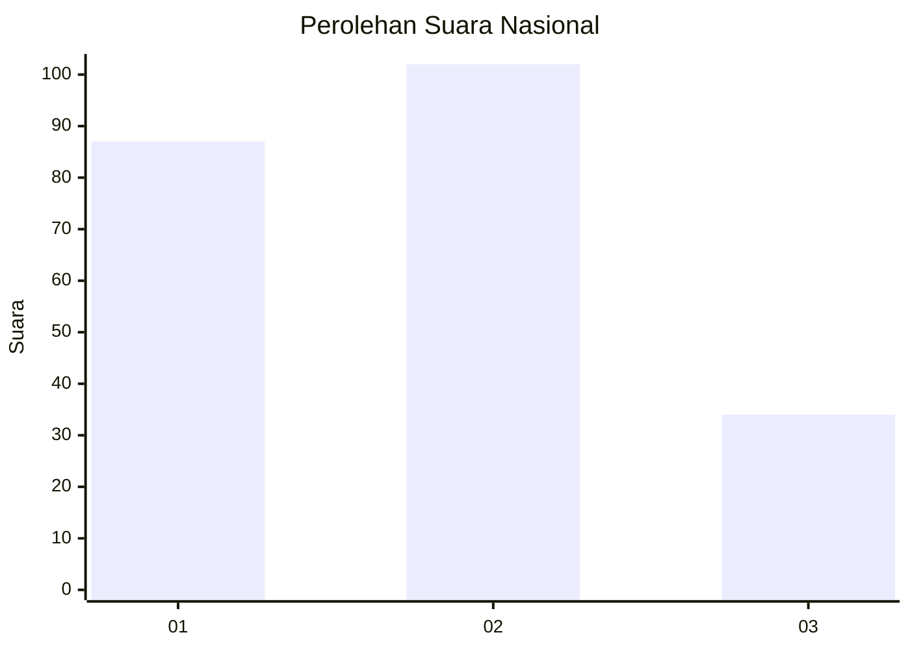
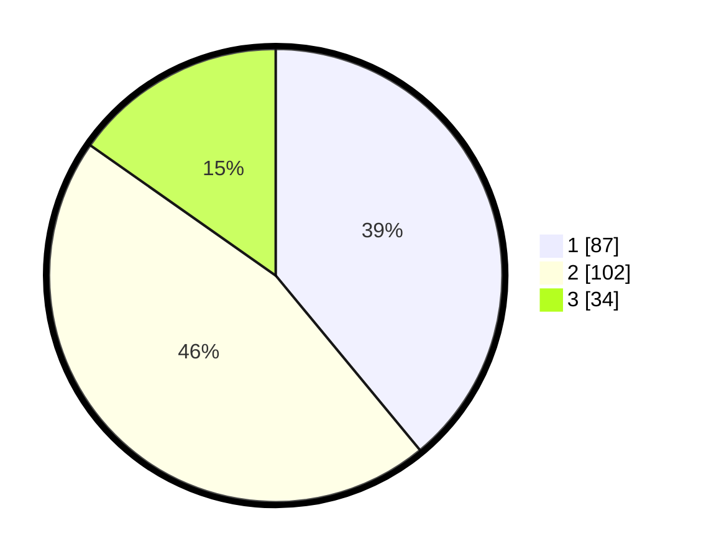

# Hasil

## Grafik

## Tabel

| No.    | Nama Paslon    | Suara | Suara (raw) | Persentase |
|:------ |:-------------- | -----:| -----------:| ----------:|
| 100025 | ANIES MUHAIMIN | 87    | [87][p-1]   | 39,01      |
| 100026 | PRABOWO GIBRAN | 102   | [102][p-2]  | 45,74      |
| 100027 | GANJAR MAHFUD  | 34    | [34][p-3]   | 15,25      |

[p-1]: https://github.com/gigit-pemilu/pemilu-2024/blob/main/pilpres/hitung-suara/sub/31-dki-jakarta/sub/73-jakarta-barat/sub/02-grogol-petamburan/sub/1006-jelambar-baru/sub/052-tps/sub/paslon-1.txt
[p-2]: https://github.com/gigit-pemilu/pemilu-2024/blob/main/pilpres/hitung-suara/sub/31-dki-jakarta/sub/73-jakarta-barat/sub/02-grogol-petamburan/sub/1006-jelambar-baru/sub/052-tps/sub/paslon-2.txt
[p-3]: https://github.com/gigit-pemilu/pemilu-2024/blob/main/pilpres/hitung-suara/sub/31-dki-jakarta/sub/73-jakarta-barat/sub/02-grogol-petamburan/sub/1006-jelambar-baru/sub/052-tps/sub/paslon-3.txt

## Foto C Plano

https://sirekap-obj-formc.kpu.go.id/c9e2/pemilu/ppwp/31/73/02/10/06/3173021006052-20240214-193640--3adebf25-0343-4f88-9318-eb7648234d2c.jpg

https://sirekap-obj-formc.kpu.go.id/c9e2/pemilu/ppwp/31/73/02/10/06/3173021006052-20240214-193703--0bdd82c8-7794-4ce1-803f-a62aaca300f8.jpg

https://sirekap-obj-formc.kpu.go.id/c9e2/pemilu/ppwp/31/73/02/10/06/3173021006052-20240214-193718--199c32cb-b37a-427f-a174-6373cf5886e2.jpg

## Metadata

| Key        | Value               |
| ---------- | ------------------- |
| Time Stamp | 2024-02-15 00:41:44 |

