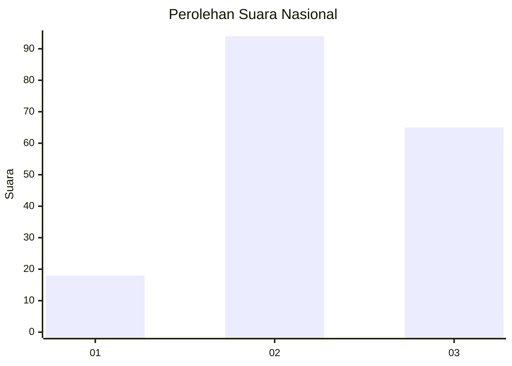
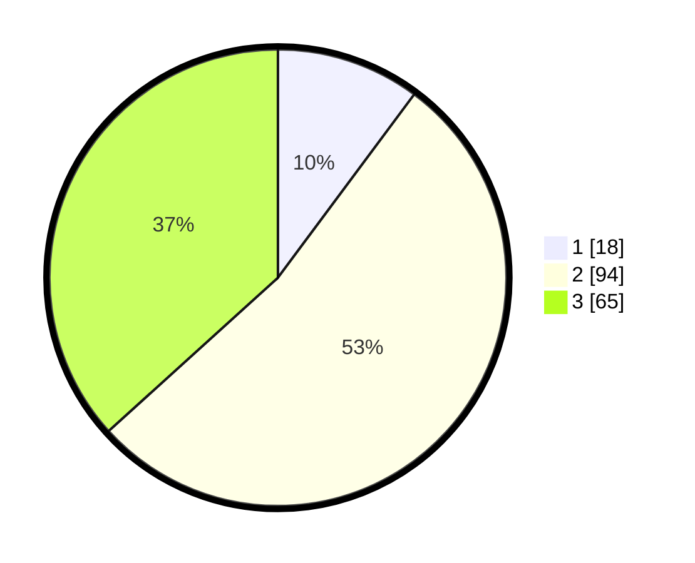

# Hasil

## Grafik

## Tabel

| No.    | Nama Paslon    | Suara | Suara (raw) | Persentase |
|:------ |:-------------- | -----:| -----------:| ----------:|
| 100025 | ANIES MUHAIMIN | 18    | [18][p-1]   | 10,17      |
| 100026 | PRABOWO GIBRAN | 94    | [94][p-2]   | 53,11      |
| 100027 | GANJAR MAHFUD  | 65    | [65][p-3]   | 36,72      |

[p-1]: https://github.com/gigit-pemilu/pemilu-2024/blob/main/pilpres/hitung-suara/sub/31-dki-jakarta/sub/73-jakarta-barat/sub/02-grogol-petamburan/sub/1006-jelambar-baru/sub/063-tps/sub/paslon-1.txt
[p-2]: https://github.com/gigit-pemilu/pemilu-2024/blob/main/pilpres/hitung-suara/sub/31-dki-jakarta/sub/73-jakarta-barat/sub/02-grogol-petamburan/sub/1006-jelambar-baru/sub/063-tps/sub/paslon-2.txt
[p-3]: https://github.com/gigit-pemilu/pemilu-2024/blob/main/pilpres/hitung-suara/sub/31-dki-jakarta/sub/73-jakarta-barat/sub/02-grogol-petamburan/sub/1006-jelambar-baru/sub/063-tps/sub/paslon-3.txt

## Foto C Plano

https://sirekap-obj-formc.kpu.go.id/3621/pemilu/ppwp/31/73/02/10/06/3173021006063-20240215-000053--a4d72320-b368-468a-b21e-02dd753a7c25.jpg

https://sirekap-obj-formc.kpu.go.id/3621/pemilu/ppwp/31/73/02/10/06/3173021006063-20240215-001057--aef9fc9f-5851-4b19-af74-129cec16daf2.jpg

https://sirekap-obj-formc.kpu.go.id/3621/pemilu/ppwp/31/73/02/10/06/3173021006063-20240215-000249--38d781c8-9c37-4c82-97e8-9bff67682186.jpg

## Metadata

| Key        | Value               |
| ---------- | ------------------- |
| Time Stamp | 2024-02-19 11:00:00 |

