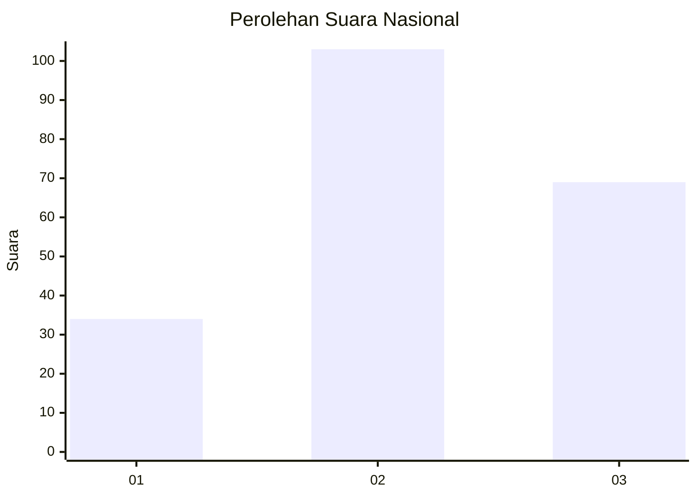
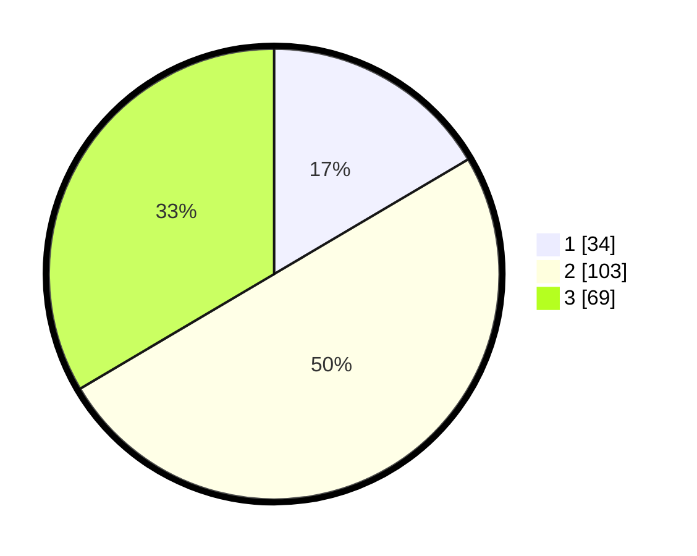

# Hasil

## Grafik

## Tabel

| No.    | Nama Paslon    | Suara | Suara (raw) | Persentase |
|:------ |:-------------- | -----:| -----------:| ----------:|
| 100025 | ANIES MUHAIMIN | 34    | [34][p-1]   | 16,50      |
| 100026 | PRABOWO GIBRAN | 103   | [103][p-2]  | 50,00      |
| 100027 | GANJAR MAHFUD  | 69    | [69][p-3]   | 33,50      |

[p-1]: https://github.com/gigit-pemilu/pemilu-2024/blob/main/pilpres/hitung-suara/sub/31-dki-jakarta/sub/73-jakarta-barat/sub/02-grogol-petamburan/sub/1006-jelambar-baru/sub/069-tps/sub/paslon-1.txt
[p-2]: https://github.com/gigit-pemilu/pemilu-2024/blob/main/pilpres/hitung-suara/sub/31-dki-jakarta/sub/73-jakarta-barat/sub/02-grogol-petamburan/sub/1006-jelambar-baru/sub/069-tps/sub/paslon-2.txt
[p-3]: https://github.com/gigit-pemilu/pemilu-2024/blob/main/pilpres/hitung-suara/sub/31-dki-jakarta/sub/73-jakarta-barat/sub/02-grogol-petamburan/sub/1006-jelambar-baru/sub/069-tps/sub/paslon-3.txt

## Foto C Plano

https://sirekap-obj-formc.kpu.go.id/8648/pemilu/ppwp/31/73/02/10/06/3173021006069-20240214-233714--6090fa1f-e524-4a6b-a6cc-96de90b47cf0.jpg

https://sirekap-obj-formc.kpu.go.id/8648/pemilu/ppwp/31/73/02/10/06/3173021006069-20240214-234314--e582630f-74df-4215-9341-a72e926cbd3b.jpg

https://sirekap-obj-formc.kpu.go.id/8648/pemilu/ppwp/31/73/02/10/06/3173021006069-20240214-234011--d08f5544-d956-44f0-ae9b-22f60d8aadbc.jpg

## Metadata

| Key        | Value               |
| ---------- | ------------------- |
| Time Stamp | 2024-02-16 02:00:27 |

