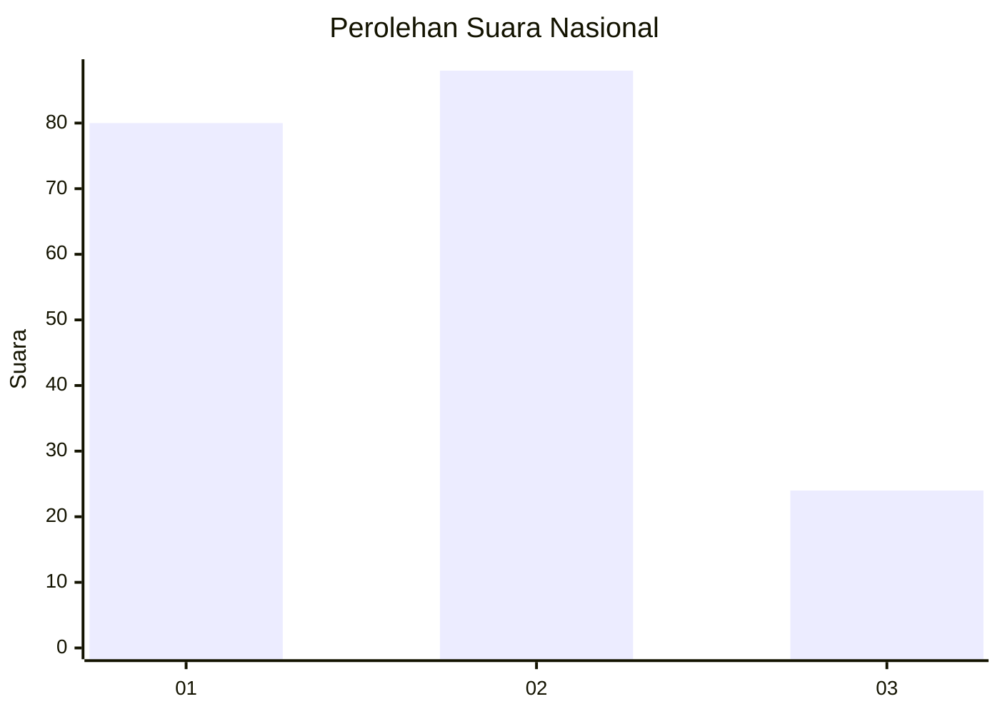
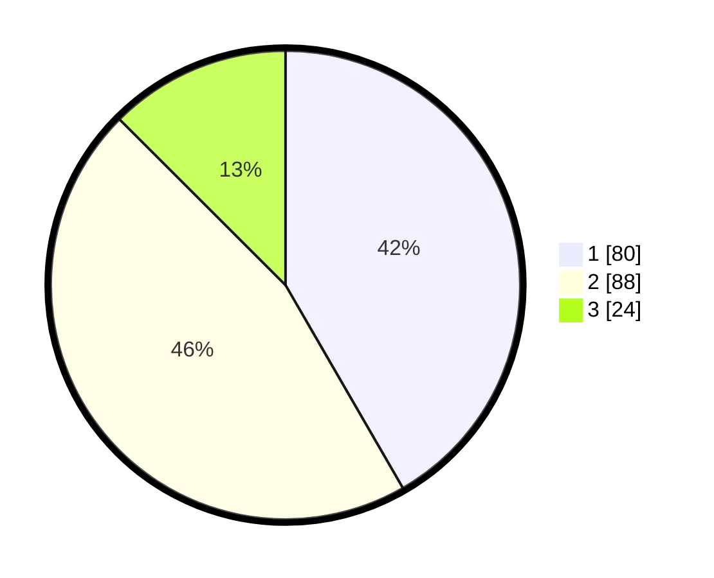

# Hasil

## Grafik

## Tabel

| No.    | Nama Paslon    | Suara | Suara (raw) | Persentase |
|:------ |:-------------- | -----:| -----------:| ----------:|
| 100025 | ANIES MUHAIMIN | 80    | [80][p-1]   | 41,67      |
| 100026 | PRABOWO GIBRAN | 88    | [88][p-2]   | 45,83      |
| 100027 | GANJAR MAHFUD  | 24    | [24][p-3]   | 12,50      |

[p-1]: https://github.com/gigit-pemilu/pemilu-2024/blob/main/pilpres/hitung-suara/sub/31-dki-jakarta/sub/73-jakarta-barat/sub/02-grogol-petamburan/sub/1006-jelambar-baru/sub/085-tps/sub/paslon-1.txt
[p-2]: https://github.com/gigit-pemilu/pemilu-2024/blob/main/pilpres/hitung-suara/sub/31-dki-jakarta/sub/73-jakarta-barat/sub/02-grogol-petamburan/sub/1006-jelambar-baru/sub/085-tps/sub/paslon-2.txt
[p-3]: https://github.com/gigit-pemilu/pemilu-2024/blob/main/pilpres/hitung-suara/sub/31-dki-jakarta/sub/73-jakarta-barat/sub/02-grogol-petamburan/sub/1006-jelambar-baru/sub/085-tps/sub/paslon-3.txt

## Foto C Plano

https://sirekap-obj-formc.kpu.go.id/64d3/pemilu/ppwp/31/73/02/10/06/3173021006085-20240214-214433--9317d073-a506-423c-85f3-3a526d1fccac.jpg

https://sirekap-obj-formc.kpu.go.id/64d3/pemilu/ppwp/31/73/02/10/06/3173021006085-20240214-213844--467dd900-a920-4a4d-b860-6eb4e9a2387e.jpg

https://sirekap-obj-formc.kpu.go.id/64d3/pemilu/ppwp/31/73/02/10/06/3173021006085-20240214-214540--d1a81a15-4560-4ba1-bc71-aabc0dde93be.jpg

## Metadata

| Key        | Value               |
| ---------- | ------------------- |
| Time Stamp | 2024-02-19 11:00:00 |

