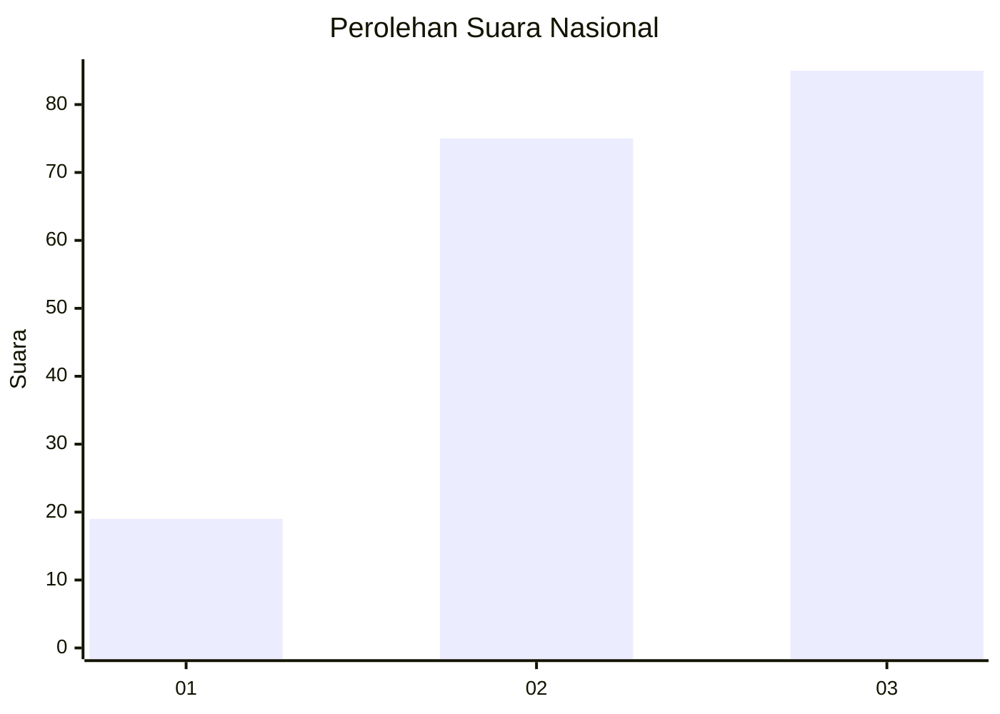
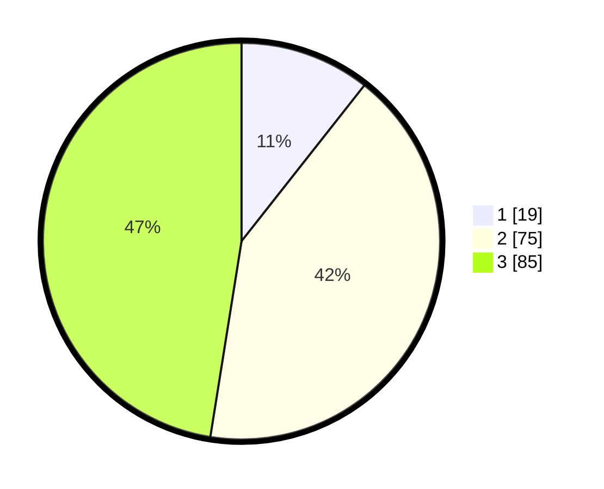

# Hasil

## Grafik

## Tabel

| No.    | Nama Paslon    | Suara | Suara (raw) | Persentase |
|:------ |:-------------- | -----:| -----------:| ----------:|
| 100025 | ANIES MUHAIMIN | 19    | [19][p-1]   | 10,61      |
| 100026 | PRABOWO GIBRAN | 75    | [75][p-2]   | 41,90      |
| 100027 | GANJAR MAHFUD  | 85    | [85][p-3]   | 47,49      |

[p-1]: https://github.com/gigit-pemilu/pemilu-2024/blob/main/pilpres/hitung-suara/sub/31-dki-jakarta/sub/73-jakarta-barat/sub/02-grogol-petamburan/sub/1006-jelambar-baru/sub/097-tps/sub/paslon-1.txt
[p-2]: https://github.com/gigit-pemilu/pemilu-2024/blob/main/pilpres/hitung-suara/sub/31-dki-jakarta/sub/73-jakarta-barat/sub/02-grogol-petamburan/sub/1006-jelambar-baru/sub/097-tps/sub/paslon-2.txt
[p-3]: https://github.com/gigit-pemilu/pemilu-2024/blob/main/pilpres/hitung-suara/sub/31-dki-jakarta/sub/73-jakarta-barat/sub/02-grogol-petamburan/sub/1006-jelambar-baru/sub/097-tps/sub/paslon-3.txt

## Foto C Plano

https://sirekap-obj-formc.kpu.go.id/0a7f/pemilu/ppwp/31/73/02/10/06/3173021006097-20240214-211956--a53be82f-184d-426b-92c7-37a27f3d3bb4.jpg

https://sirekap-obj-formc.kpu.go.id/0a7f/pemilu/ppwp/31/73/02/10/06/3173021006097-20240214-212815--d82e47e0-98eb-4c57-90e6-282fd174677e.jpg

https://sirekap-obj-formc.kpu.go.id/0a7f/pemilu/ppwp/31/73/02/10/06/3173021006097-20240214-213126--13656002-5566-4eef-b049-6ff603cef9f7.jpg

## Metadata

| Key        | Value               |
| ---------- | ------------------- |
| Time Stamp | 2024-02-19 11:00:00 |

