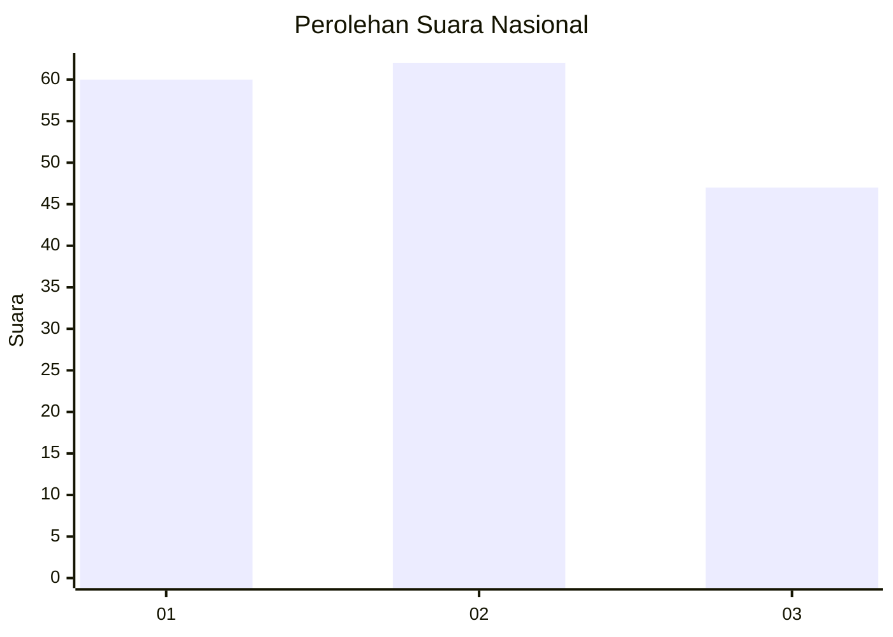
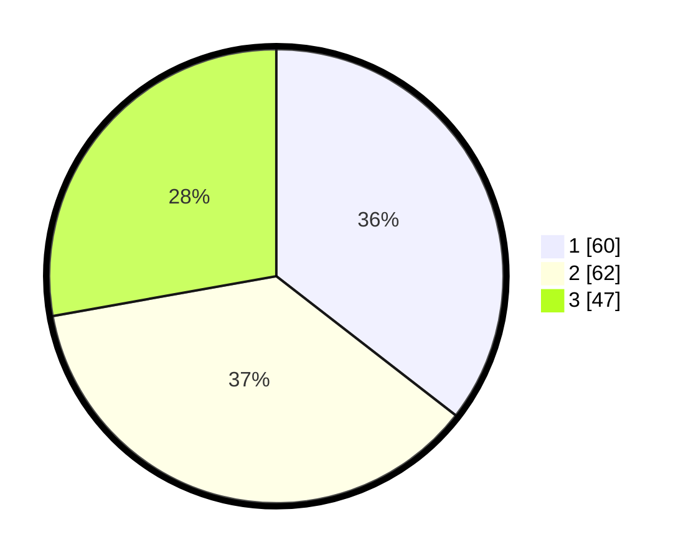

# Hasil

## Grafik

## Tabel

| No.    | Nama Paslon    | Suara | Suara (raw) | Persentase |
|:------ |:-------------- | -----:| -----------:| ----------:|
| 100025 | ANIES MUHAIMIN | 60    | [60][p-1]   | 35,50      |
| 100026 | PRABOWO GIBRAN | 62    | [62][p-2]   | 36,69      |
| 100027 | GANJAR MAHFUD  | 47    | [47][p-3]   | 27,81      |

[p-1]: https://github.com/gigit-pemilu/pemilu-2024/blob/main/pilpres/hitung-suara/sub/31-dki-jakarta/sub/73-jakarta-barat/sub/02-grogol-petamburan/sub/1006-jelambar-baru/sub/107-tps/sub/paslon-1.txt
[p-2]: https://github.com/gigit-pemilu/pemilu-2024/blob/main/pilpres/hitung-suara/sub/31-dki-jakarta/sub/73-jakarta-barat/sub/02-grogol-petamburan/sub/1006-jelambar-baru/sub/107-tps/sub/paslon-2.txt
[p-3]: https://github.com/gigit-pemilu/pemilu-2024/blob/main/pilpres/hitung-suara/sub/31-dki-jakarta/sub/73-jakarta-barat/sub/02-grogol-petamburan/sub/1006-jelambar-baru/sub/107-tps/sub/paslon-3.txt

## Foto C Plano

https://sirekap-obj-formc.kpu.go.id/e119/pemilu/ppwp/31/73/02/10/06/3173021006107-20240214-200648--3fa83059-8dde-4dc7-b5d5-9865e9dc2226.jpg

https://sirekap-obj-formc.kpu.go.id/e119/pemilu/ppwp/31/73/02/10/06/3173021006107-20240214-200631--37183409-9a42-4156-afb6-9a7f0d559e8d.jpg

https://sirekap-obj-formc.kpu.go.id/e119/pemilu/ppwp/31/73/02/10/06/3173021006107-20240214-211711--3c214665-13da-4a90-8cff-73e1d6f4e87f.jpg

## Metadata

| Key        | Value               |
| ---------- | ------------------- |
| Time Stamp | 2024-02-14 21:46:01 |

