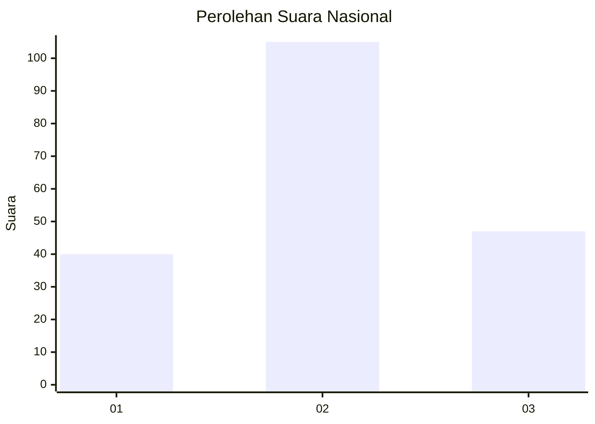
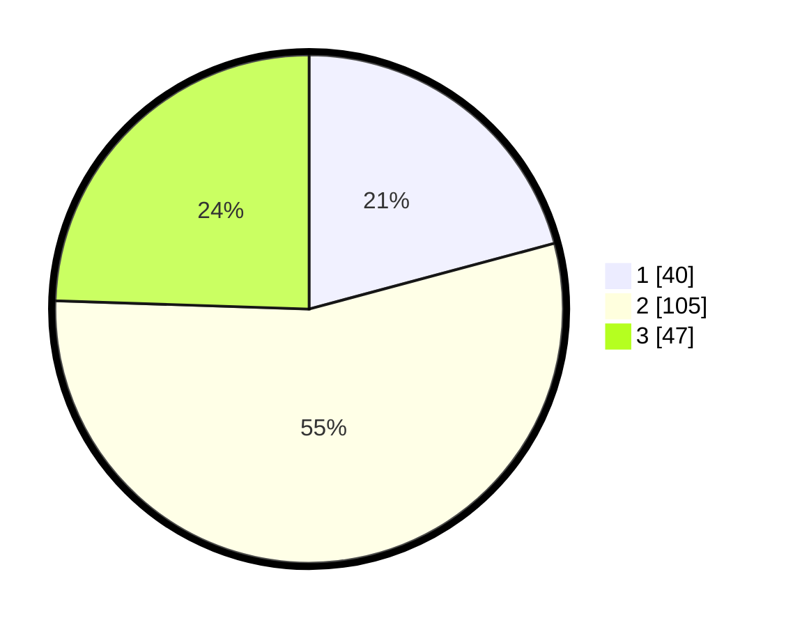

# Hasil

## Grafik

## Tabel

| No.    | Nama Paslon    | Suara | Suara (raw) | Persentase |
|:------ |:-------------- | -----:| -----------:| ----------:|
| 100025 | ANIES MUHAIMIN | 40    | [40][p-1]   | 20,83      |
| 100026 | PRABOWO GIBRAN | 105   | [105][p-2]  | 54,69      |
| 100027 | GANJAR MAHFUD  | 47    | [47][p-3]   | 24,48      |

[p-1]: https://github.com/gigit-pemilu/pemilu-2024/blob/main/pilpres/hitung-suara/sub/31-dki-jakarta/sub/73-jakarta-barat/sub/02-grogol-petamburan/sub/1006-jelambar-baru/sub/109-tps/sub/paslon-1.txt
[p-2]: https://github.com/gigit-pemilu/pemilu-2024/blob/main/pilpres/hitung-suara/sub/31-dki-jakarta/sub/73-jakarta-barat/sub/02-grogol-petamburan/sub/1006-jelambar-baru/sub/109-tps/sub/paslon-2.txt
[p-3]: https://github.com/gigit-pemilu/pemilu-2024/blob/main/pilpres/hitung-suara/sub/31-dki-jakarta/sub/73-jakarta-barat/sub/02-grogol-petamburan/sub/1006-jelambar-baru/sub/109-tps/sub/paslon-3.txt

## Foto C Plano

https://sirekap-obj-formc.kpu.go.id/5543/pemilu/ppwp/31/73/02/10/06/3173021006109-20240215-005833--0a1c8428-3b88-4dc6-8832-c52bb38912e5.jpg

https://sirekap-obj-formc.kpu.go.id/5543/pemilu/ppwp/31/73/02/10/06/3173021006109-20240215-005933--76a644d6-e51a-4f87-baef-c7736cd8831b.jpg

https://sirekap-obj-formc.kpu.go.id/5543/pemilu/ppwp/31/73/02/10/06/3173021006109-20240215-010029--8d0aa1bd-644c-4611-a3a5-bbc359afe338.jpg

## Metadata

| Key        | Value               |
| ---------- | ------------------- |
| Time Stamp | 2024-02-16 02:00:27 |

