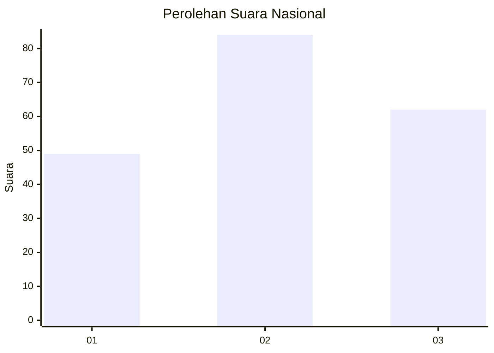
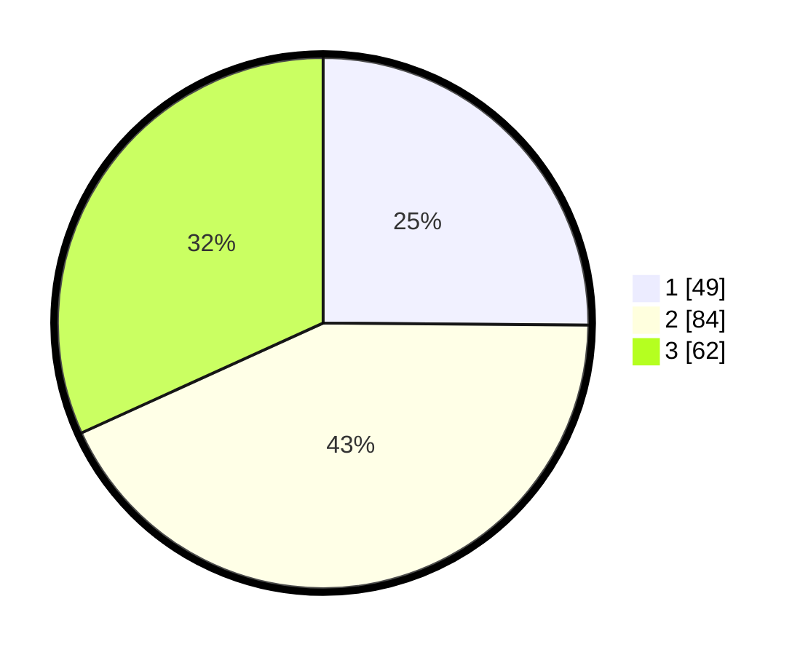

# Hasil

## Grafik

## Tabel

| No.    | Nama Paslon    | Suara | Suara (raw) | Persentase |
|:------ |:-------------- | -----:| -----------:| ----------:|
| 100025 | ANIES MUHAIMIN | 49    | [49][p-1]   | 25,13      |
| 100026 | PRABOWO GIBRAN | 84    | [84][p-2]   | 43,08      |
| 100027 | GANJAR MAHFUD  | 62    | [62][p-3]   | 31,79      |

[p-1]: https://github.com/gigit-pemilu/pemilu-2024/blob/main/pilpres/hitung-suara/sub/31-dki-jakarta/sub/73-jakarta-barat/sub/02-grogol-petamburan/sub/1006-jelambar-baru/sub/124-tps/sub/paslon-1.txt
[p-2]: https://github.com/gigit-pemilu/pemilu-2024/blob/main/pilpres/hitung-suara/sub/31-dki-jakarta/sub/73-jakarta-barat/sub/02-grogol-petamburan/sub/1006-jelambar-baru/sub/124-tps/sub/paslon-2.txt
[p-3]: https://github.com/gigit-pemilu/pemilu-2024/blob/main/pilpres/hitung-suara/sub/31-dki-jakarta/sub/73-jakarta-barat/sub/02-grogol-petamburan/sub/1006-jelambar-baru/sub/124-tps/sub/paslon-3.txt

## Foto C Plano

https://sirekap-obj-formc.kpu.go.id/84ab/pemilu/ppwp/31/73/02/10/06/3173021006124-20240214-205856--b41b877a-7671-418d-8a90-eeceb374e3c3.jpg

https://sirekap-obj-formc.kpu.go.id/84ab/pemilu/ppwp/31/73/02/10/06/3173021006124-20240214-210416--0155465e-2e9e-4c3f-9858-7c5a00c0636e.jpg

https://sirekap-obj-formc.kpu.go.id/84ab/pemilu/ppwp/31/73/02/10/06/3173021006124-20240214-210709--3d790b38-b8f0-4cc9-9e20-17f8440f0ff8.jpg

## Metadata

| Key        | Value               |
| ---------- | ------------------- |
| Time Stamp | 2024-02-19 12:00:00 |

