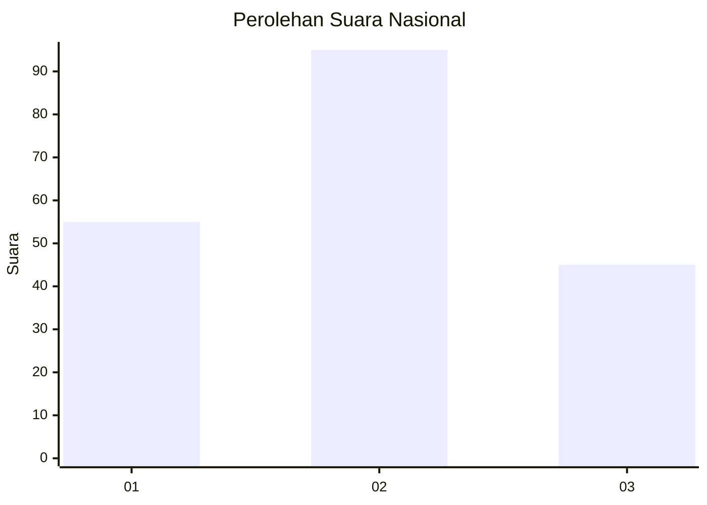
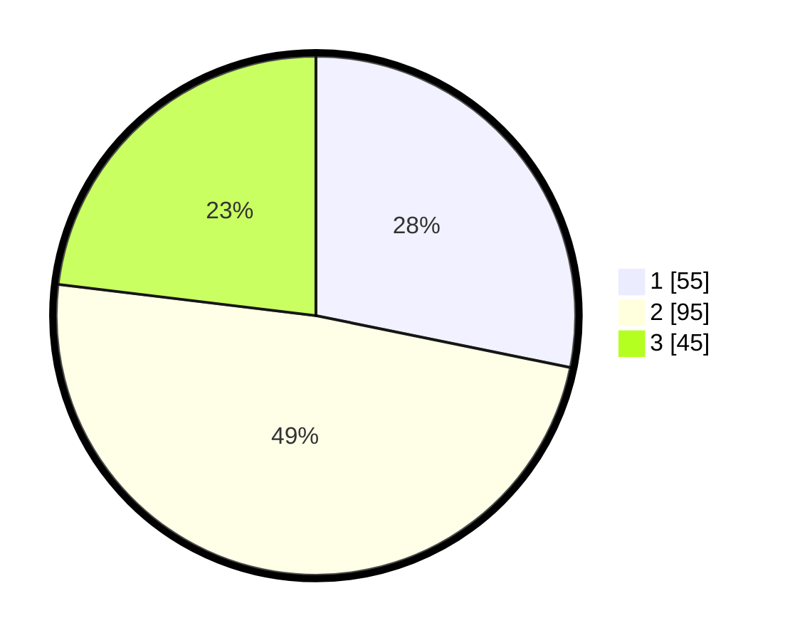

# Hasil

## Grafik

## Tabel

| No.    | Nama Paslon    | Suara | Suara (raw) | Persentase |
|:------ |:-------------- | -----:| -----------:| ----------:|
| 100025 | ANIES MUHAIMIN | 55    | [55][p-1]   | 28,21      |
| 100026 | PRABOWO GIBRAN | 95    | [95][p-2]   | 48,72      |
| 100027 | GANJAR MAHFUD  | 45    | [45][p-3]   | 23,08      |

[p-1]: https://github.com/gigit-pemilu/pemilu-2024/blob/main/pilpres/hitung-suara/sub/31-dki-jakarta/sub/73-jakarta-barat/sub/02-grogol-petamburan/sub/1007-wijaya-kusuma/sub/031-tps/sub/paslon-1.txt
[p-2]: https://github.com/gigit-pemilu/pemilu-2024/blob/main/pilpres/hitung-suara/sub/31-dki-jakarta/sub/73-jakarta-barat/sub/02-grogol-petamburan/sub/1007-wijaya-kusuma/sub/031-tps/sub/paslon-2.txt
[p-3]: https://github.com/gigit-pemilu/pemilu-2024/blob/main/pilpres/hitung-suara/sub/31-dki-jakarta/sub/73-jakarta-barat/sub/02-grogol-petamburan/sub/1007-wijaya-kusuma/sub/031-tps/sub/paslon-3.txt

## Foto C Plano

https://sirekap-obj-formc.kpu.go.id/b5fc/pemilu/ppwp/31/73/02/10/07/3173021007031-20240214-212003--9045b8aa-abf3-49a4-a937-fd4860052989.jpg

https://sirekap-obj-formc.kpu.go.id/b5fc/pemilu/ppwp/31/73/02/10/07/3173021007031-20240214-212122--80e12e07-b180-4ae5-90ef-5b31db1e0b95.jpg

https://sirekap-obj-formc.kpu.go.id/b5fc/pemilu/ppwp/31/73/02/10/07/3173021007031-20240214-223222--2b1df4c4-a9f0-4a37-bfd7-79709c4e758e.jpg

## Metadata

| Key        | Value               |
| ---------- | ------------------- |
| Time Stamp | 2024-02-19 11:00:00 |

