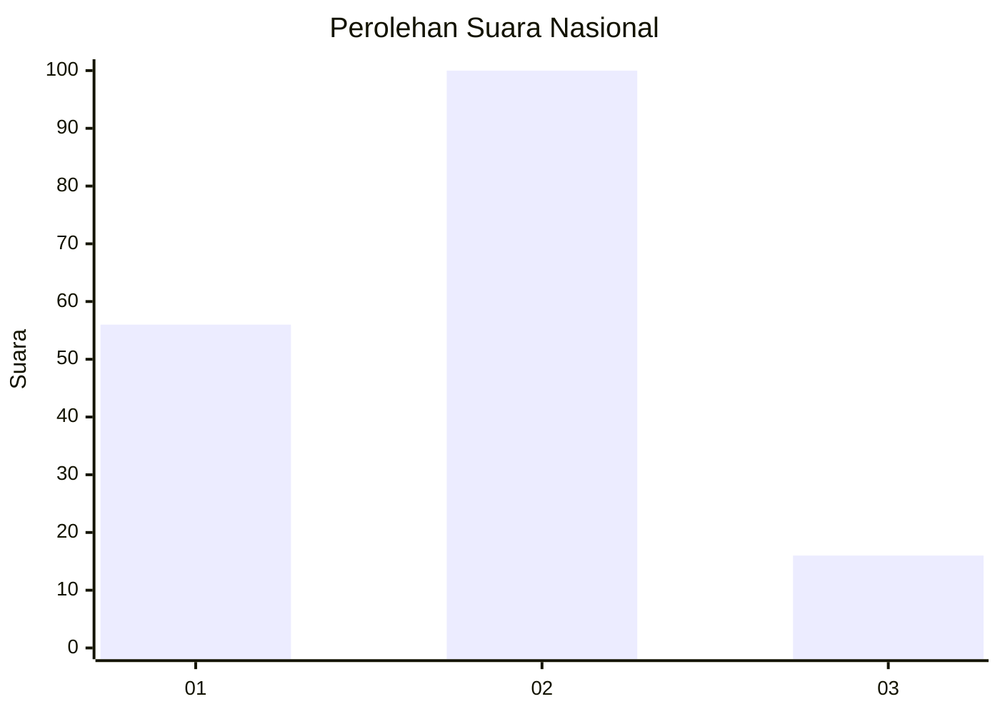
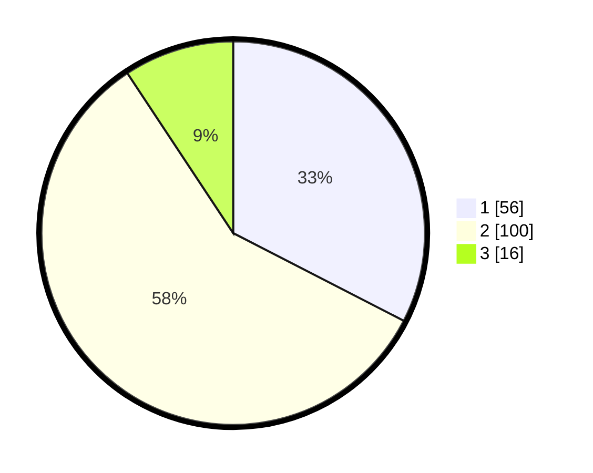

# Hasil

## Grafik

## Tabel

| No.    | Nama Paslon    | Suara | Suara (raw) | Persentase |
|:------ |:-------------- | -----:| -----------:| ----------:|
| 100025 | ANIES MUHAIMIN | 56    | [56][p-1]   | 32,56      |
| 100026 | PRABOWO GIBRAN | 100   | [100][p-2]  | 58,14      |
| 100027 | GANJAR MAHFUD  | 16    | [16][p-3]   | 9,30       |

[p-1]: https://github.com/gigit-pemilu/pemilu-2024/blob/main/pilpres/hitung-suara/sub/31-dki-jakarta/sub/73-jakarta-barat/sub/02-grogol-petamburan/sub/1007-wijaya-kusuma/sub/051-tps/sub/paslon-1.txt
[p-2]: https://github.com/gigit-pemilu/pemilu-2024/blob/main/pilpres/hitung-suara/sub/31-dki-jakarta/sub/73-jakarta-barat/sub/02-grogol-petamburan/sub/1007-wijaya-kusuma/sub/051-tps/sub/paslon-2.txt
[p-3]: https://github.com/gigit-pemilu/pemilu-2024/blob/main/pilpres/hitung-suara/sub/31-dki-jakarta/sub/73-jakarta-barat/sub/02-grogol-petamburan/sub/1007-wijaya-kusuma/sub/051-tps/sub/paslon-3.txt

## Foto C Plano

https://sirekap-obj-formc.kpu.go.id/2f81/pemilu/ppwp/31/73/02/10/07/3173021007051-20240215-020232--63962ffa-e0ad-4d1d-9a9f-ca657efbb13a.jpg

https://sirekap-obj-formc.kpu.go.id/2f81/pemilu/ppwp/31/73/02/10/07/3173021007051-20240215-020333--acee249b-9ce5-41bb-8564-b47403a20898.jpg

https://sirekap-obj-formc.kpu.go.id/2f81/pemilu/ppwp/31/73/02/10/07/3173021007051-20240215-020418--c65e78d2-c50e-49a5-b9ae-3b0f8c9b9175.jpg

## Metadata

| Key        | Value               |
| ---------- | ------------------- |
| Time Stamp | 2024-02-19 12:00:00 |

