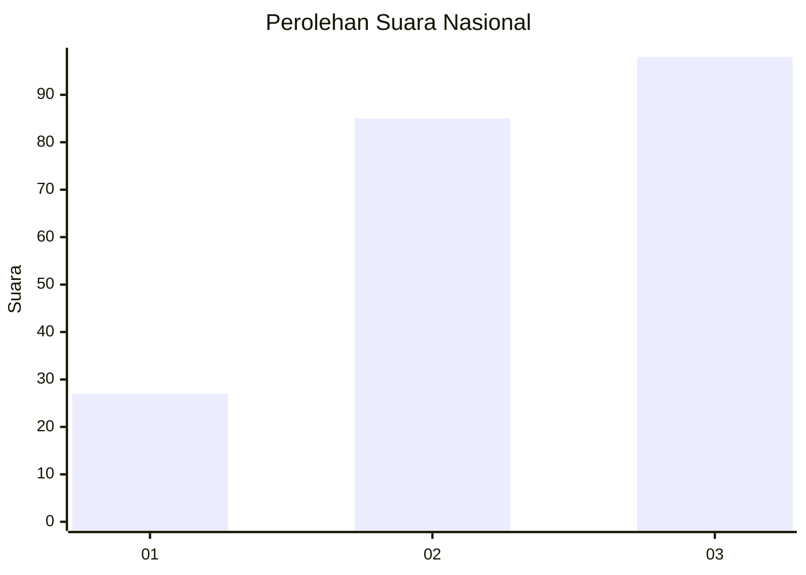
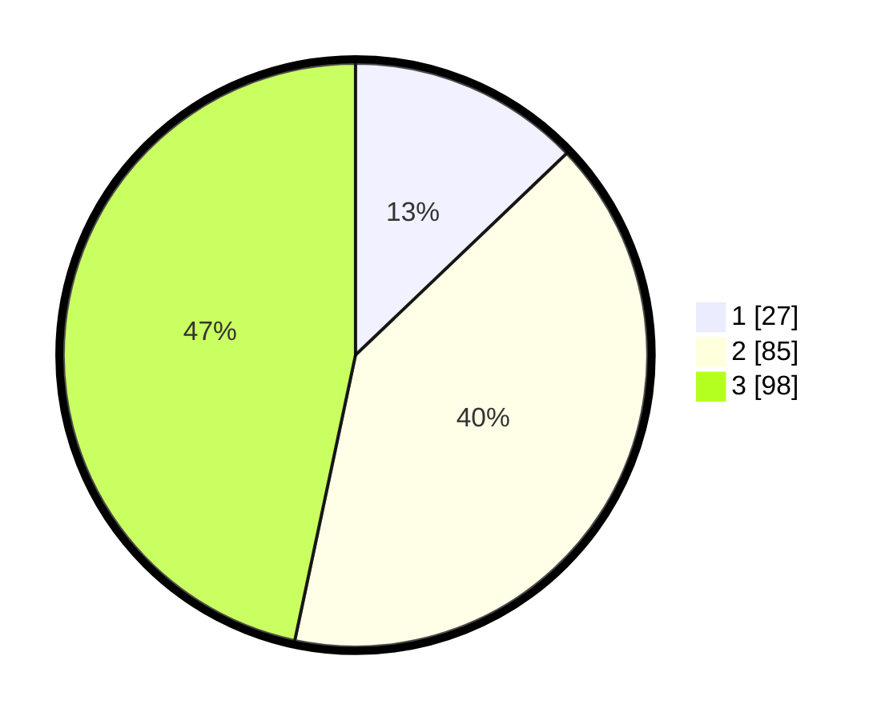

# Hasil

## Grafik

## Tabel

| No.    | Nama Paslon    | Suara | Suara (raw) | Persentase |
|:------ |:-------------- | -----:| -----------:| ----------:|
| 100025 | ANIES MUHAIMIN | 27    | [27][p-1]   | 12,86      |
| 100026 | PRABOWO GIBRAN | 85    | [85][p-2]   | 40,48      |
| 100027 | GANJAR MAHFUD  | 98    | [98][p-3]   | 46,67      |

[p-1]: https://github.com/gigit-pemilu/pemilu-2024/blob/main/pilpres/hitung-suara/sub/31-dki-jakarta/sub/73-jakarta-barat/sub/02-grogol-petamburan/sub/1007-wijaya-kusuma/sub/070-tps/sub/paslon-1.txt
[p-2]: https://github.com/gigit-pemilu/pemilu-2024/blob/main/pilpres/hitung-suara/sub/31-dki-jakarta/sub/73-jakarta-barat/sub/02-grogol-petamburan/sub/1007-wijaya-kusuma/sub/070-tps/sub/paslon-2.txt
[p-3]: https://github.com/gigit-pemilu/pemilu-2024/blob/main/pilpres/hitung-suara/sub/31-dki-jakarta/sub/73-jakarta-barat/sub/02-grogol-petamburan/sub/1007-wijaya-kusuma/sub/070-tps/sub/paslon-3.txt

## Foto C Plano

https://sirekap-obj-formc.kpu.go.id/6e96/pemilu/ppwp/31/73/02/10/07/3173021007070-20240215-142037--08fb5433-cb42-4ca5-b601-85ed878f11ba.jpg

https://sirekap-obj-formc.kpu.go.id/6e96/pemilu/ppwp/31/73/02/10/07/3173021007070-20240215-142045--fdee336e-5542-4657-8f8b-549eb5fd84b3.jpg

https://sirekap-obj-formc.kpu.go.id/6e96/pemilu/ppwp/31/73/02/10/07/3173021007070-20240215-142051--3862b73a-d202-45b6-91ed-9a24bd93fb9f.jpg

## Metadata

| Key        | Value               |
| ---------- | ------------------- |
| Time Stamp | 2024-02-19 13:00:00 |

