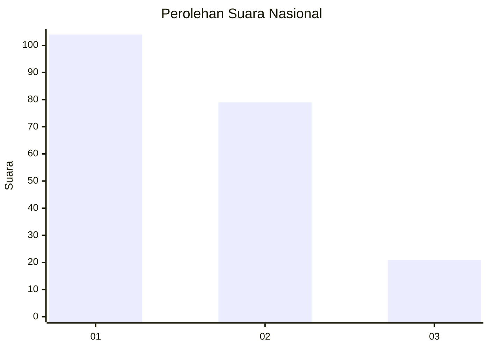
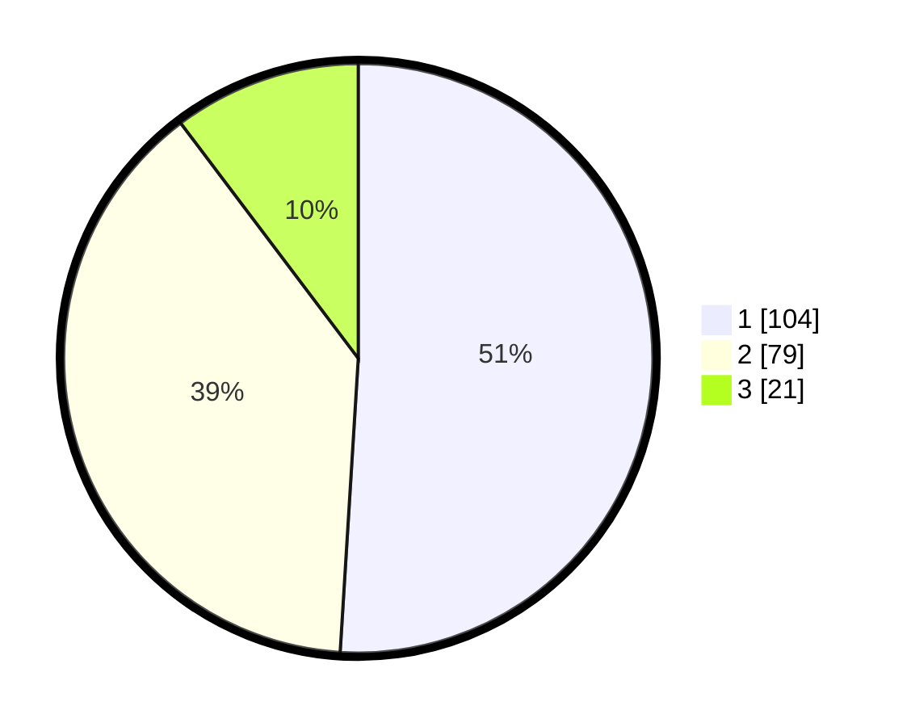

# Hasil

## Grafik

## Tabel

| No.    | Nama Paslon    | Suara | Suara (raw) | Persentase |
|:------ |:-------------- | -----:| -----------:| ----------:|
| 100025 | ANIES MUHAIMIN | 104   | [104][p-1]  | 50,98      |
| 100026 | PRABOWO GIBRAN | 79    | [79][p-2]   | 38,73      |
| 100027 | GANJAR MAHFUD  | 21    | [21][p-3]   | 10,29      |

[p-1]: https://github.com/gigit-pemilu/pemilu-2024/blob/main/pilpres/hitung-suara/sub/31-dki-jakarta/sub/73-jakarta-barat/sub/02-grogol-petamburan/sub/1007-wijaya-kusuma/sub/132-tps/sub/paslon-1.txt
[p-2]: https://github.com/gigit-pemilu/pemilu-2024/blob/main/pilpres/hitung-suara/sub/31-dki-jakarta/sub/73-jakarta-barat/sub/02-grogol-petamburan/sub/1007-wijaya-kusuma/sub/132-tps/sub/paslon-2.txt
[p-3]: https://github.com/gigit-pemilu/pemilu-2024/blob/main/pilpres/hitung-suara/sub/31-dki-jakarta/sub/73-jakarta-barat/sub/02-grogol-petamburan/sub/1007-wijaya-kusuma/sub/132-tps/sub/paslon-3.txt

## Foto C Plano

https://sirekap-obj-formc.kpu.go.id/2bc1/pemilu/ppwp/31/73/02/10/07/3173021007132-20240214-215551--0e08493f-109d-4848-9dc2-c8e184ecb353.jpg

https://sirekap-obj-formc.kpu.go.id/2bc1/pemilu/ppwp/31/73/02/10/07/3173021007132-20240214-213733--ddff3c39-d21e-4737-8b90-63613c6aa082.jpg

https://sirekap-obj-formc.kpu.go.id/2bc1/pemilu/ppwp/31/73/02/10/07/3173021007132-20240214-214106--7967f252-b847-4e5c-9451-e4f75a0d8e26.jpg

## Metadata

| Key        | Value               |
| ---------- | ------------------- |
| Time Stamp | 2024-02-15 09:00:24 |

