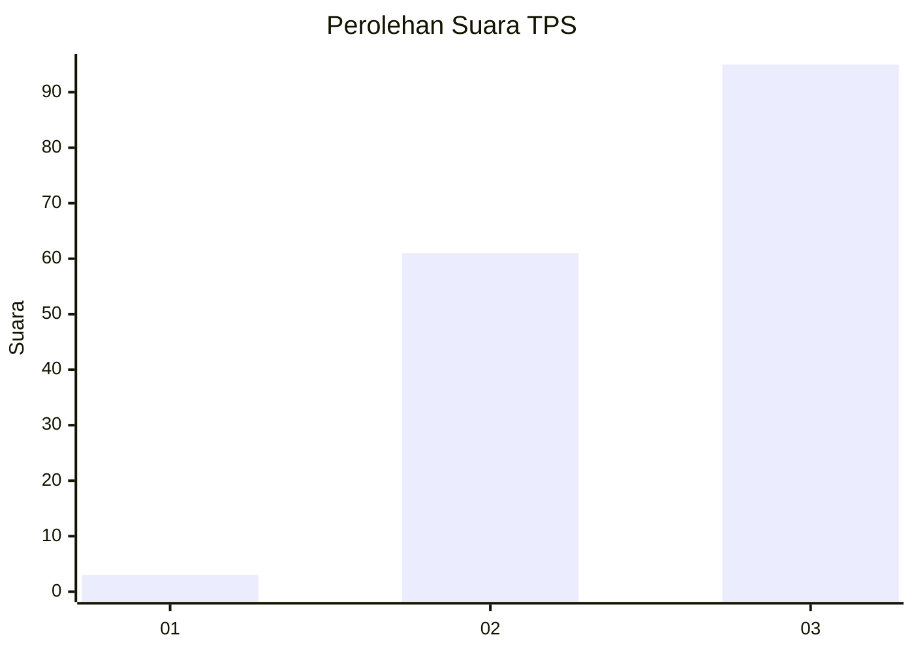
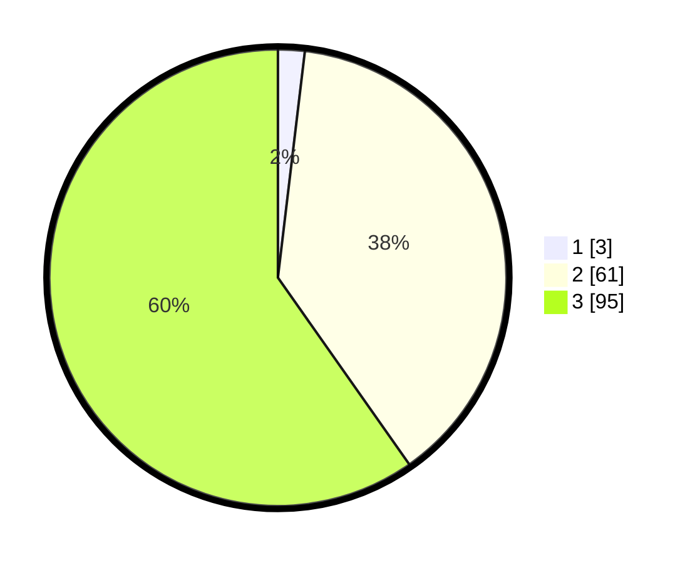

# Hasil

## Grafik

## Tabel

| No. | Nama Paslon    | Suara | Suara (raw) | Persentase |
|:--- |:-------------- | -----:| -----------:| ----------:|
| 1   | ANIES MUHAIMIN | 3     | [3][p-1]    | 1,89       |
| 2   | PRABOWO GIBRAN | 61    | [61][p-2]   | 38,36      |
| 3   | GANJAR MAHFUD  | 95    | [95][p-3]   | 59,75      |

[p-1]: https://github.com/gigit-pemilu/pemilu-2024-31-dki-jakarta/blob/main/pilpres/hitung-suara/sub/31-dki-jakarta/sub/73-jakarta-barat/sub/03-taman-sari/sub/1001-taman-sari/sub/003-tps/sub/paslon-1.txt
[p-2]: https://github.com/gigit-pemilu/pemilu-2024-31-dki-jakarta/blob/main/pilpres/hitung-suara/sub/31-dki-jakarta/sub/73-jakarta-barat/sub/03-taman-sari/sub/1001-taman-sari/sub/003-tps/sub/paslon-2.txt
[p-3]: https://github.com/gigit-pemilu/pemilu-2024-31-dki-jakarta/blob/main/pilpres/hitung-suara/sub/31-dki-jakarta/sub/73-jakarta-barat/sub/03-taman-sari/sub/1001-taman-sari/sub/003-tps/sub/paslon-3.txt

## Foto C Plano

https://sirekap-obj-formc.kpu.go.id/b828/pemilu/ppwp/31/73/03/10/01/3173031001003-20240214-222547--a5cb78dd-0712-4fc5-87b3-593ac923b7a4.jpg

https://sirekap-obj-formc.kpu.go.id/b828/pemilu/ppwp/31/73/03/10/01/3173031001003-20240214-222621--eea3714d-3af4-4767-bc92-d4bbae73944f.jpg

https://sirekap-obj-formc.kpu.go.id/b828/pemilu/ppwp/31/73/03/10/01/3173031001003-20240214-222644--2f6bcdf8-7599-4f67-a062-cdf02ba31999.jpg

## Metadata

| Key        | Value               |
| ---------- | ------------------- |
| Time Stamp | 2024-02-16 01:30:27 |

