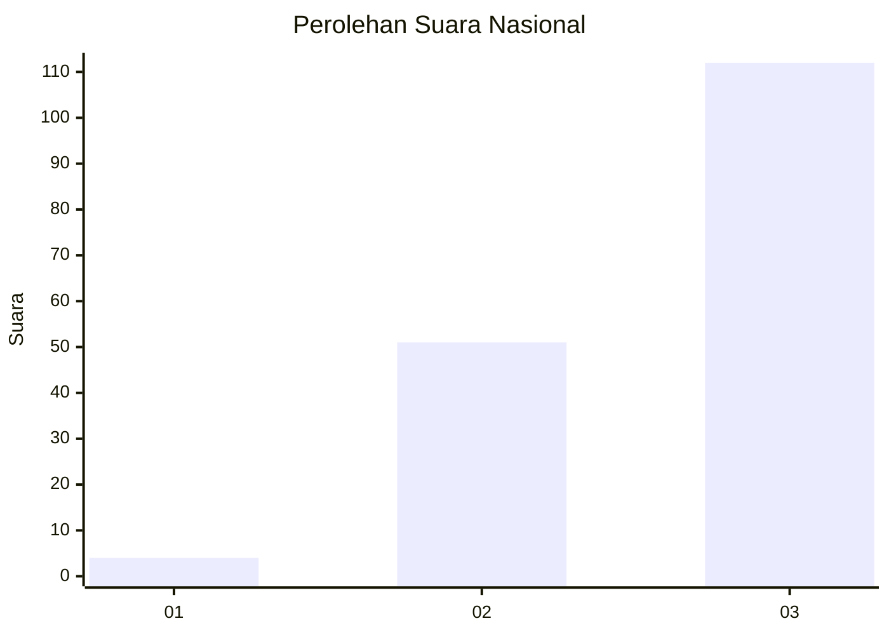
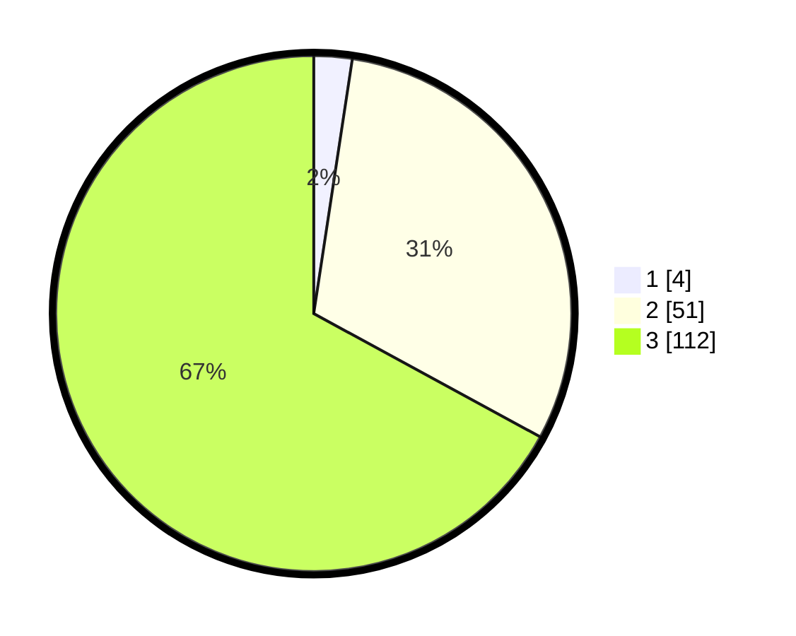

# Hasil

## Grafik

## Tabel

| No.    | Nama Paslon    | Suara | Suara (raw) | Persentase |
|:------ |:-------------- | -----:| -----------:| ----------:|
| 100025 | ANIES MUHAIMIN | 4     | [4][p-1]    | 2,40       |
| 100026 | PRABOWO GIBRAN | 51    | [51][p-2]   | 30,54      |
| 100027 | GANJAR MAHFUD  | 112   | [112][p-3]  | 67,07      |

[p-1]: https://github.com/gigit-pemilu/pemilu-2024/blob/main/pilpres/hitung-suara/sub/31-dki-jakarta/sub/73-jakarta-barat/sub/03-taman-sari/sub/1001-taman-sari/sub/004-tps/sub/paslon-1.txt
[p-2]: https://github.com/gigit-pemilu/pemilu-2024/blob/main/pilpres/hitung-suara/sub/31-dki-jakarta/sub/73-jakarta-barat/sub/03-taman-sari/sub/1001-taman-sari/sub/004-tps/sub/paslon-2.txt
[p-3]: https://github.com/gigit-pemilu/pemilu-2024/blob/main/pilpres/hitung-suara/sub/31-dki-jakarta/sub/73-jakarta-barat/sub/03-taman-sari/sub/1001-taman-sari/sub/004-tps/sub/paslon-3.txt

## Foto C Plano

https://sirekap-obj-formc.kpu.go.id/0d62/pemilu/ppwp/31/73/03/10/01/3173031001004-20240214-213724--370f0304-a49a-455f-bb68-a69c0d560a62.jpg

https://sirekap-obj-formc.kpu.go.id/0d62/pemilu/ppwp/31/73/03/10/01/3173031001004-20240214-213811--e53f8aa2-e41b-4d8c-a22d-7fdf9101ea73.jpg

https://sirekap-obj-formc.kpu.go.id/0d62/pemilu/ppwp/31/73/03/10/01/3173031001004-20240214-213836--f17692a1-6b9e-4bae-9789-8e3c1ec8843d.jpg

## Metadata

| Key        | Value               |
| ---------- | ------------------- |
| Time Stamp | 2024-02-16 01:30:27 |

