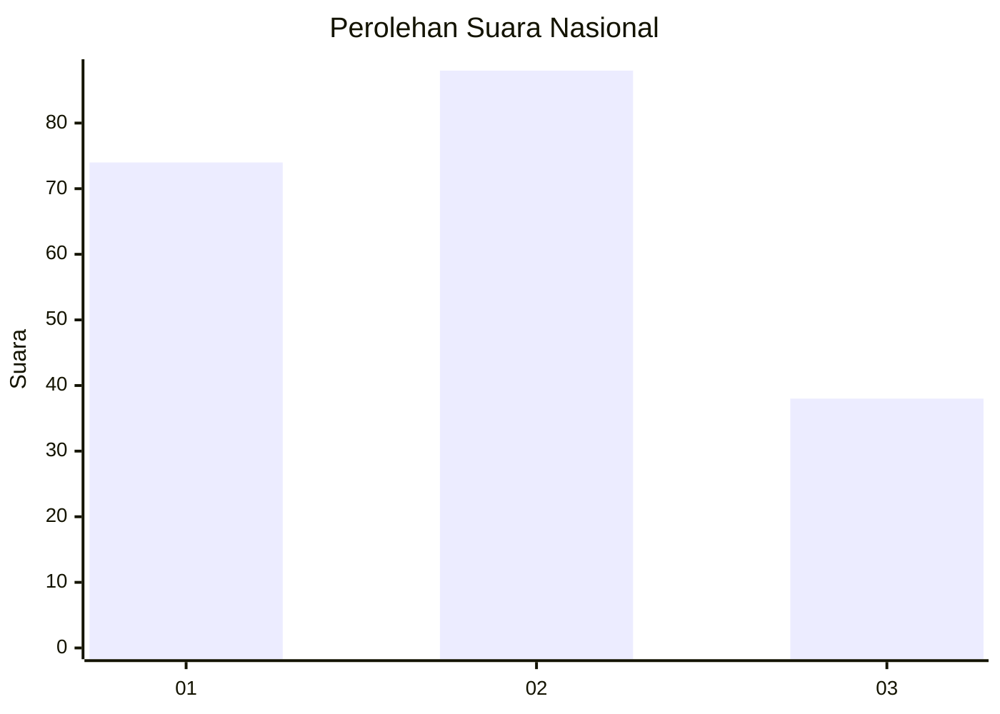
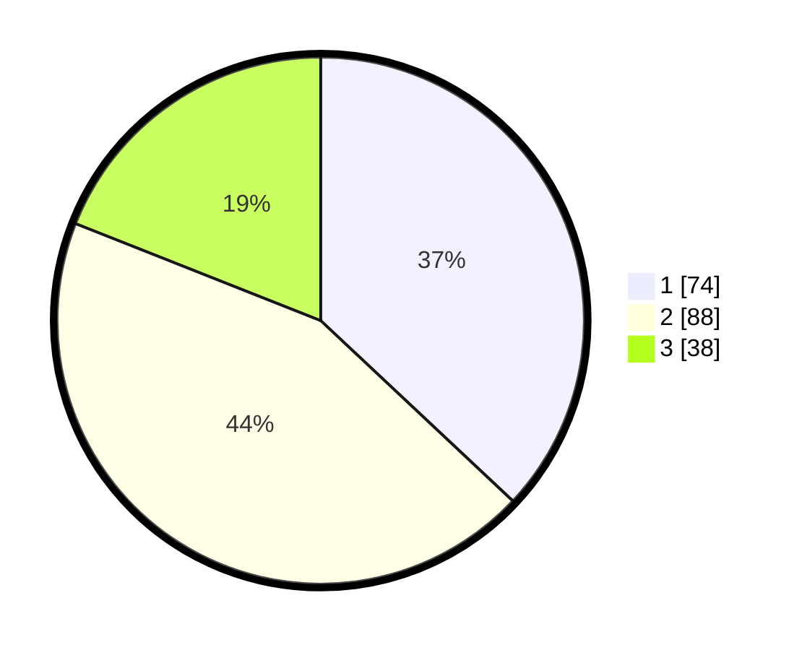

# Hasil

## Grafik

## Tabel

| No.    | Nama Paslon    | Suara | Suara (raw) | Persentase |
|:------ |:-------------- | -----:| -----------:| ----------:|
| 100025 | ANIES MUHAIMIN | 74    | [74][p-1]   | 37,00      |
| 100026 | PRABOWO GIBRAN | 88    | [88][p-2]   | 44,00      |
| 100027 | GANJAR MAHFUD  | 38    | [38][p-3]   | 19,00      |

[p-1]: https://github.com/gigit-pemilu/pemilu-2024/blob/main/pilpres/hitung-suara/sub/31-dki-jakarta/sub/73-jakarta-barat/sub/03-taman-sari/sub/1001-taman-sari/sub/007-tps/sub/paslon-1.txt
[p-2]: https://github.com/gigit-pemilu/pemilu-2024/blob/main/pilpres/hitung-suara/sub/31-dki-jakarta/sub/73-jakarta-barat/sub/03-taman-sari/sub/1001-taman-sari/sub/007-tps/sub/paslon-2.txt
[p-3]: https://github.com/gigit-pemilu/pemilu-2024/blob/main/pilpres/hitung-suara/sub/31-dki-jakarta/sub/73-jakarta-barat/sub/03-taman-sari/sub/1001-taman-sari/sub/007-tps/sub/paslon-3.txt

## Foto C Plano

https://sirekap-obj-formc.kpu.go.id/79fe/pemilu/ppwp/31/73/03/10/01/3173031001007-20240215-015418--ad06fa67-acb1-41f1-ac28-70c33eb02ac4.jpg

https://sirekap-obj-formc.kpu.go.id/79fe/pemilu/ppwp/31/73/03/10/01/3173031001007-20240215-001618--79568404-9a38-4dc4-9ad3-59d59cb393aa.jpg

https://sirekap-obj-formc.kpu.go.id/79fe/pemilu/ppwp/31/73/03/10/01/3173031001007-20240215-001756--3c2e2abb-753e-4d13-a1aa-3421a11b6434.jpg

## Metadata

| Key        | Value               |
| ---------- | ------------------- |
| Time Stamp | 2024-02-16 01:30:27 |

