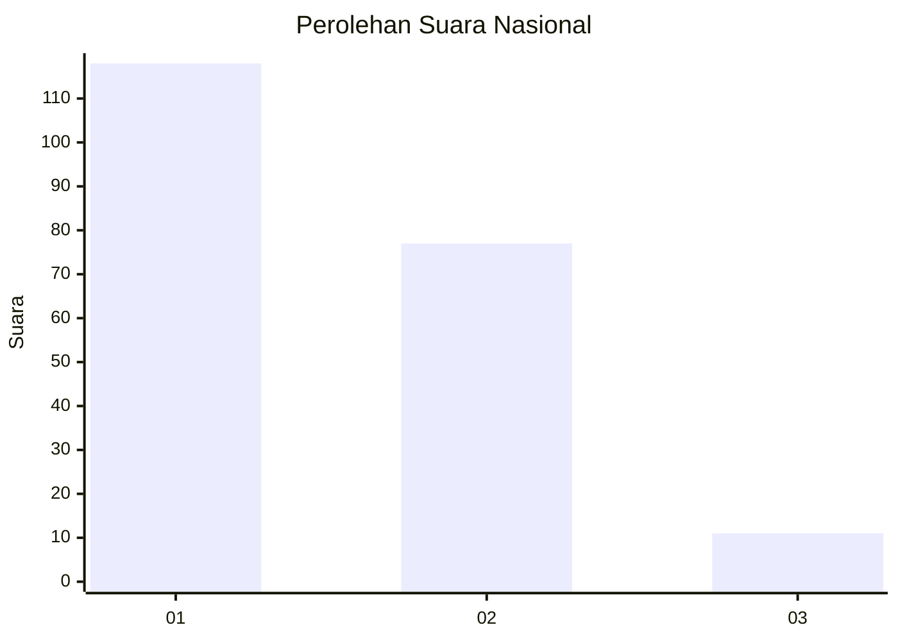
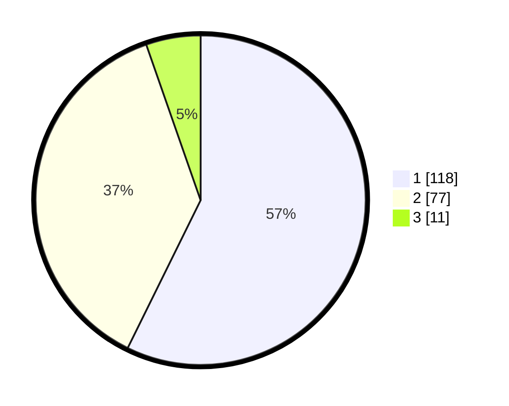

# Hasil

## Grafik

## Tabel

| No.    | Nama Paslon    | Suara | Suara (raw) | Persentase |
|:------ |:-------------- | -----:| -----------:| ----------:|
| 100025 | ANIES MUHAIMIN | 118   | [118][p-1]  | 57,28      |
| 100026 | PRABOWO GIBRAN | 77    | [77][p-2]   | 37,38      |
| 100027 | GANJAR MAHFUD  | 11    | [11][p-3]   | 5,34       |

[p-1]: https://github.com/gigit-pemilu/pemilu-2024/blob/main/pilpres/hitung-suara/sub/31-dki-jakarta/sub/73-jakarta-barat/sub/03-taman-sari/sub/1001-taman-sari/sub/010-tps/sub/paslon-1.txt
[p-2]: https://github.com/gigit-pemilu/pemilu-2024/blob/main/pilpres/hitung-suara/sub/31-dki-jakarta/sub/73-jakarta-barat/sub/03-taman-sari/sub/1001-taman-sari/sub/010-tps/sub/paslon-2.txt
[p-3]: https://github.com/gigit-pemilu/pemilu-2024/blob/main/pilpres/hitung-suara/sub/31-dki-jakarta/sub/73-jakarta-barat/sub/03-taman-sari/sub/1001-taman-sari/sub/010-tps/sub/paslon-3.txt

## Foto C Plano

https://sirekap-obj-formc.kpu.go.id/4b06/pemilu/ppwp/31/73/03/10/01/3173031001010-20240215-000136--fbd45918-fe8f-4247-8269-900be777f073.jpg

https://sirekap-obj-formc.kpu.go.id/4b06/pemilu/ppwp/31/73/03/10/01/3173031001010-20240215-000232--0a1eadf5-2cee-47cf-a2f8-276af48a5082.jpg

https://sirekap-obj-formc.kpu.go.id/4b06/pemilu/ppwp/31/73/03/10/01/3173031001010-20240215-000358--a49924d3-c351-47e4-be6d-59f19dcc4b26.jpg

## Metadata

| Key        | Value               |
| ---------- | ------------------- |
| Time Stamp | 2024-02-15 05:00:24 |

