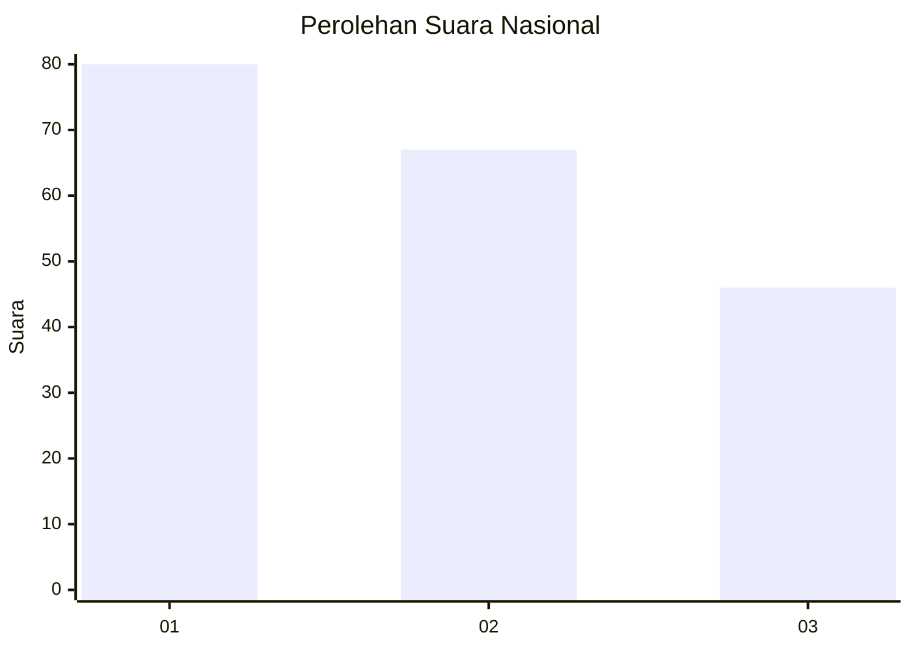
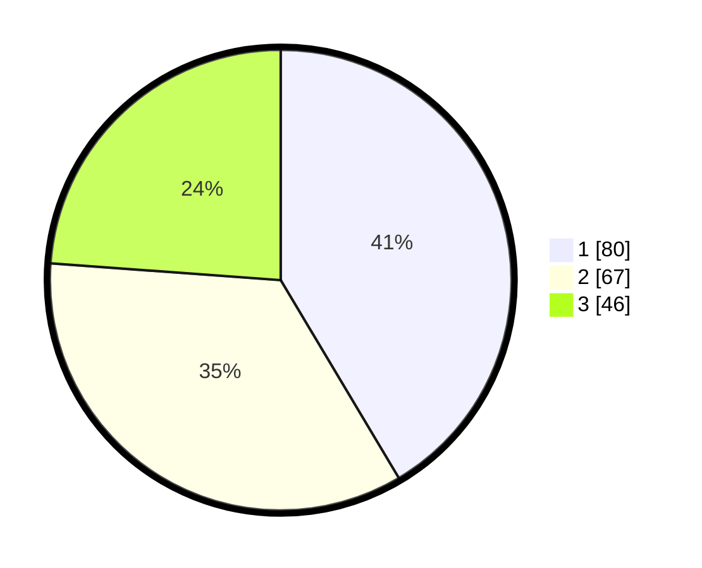

# Hasil

## Grafik

## Tabel

| No.    | Nama Paslon    | Suara | Suara (raw) | Persentase |
|:------ |:-------------- | -----:| -----------:| ----------:|
| 100025 | ANIES MUHAIMIN | 80    | [80][p-1]   | 41,45      |
| 100026 | PRABOWO GIBRAN | 67    | [67][p-2]   | 34,72      |
| 100027 | GANJAR MAHFUD  | 46    | [46][p-3]   | 23,83      |

[p-1]: https://github.com/gigit-pemilu/pemilu-2024/blob/main/pilpres/hitung-suara/sub/31-dki-jakarta/sub/73-jakarta-barat/sub/03-taman-sari/sub/1001-taman-sari/sub/022-tps/sub/paslon-1.txt
[p-2]: https://github.com/gigit-pemilu/pemilu-2024/blob/main/pilpres/hitung-suara/sub/31-dki-jakarta/sub/73-jakarta-barat/sub/03-taman-sari/sub/1001-taman-sari/sub/022-tps/sub/paslon-2.txt
[p-3]: https://github.com/gigit-pemilu/pemilu-2024/blob/main/pilpres/hitung-suara/sub/31-dki-jakarta/sub/73-jakarta-barat/sub/03-taman-sari/sub/1001-taman-sari/sub/022-tps/sub/paslon-3.txt

## Foto C Plano

https://sirekap-obj-formc.kpu.go.id/72ed/pemilu/ppwp/31/73/03/10/01/3173031001022-20240214-215740--4235b3a9-aad2-409a-943a-d45c8b7dab9a.jpg

https://sirekap-obj-formc.kpu.go.id/72ed/pemilu/ppwp/31/73/03/10/01/3173031001022-20240214-212850--90702391-05f9-4251-93b8-c12d152486de.jpg

https://sirekap-obj-formc.kpu.go.id/72ed/pemilu/ppwp/31/73/03/10/01/3173031001022-20240214-215838--cdeb6335-983b-435d-875b-a99c666ff34c.jpg

## Metadata

| Key        | Value               |
| ---------- | ------------------- |
| Time Stamp | 2024-02-17 16:36:25 |

