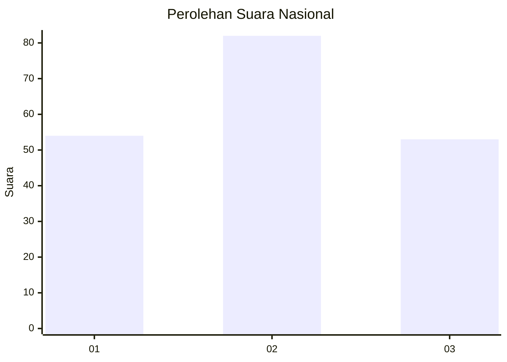
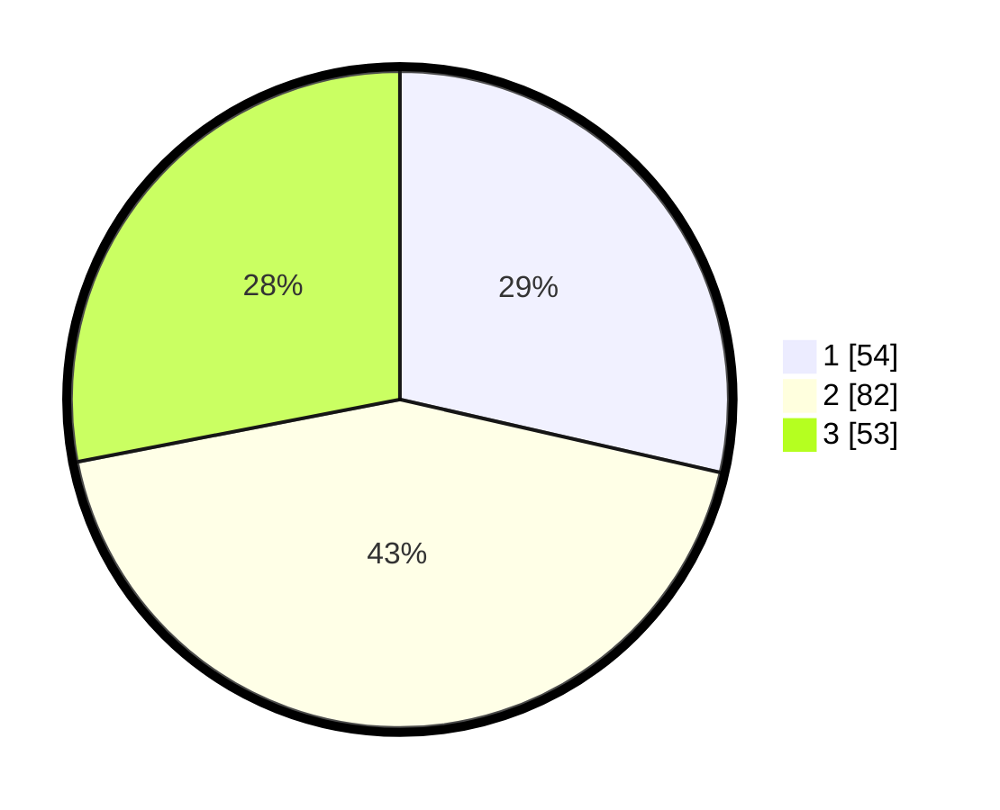

# Hasil

## Grafik

## Tabel

| No.    | Nama Paslon    | Suara | Suara (raw) | Persentase |
|:------ |:-------------- | -----:| -----------:| ----------:|
| 100025 | ANIES MUHAIMIN | 54    | [54][p-1]   | 28,57      |
| 100026 | PRABOWO GIBRAN | 82    | [82][p-2]   | 43,39      |
| 100027 | GANJAR MAHFUD  | 53    | [53][p-3]   | 28,04      |

[p-1]: https://github.com/gigit-pemilu/pemilu-2024/blob/main/pilpres/hitung-suara/sub/31-dki-jakarta/sub/73-jakarta-barat/sub/03-taman-sari/sub/1001-taman-sari/sub/031-tps/sub/paslon-1.txt
[p-2]: https://github.com/gigit-pemilu/pemilu-2024/blob/main/pilpres/hitung-suara/sub/31-dki-jakarta/sub/73-jakarta-barat/sub/03-taman-sari/sub/1001-taman-sari/sub/031-tps/sub/paslon-2.txt
[p-3]: https://github.com/gigit-pemilu/pemilu-2024/blob/main/pilpres/hitung-suara/sub/31-dki-jakarta/sub/73-jakarta-barat/sub/03-taman-sari/sub/1001-taman-sari/sub/031-tps/sub/paslon-3.txt

## Foto C Plano

https://sirekap-obj-formc.kpu.go.id/b9da/pemilu/ppwp/31/73/03/10/01/3173031001031-20240214-205516--5bb26252-cdeb-4a8d-934f-a2b6a291c30d.jpg

https://sirekap-obj-formc.kpu.go.id/b9da/pemilu/ppwp/31/73/03/10/01/3173031001031-20240214-205601--235fb89e-5e95-4ffd-aa0a-3f354d3a54fe.jpg

https://sirekap-obj-formc.kpu.go.id/b9da/pemilu/ppwp/31/73/03/10/01/3173031001031-20240214-205655--e7f06639-058d-4a97-83c9-3d04df09a37e.jpg

## Metadata

| Key        | Value               |
| ---------- | ------------------- |
| Time Stamp | 2024-02-16 02:00:27 |

