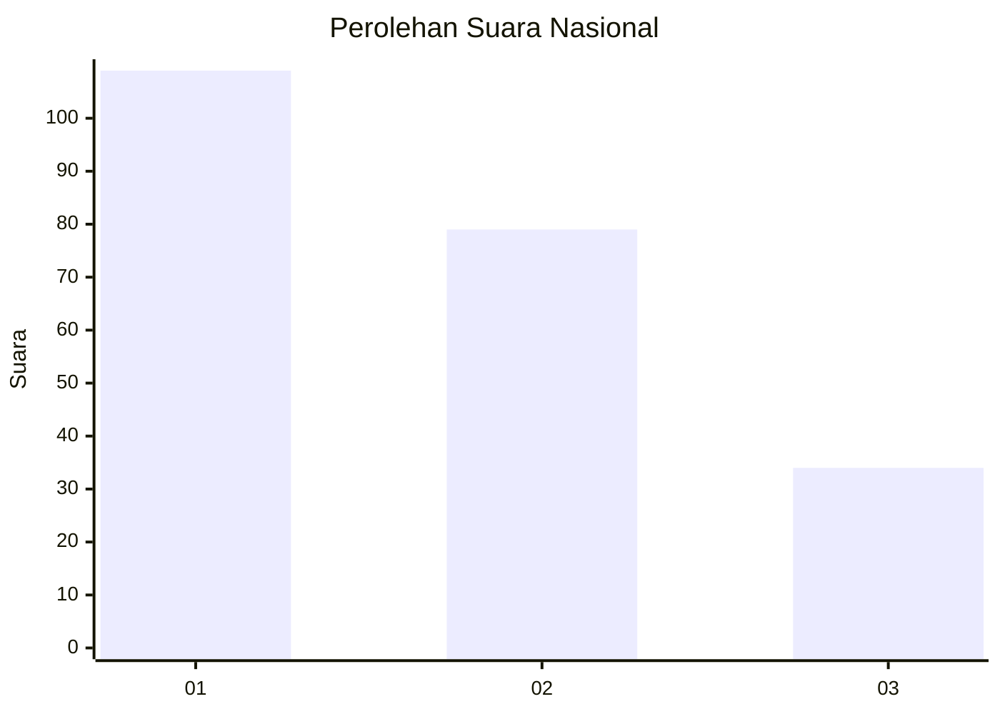
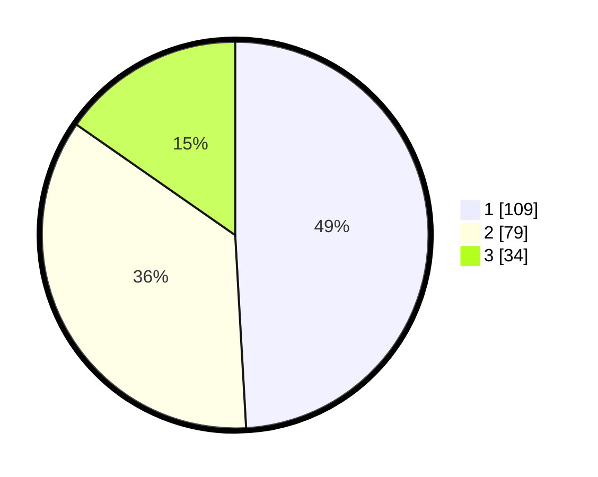

# Hasil

## Grafik

## Tabel

| No.    | Nama Paslon    | Suara | Suara (raw) | Persentase |
|:------ |:-------------- | -----:| -----------:| ----------:|
| 100025 | ANIES MUHAIMIN | 109   | [109][p-1]  | 49,10      |
| 100026 | PRABOWO GIBRAN | 79    | [79][p-2]   | 35,59      |
| 100027 | GANJAR MAHFUD  | 34    | [34][p-3]   | 15,32      |

[p-1]: https://github.com/gigit-pemilu/pemilu-2024/blob/main/pilpres/hitung-suara/sub/31-dki-jakarta/sub/73-jakarta-barat/sub/03-taman-sari/sub/1001-taman-sari/sub/040-tps/sub/paslon-1.txt
[p-2]: https://github.com/gigit-pemilu/pemilu-2024/blob/main/pilpres/hitung-suara/sub/31-dki-jakarta/sub/73-jakarta-barat/sub/03-taman-sari/sub/1001-taman-sari/sub/040-tps/sub/paslon-2.txt
[p-3]: https://github.com/gigit-pemilu/pemilu-2024/blob/main/pilpres/hitung-suara/sub/31-dki-jakarta/sub/73-jakarta-barat/sub/03-taman-sari/sub/1001-taman-sari/sub/040-tps/sub/paslon-3.txt

## Foto C Plano

https://sirekap-obj-formc.kpu.go.id/396b/pemilu/ppwp/31/73/03/10/01/3173031001040-20240215-011644--ad5a292e-04a0-4fec-94df-1888091e3cf4.jpg

https://sirekap-obj-formc.kpu.go.id/396b/pemilu/ppwp/31/73/03/10/01/3173031001040-20240214-155212--05d31cb6-b903-4031-af3a-800619db7d38.jpg

https://sirekap-obj-formc.kpu.go.id/396b/pemilu/ppwp/31/73/03/10/01/3173031001040-20240214-155457--530140e4-5cb0-4e76-9d6b-e5b07669b5f5.jpg

## Metadata

| Key        | Value               |
| ---------- | ------------------- |
| Time Stamp | 2024-02-16 16:25:10 |

