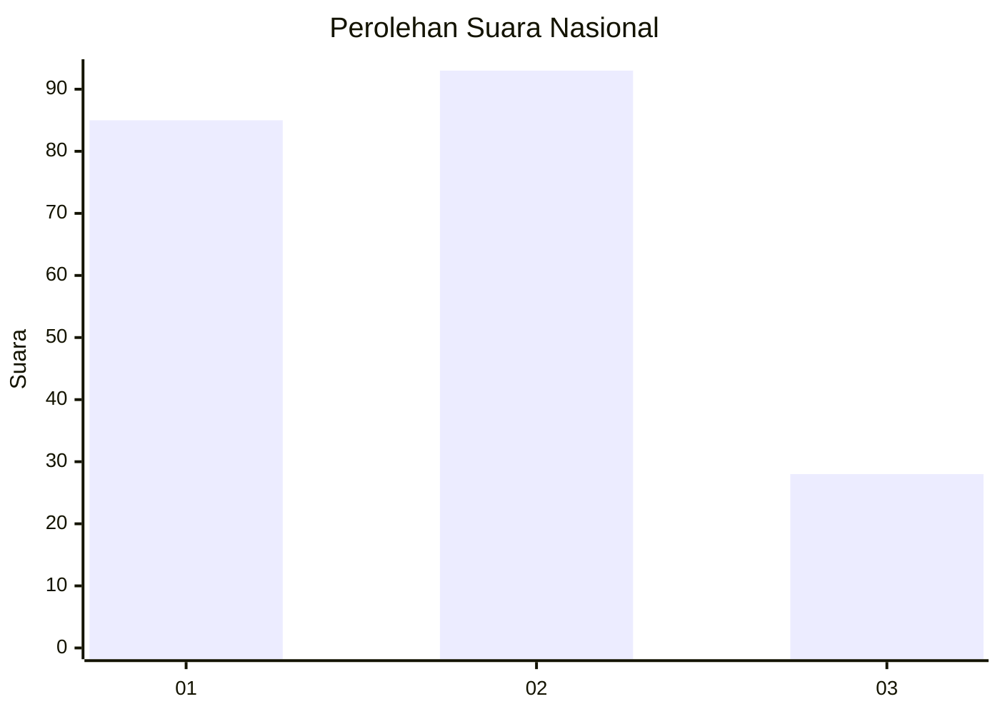
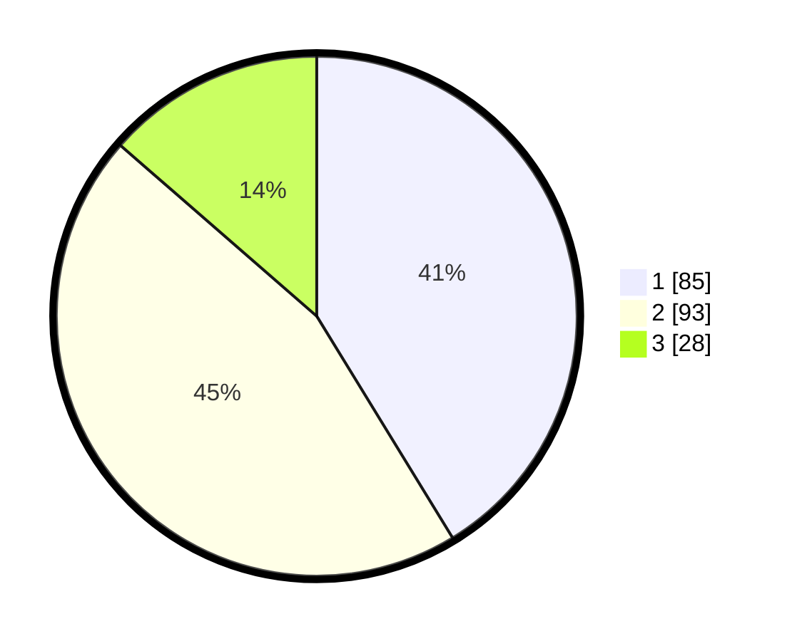

# Hasil

## Grafik

## Tabel

| No.    | Nama Paslon    | Suara | Suara (raw) | Persentase |
|:------ |:-------------- | -----:| -----------:| ----------:|
| 100025 | ANIES MUHAIMIN | 85    | [85][p-1]   | 41,26      |
| 100026 | PRABOWO GIBRAN | 93    | [93][p-2]   | 45,15      |
| 100027 | GANJAR MAHFUD  | 28    | [28][p-3]   | 13,59      |

[p-1]: https://github.com/gigit-pemilu/pemilu-2024/blob/main/pilpres/hitung-suara/sub/31-dki-jakarta/sub/73-jakarta-barat/sub/03-taman-sari/sub/1001-taman-sari/sub/043-tps/sub/paslon-1.txt
[p-2]: https://github.com/gigit-pemilu/pemilu-2024/blob/main/pilpres/hitung-suara/sub/31-dki-jakarta/sub/73-jakarta-barat/sub/03-taman-sari/sub/1001-taman-sari/sub/043-tps/sub/paslon-2.txt
[p-3]: https://github.com/gigit-pemilu/pemilu-2024/blob/main/pilpres/hitung-suara/sub/31-dki-jakarta/sub/73-jakarta-barat/sub/03-taman-sari/sub/1001-taman-sari/sub/043-tps/sub/paslon-3.txt

## Foto C Plano

https://sirekap-obj-formc.kpu.go.id/5ebb/pemilu/ppwp/31/73/03/10/01/3173031001043-20240215-010057--07f87acc-dce4-4f49-9a89-05ce7057a045.jpg

https://sirekap-obj-formc.kpu.go.id/5ebb/pemilu/ppwp/31/73/03/10/01/3173031001043-20240215-002044--f636dfe4-23e8-4770-9515-64a18586ae43.jpg

https://sirekap-obj-formc.kpu.go.id/5ebb/pemilu/ppwp/31/73/03/10/01/3173031001043-20240215-002137--1986fbfe-9ff7-44b4-85b8-de8bf20c910d.jpg

## Metadata

| Key        | Value               |
| ---------- | ------------------- |
| Time Stamp | 2024-02-17 16:36:25 |

