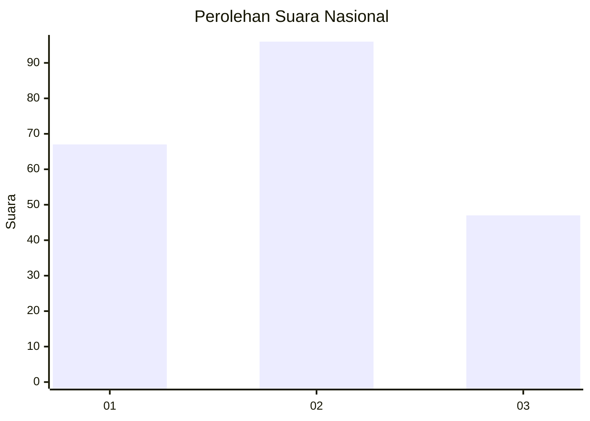
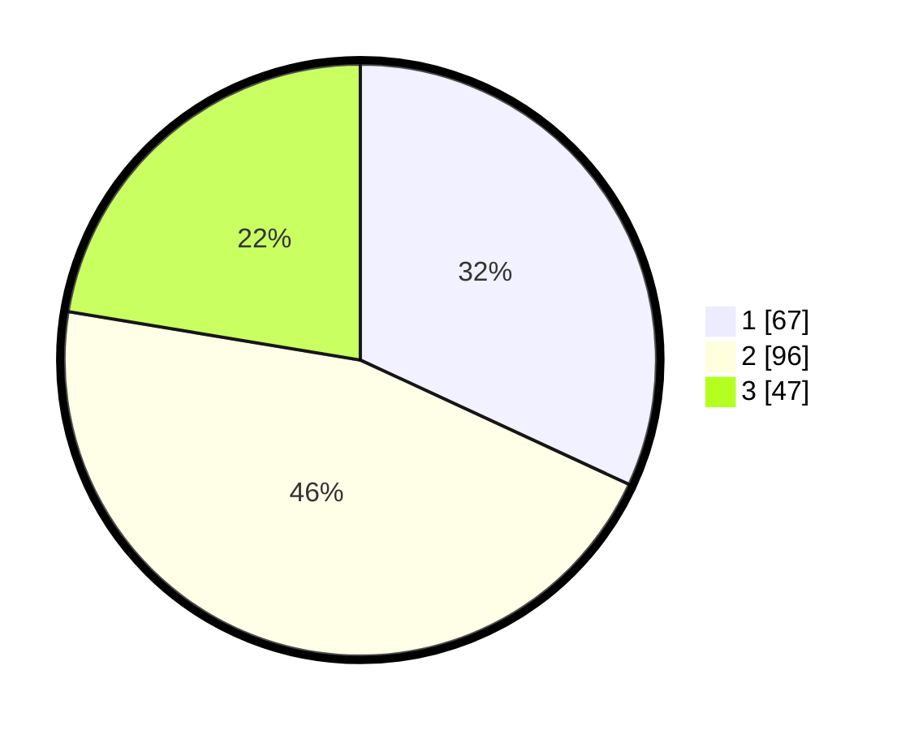

# Hasil

## Grafik

## Tabel

| No.    | Nama Paslon    | Suara | Suara (raw) | Persentase |
|:------ |:-------------- | -----:| -----------:| ----------:|
| 100025 | ANIES MUHAIMIN | 67    | [67][p-1]   | 31,90      |
| 100026 | PRABOWO GIBRAN | 96    | [96][p-2]   | 45,71      |
| 100027 | GANJAR MAHFUD  | 47    | [47][p-3]   | 22,38      |

[p-1]: https://github.com/gigit-pemilu/pemilu-2024/blob/main/pilpres/hitung-suara/sub/31-dki-jakarta/sub/73-jakarta-barat/sub/03-taman-sari/sub/1001-taman-sari/sub/044-tps/sub/paslon-1.txt
[p-2]: https://github.com/gigit-pemilu/pemilu-2024/blob/main/pilpres/hitung-suara/sub/31-dki-jakarta/sub/73-jakarta-barat/sub/03-taman-sari/sub/1001-taman-sari/sub/044-tps/sub/paslon-2.txt
[p-3]: https://github.com/gigit-pemilu/pemilu-2024/blob/main/pilpres/hitung-suara/sub/31-dki-jakarta/sub/73-jakarta-barat/sub/03-taman-sari/sub/1001-taman-sari/sub/044-tps/sub/paslon-3.txt

## Foto C Plano

https://sirekap-obj-formc.kpu.go.id/550c/pemilu/ppwp/31/73/03/10/01/3173031001044-20240214-233315--f3cb262a-4acc-45c2-994b-87e5270fe9b6.jpg

https://sirekap-obj-formc.kpu.go.id/550c/pemilu/ppwp/31/73/03/10/01/3173031001044-20240214-233417--cc9e85b0-cd18-46bf-8c7f-396823f48d71.jpg

https://sirekap-obj-formc.kpu.go.id/550c/pemilu/ppwp/31/73/03/10/01/3173031001044-20240214-233602--6faaf924-61a4-46df-9edc-2591195a88ba.jpg

## Metadata

| Key        | Value               |
| ---------- | ------------------- |
| Time Stamp | 2024-02-17 16:36:25 |

