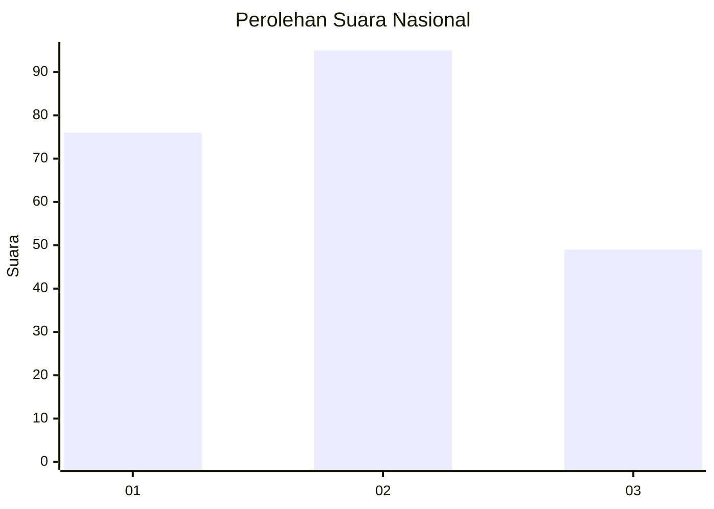
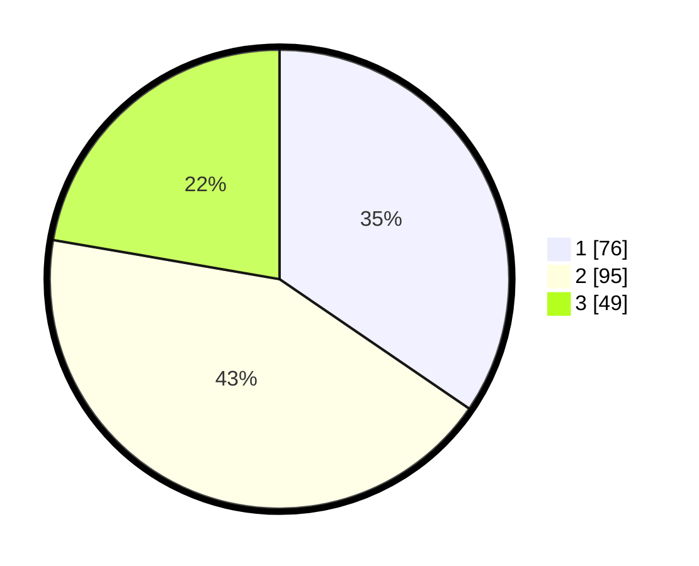

# Hasil

## Grafik

## Tabel

| No.    | Nama Paslon    | Suara | Suara (raw) | Persentase |
|:------ |:-------------- | -----:| -----------:| ----------:|
| 100025 | ANIES MUHAIMIN | 76    | [76][p-1]   | 34,55      |
| 100026 | PRABOWO GIBRAN | 95    | [95][p-2]   | 43,18      |
| 100027 | GANJAR MAHFUD  | 49    | [49][p-3]   | 22,27      |

[p-1]: https://github.com/gigit-pemilu/pemilu-2024/blob/main/pilpres/hitung-suara/sub/31-dki-jakarta/sub/73-jakarta-barat/sub/03-taman-sari/sub/1001-taman-sari/sub/045-tps/sub/paslon-1.txt
[p-2]: https://github.com/gigit-pemilu/pemilu-2024/blob/main/pilpres/hitung-suara/sub/31-dki-jakarta/sub/73-jakarta-barat/sub/03-taman-sari/sub/1001-taman-sari/sub/045-tps/sub/paslon-2.txt
[p-3]: https://github.com/gigit-pemilu/pemilu-2024/blob/main/pilpres/hitung-suara/sub/31-dki-jakarta/sub/73-jakarta-barat/sub/03-taman-sari/sub/1001-taman-sari/sub/045-tps/sub/paslon-3.txt

## Foto C Plano

https://sirekap-obj-formc.kpu.go.id/93ee/pemilu/ppwp/31/73/03/10/01/3173031001045-20240214-215253--b548f544-d747-4766-8a62-9313b3ac92b8.jpg

https://sirekap-obj-formc.kpu.go.id/93ee/pemilu/ppwp/31/73/03/10/01/3173031001045-20240214-215247--7a17f0ff-5d94-4148-b145-2723663c0002.jpg

https://sirekap-obj-formc.kpu.go.id/93ee/pemilu/ppwp/31/73/03/10/01/3173031001045-20240214-215239--af54bd9a-2af1-4ff0-bb34-5fb2e7bf4140.jpg

## Metadata

| Key        | Value               |
| ---------- | ------------------- |
| Time Stamp | 2024-02-16 02:00:27 |

