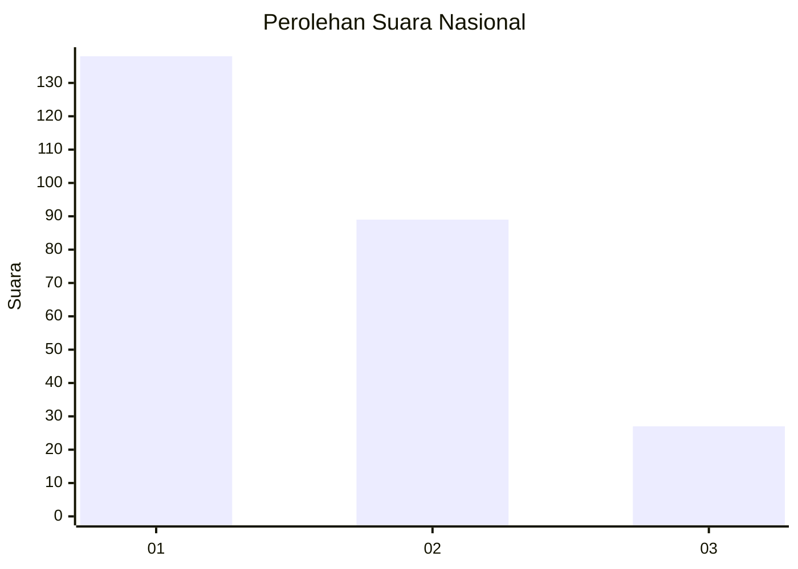
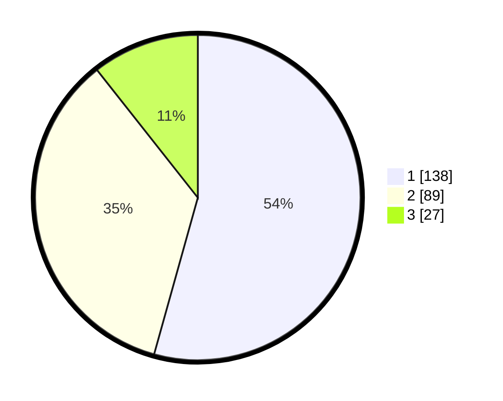

# Hasil

## Grafik

## Tabel

| No.    | Nama Paslon    | Suara | Suara (raw) | Persentase |
|:------ |:-------------- | -----:| -----------:| ----------:|
| 100025 | ANIES MUHAIMIN | 138   | [138][p-1]  | 54,33      |
| 100026 | PRABOWO GIBRAN | 89    | [89][p-2]   | 35,04      |
| 100027 | GANJAR MAHFUD  | 27    | [27][p-3]   | 10,63      |

[p-1]: https://github.com/gigit-pemilu/pemilu-2024/blob/main/pilpres/hitung-suara/sub/31-dki-jakarta/sub/73-jakarta-barat/sub/03-taman-sari/sub/1002-krukut/sub/008-tps/sub/paslon-1.txt
[p-2]: https://github.com/gigit-pemilu/pemilu-2024/blob/main/pilpres/hitung-suara/sub/31-dki-jakarta/sub/73-jakarta-barat/sub/03-taman-sari/sub/1002-krukut/sub/008-tps/sub/paslon-2.txt
[p-3]: https://github.com/gigit-pemilu/pemilu-2024/blob/main/pilpres/hitung-suara/sub/31-dki-jakarta/sub/73-jakarta-barat/sub/03-taman-sari/sub/1002-krukut/sub/008-tps/sub/paslon-3.txt

## Foto C Plano

https://sirekap-obj-formc.kpu.go.id/a87c/pemilu/ppwp/31/73/03/10/02/3173031002008-20240221-150646--1672f505-b7ad-493e-a535-d1075f376e4a.jpg

https://sirekap-obj-formc.kpu.go.id/a87c/pemilu/ppwp/31/73/03/10/02/3173031002008-20240221-150721--593e4f47-5cbd-43b9-a30e-9d607d0aa22b.jpg

https://sirekap-obj-formc.kpu.go.id/a87c/pemilu/ppwp/31/73/03/10/02/3173031002008-20240221-150747--34064a63-dc4d-4694-b5e5-7a8833e92fea.jpg

## Metadata

| Key        | Value               |
| ---------- | ------------------- |
| Time Stamp | 2024-02-21 16:00:00 |

