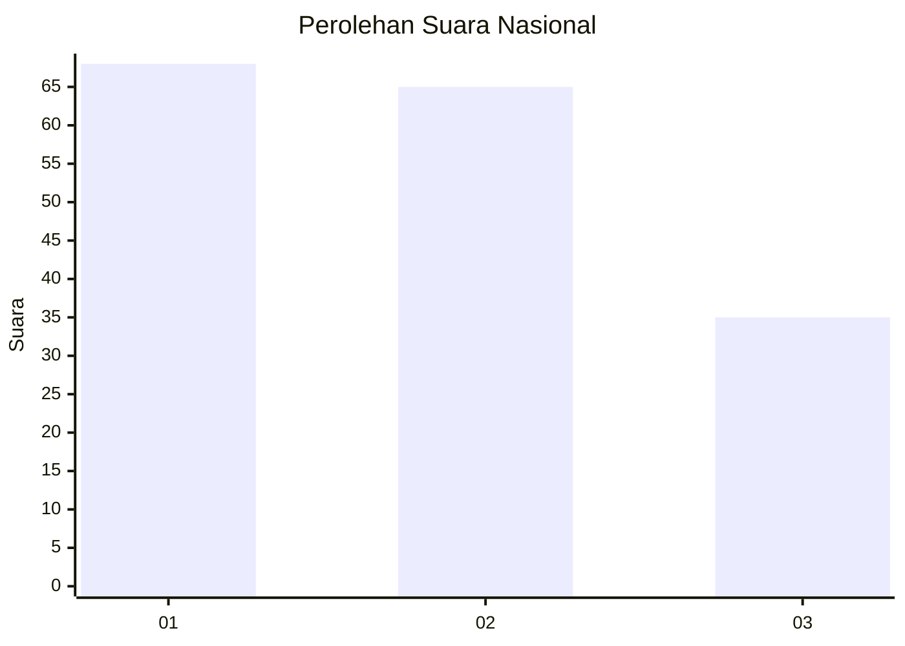
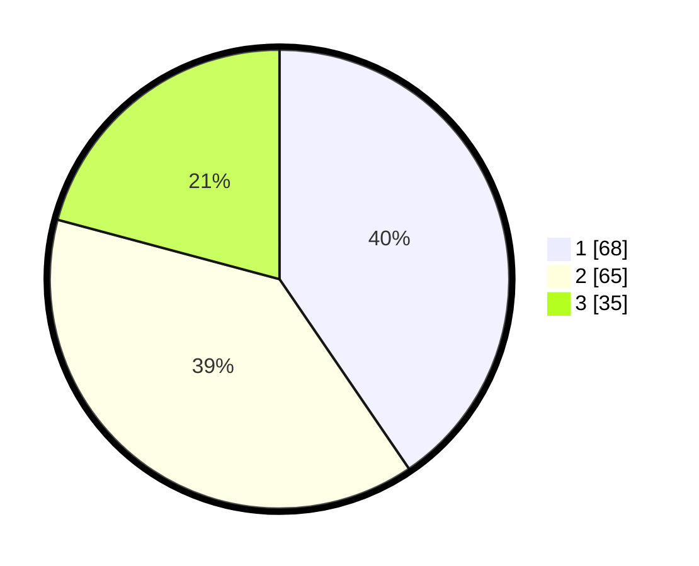

# Hasil

## Grafik

## Tabel

| No.    | Nama Paslon    | Suara | Suara (raw) | Persentase |
|:------ |:-------------- | -----:| -----------:| ----------:|
| 100025 | ANIES MUHAIMIN | 68    | [68][p-1]   | 40,48      |
| 100026 | PRABOWO GIBRAN | 65    | [65][p-2]   | 38,69      |
| 100027 | GANJAR MAHFUD  | 35    | [35][p-3]   | 20,83      |

[p-1]: https://github.com/gigit-pemilu/pemilu-2024/blob/main/pilpres/hitung-suara/sub/31-dki-jakarta/sub/73-jakarta-barat/sub/03-taman-sari/sub/1002-krukut/sub/016-tps/sub/paslon-1.txt
[p-2]: https://github.com/gigit-pemilu/pemilu-2024/blob/main/pilpres/hitung-suara/sub/31-dki-jakarta/sub/73-jakarta-barat/sub/03-taman-sari/sub/1002-krukut/sub/016-tps/sub/paslon-2.txt
[p-3]: https://github.com/gigit-pemilu/pemilu-2024/blob/main/pilpres/hitung-suara/sub/31-dki-jakarta/sub/73-jakarta-barat/sub/03-taman-sari/sub/1002-krukut/sub/016-tps/sub/paslon-3.txt

## Foto C Plano

https://sirekap-obj-formc.kpu.go.id/6d0d/pemilu/ppwp/31/73/03/10/02/3173031002016-20240221-152955--ab536ca6-b1fa-49f0-bb65-8e44174fba94.jpg

https://sirekap-obj-formc.kpu.go.id/6d0d/pemilu/ppwp/31/73/03/10/02/3173031002016-20240221-153012--ff1c77e4-4857-40fa-ba16-1746aca68da7.jpg

https://sirekap-obj-formc.kpu.go.id/6d0d/pemilu/ppwp/31/73/03/10/02/3173031002016-20240221-153038--f0b001c7-8399-4889-b0ed-195dbbaf849a.jpg

## Metadata

| Key        | Value               |
| ---------- | ------------------- |
| Time Stamp | 2024-02-21 16:00:00 |

