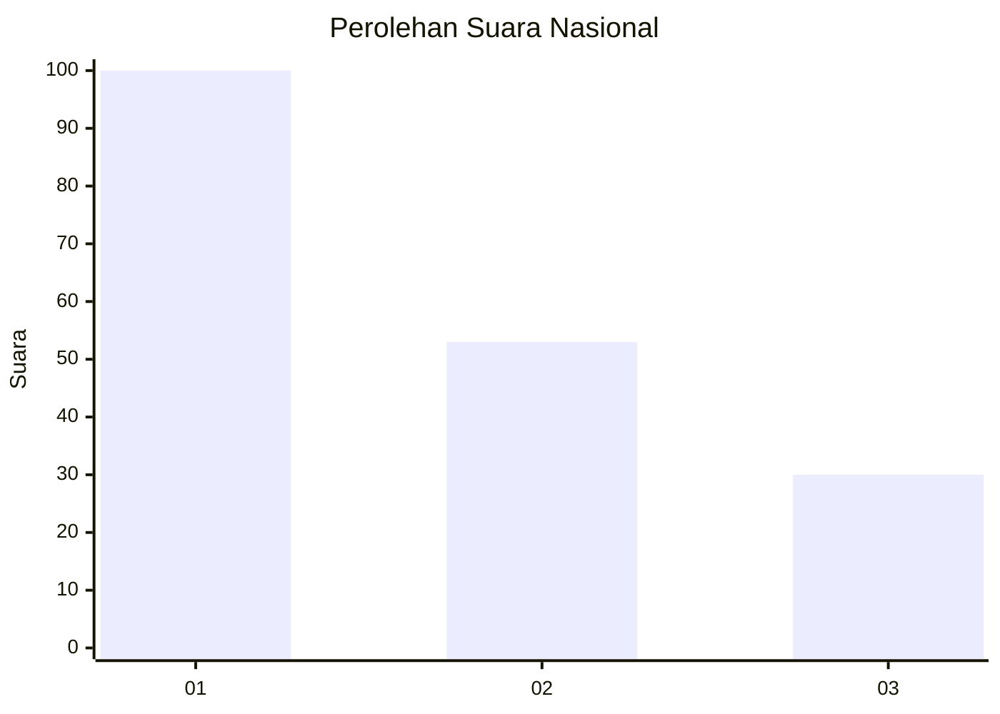
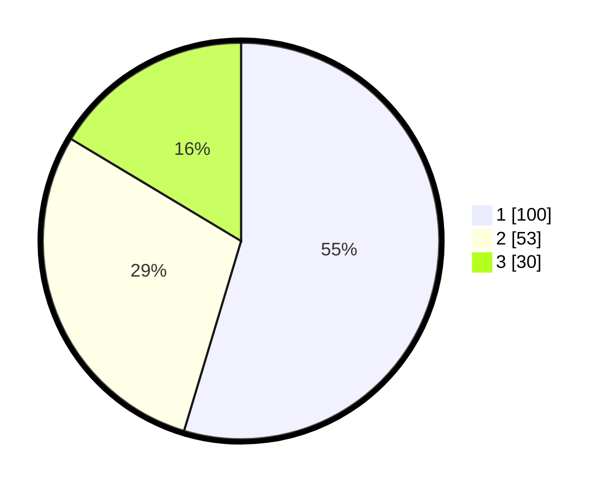

# Hasil

## Grafik

## Tabel

| No.    | Nama Paslon    | Suara | Suara (raw) | Persentase |
|:------ |:-------------- | -----:| -----------:| ----------:|
| 100025 | ANIES MUHAIMIN | 100   | [100][p-1]  | 54,64      |
| 100026 | PRABOWO GIBRAN | 53    | [53][p-2]   | 28,96      |
| 100027 | GANJAR MAHFUD  | 30    | [30][p-3]   | 16,39      |

[p-1]: https://github.com/gigit-pemilu/pemilu-2024/blob/main/pilpres/hitung-suara/sub/31-dki-jakarta/sub/73-jakarta-barat/sub/03-taman-sari/sub/1002-krukut/sub/018-tps/sub/paslon-1.txt
[p-2]: https://github.com/gigit-pemilu/pemilu-2024/blob/main/pilpres/hitung-suara/sub/31-dki-jakarta/sub/73-jakarta-barat/sub/03-taman-sari/sub/1002-krukut/sub/018-tps/sub/paslon-2.txt
[p-3]: https://github.com/gigit-pemilu/pemilu-2024/blob/main/pilpres/hitung-suara/sub/31-dki-jakarta/sub/73-jakarta-barat/sub/03-taman-sari/sub/1002-krukut/sub/018-tps/sub/paslon-3.txt

## Foto C Plano

https://sirekap-obj-formc.kpu.go.id/7a06/pemilu/ppwp/31/73/03/10/02/3173031002018-20240221-153551--a2e45d0a-4727-4de1-a22f-133c11702c02.jpg

https://sirekap-obj-formc.kpu.go.id/7a06/pemilu/ppwp/31/73/03/10/02/3173031002018-20240221-153608--dd408c6f-36ca-4b94-8e83-ab5b0e23f07c.jpg

https://sirekap-obj-formc.kpu.go.id/7a06/pemilu/ppwp/31/73/03/10/02/3173031002018-20240221-153628--f5842ee8-469f-410d-af61-5f0fb218ce1d.jpg

## Metadata

| Key        | Value               |
| ---------- | ------------------- |
| Time Stamp | 2024-02-21 16:00:00 |

