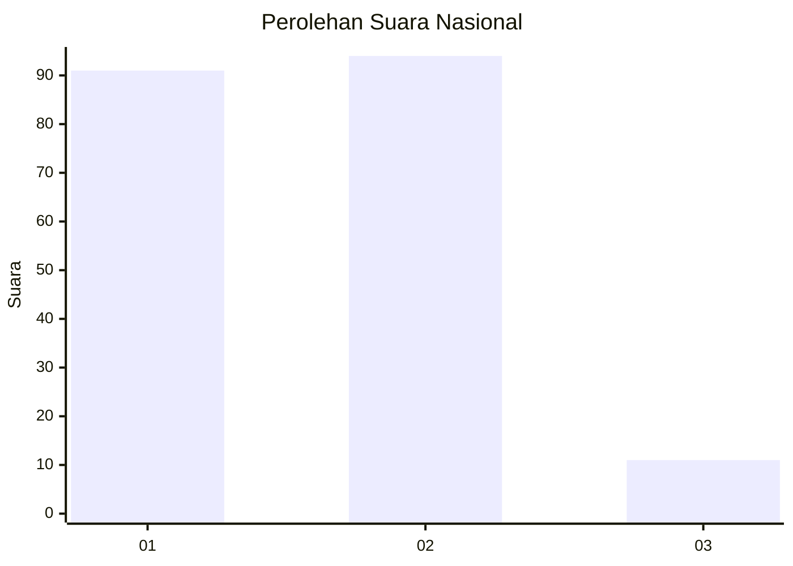
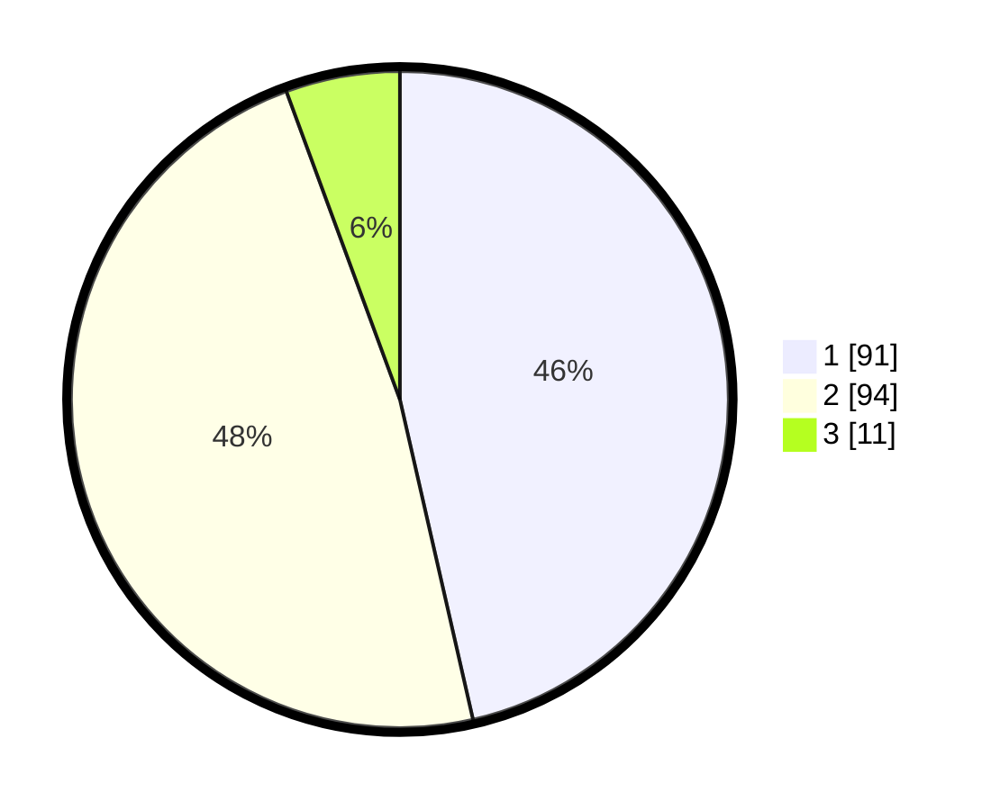

# Hasil

## Grafik

## Tabel

| No.    | Nama Paslon    | Suara | Suara (raw) | Persentase |
|:------ |:-------------- | -----:| -----------:| ----------:|
| 100025 | ANIES MUHAIMIN | 91    | [91][p-1]   | 46,43      |
| 100026 | PRABOWO GIBRAN | 94    | [94][p-2]   | 47,96      |
| 100027 | GANJAR MAHFUD  | 11    | [11][p-3]   | 5,61       |

[p-1]: https://github.com/gigit-pemilu/pemilu-2024/blob/main/pilpres/hitung-suara/sub/31-dki-jakarta/sub/73-jakarta-barat/sub/03-taman-sari/sub/1002-krukut/sub/020-tps/sub/paslon-1.txt
[p-2]: https://github.com/gigit-pemilu/pemilu-2024/blob/main/pilpres/hitung-suara/sub/31-dki-jakarta/sub/73-jakarta-barat/sub/03-taman-sari/sub/1002-krukut/sub/020-tps/sub/paslon-2.txt
[p-3]: https://github.com/gigit-pemilu/pemilu-2024/blob/main/pilpres/hitung-suara/sub/31-dki-jakarta/sub/73-jakarta-barat/sub/03-taman-sari/sub/1002-krukut/sub/020-tps/sub/paslon-3.txt

## Foto C Plano

https://sirekap-obj-formc.kpu.go.id/186d/pemilu/ppwp/31/73/03/10/02/3173031002020-20240221-154054--0e3b3c4a-31fb-47db-9334-d4698db75245.jpg

https://sirekap-obj-formc.kpu.go.id/186d/pemilu/ppwp/31/73/03/10/02/3173031002020-20240221-154139--224a9277-4def-4882-ae6e-e69a93d72c4b.jpg

https://sirekap-obj-formc.kpu.go.id/186d/pemilu/ppwp/31/73/03/10/02/3173031002020-20240221-154158--f7821650-37b9-41e5-b379-edabc707e737.jpg

## Metadata

| Key        | Value               |
| ---------- | ------------------- |
| Time Stamp | 2024-02-21 16:00:00 |

