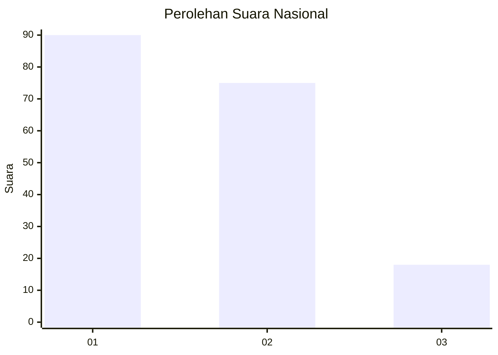
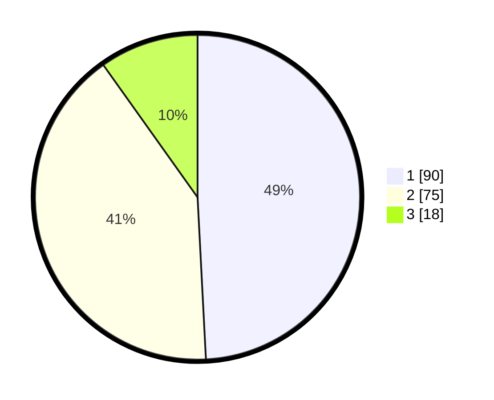

# Hasil

## Grafik

## Tabel

| No.    | Nama Paslon    | Suara | Suara (raw) | Persentase |
|:------ |:-------------- | -----:| -----------:| ----------:|
| 100025 | ANIES MUHAIMIN | 90    | [90][p-1]   | 49,18      |
| 100026 | PRABOWO GIBRAN | 75    | [75][p-2]   | 40,98      |
| 100027 | GANJAR MAHFUD  | 18    | [18][p-3]   | 9,84       |

[p-1]: https://github.com/gigit-pemilu/pemilu-2024/blob/main/pilpres/hitung-suara/sub/31-dki-jakarta/sub/73-jakarta-barat/sub/03-taman-sari/sub/1002-krukut/sub/025-tps/sub/paslon-1.txt
[p-2]: https://github.com/gigit-pemilu/pemilu-2024/blob/main/pilpres/hitung-suara/sub/31-dki-jakarta/sub/73-jakarta-barat/sub/03-taman-sari/sub/1002-krukut/sub/025-tps/sub/paslon-2.txt
[p-3]: https://github.com/gigit-pemilu/pemilu-2024/blob/main/pilpres/hitung-suara/sub/31-dki-jakarta/sub/73-jakarta-barat/sub/03-taman-sari/sub/1002-krukut/sub/025-tps/sub/paslon-3.txt

## Foto C Plano

https://sirekap-obj-formc.kpu.go.id/418d/pemilu/ppwp/31/73/03/10/02/3173031002025-20240221-161824--28f8c3fa-f039-49cd-b79e-620d35cf2e68.jpg

https://sirekap-obj-formc.kpu.go.id/418d/pemilu/ppwp/31/73/03/10/02/3173031002025-20240221-161903--001d20e6-60b5-48bf-94b8-c2e41fe14d80.jpg

https://sirekap-obj-formc.kpu.go.id/418d/pemilu/ppwp/31/73/03/10/02/3173031002025-20240221-161924--7d51878b-d4b3-4352-bbef-001ebbebebfc.jpg

## Metadata

| Key        | Value               |
| ---------- | ------------------- |
| Time Stamp | 2024-02-21 17:00:00 |

