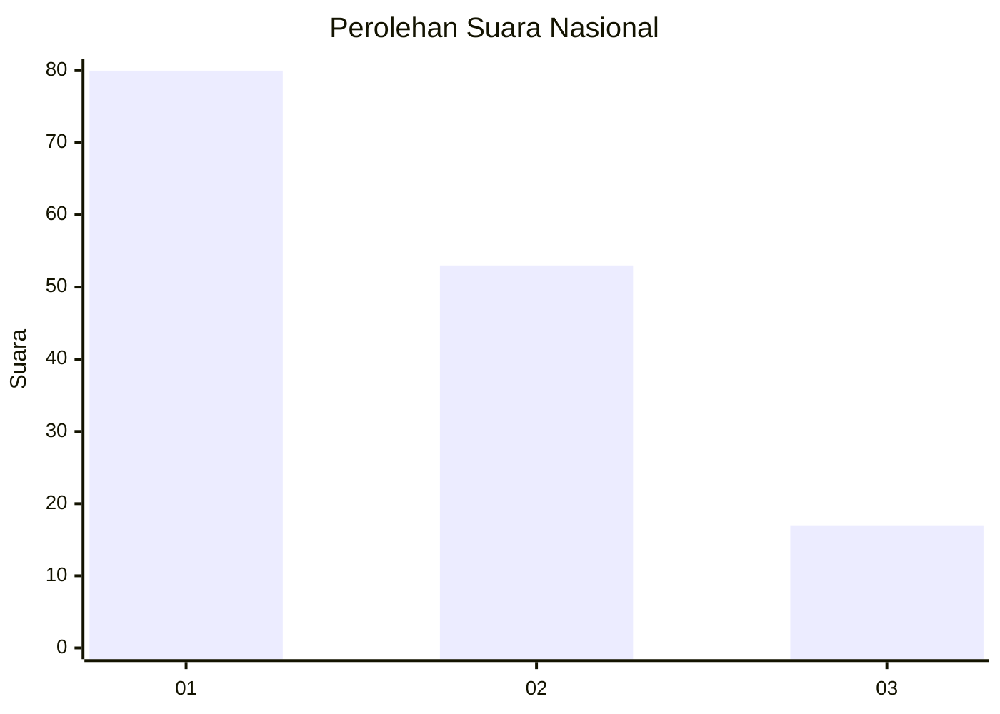
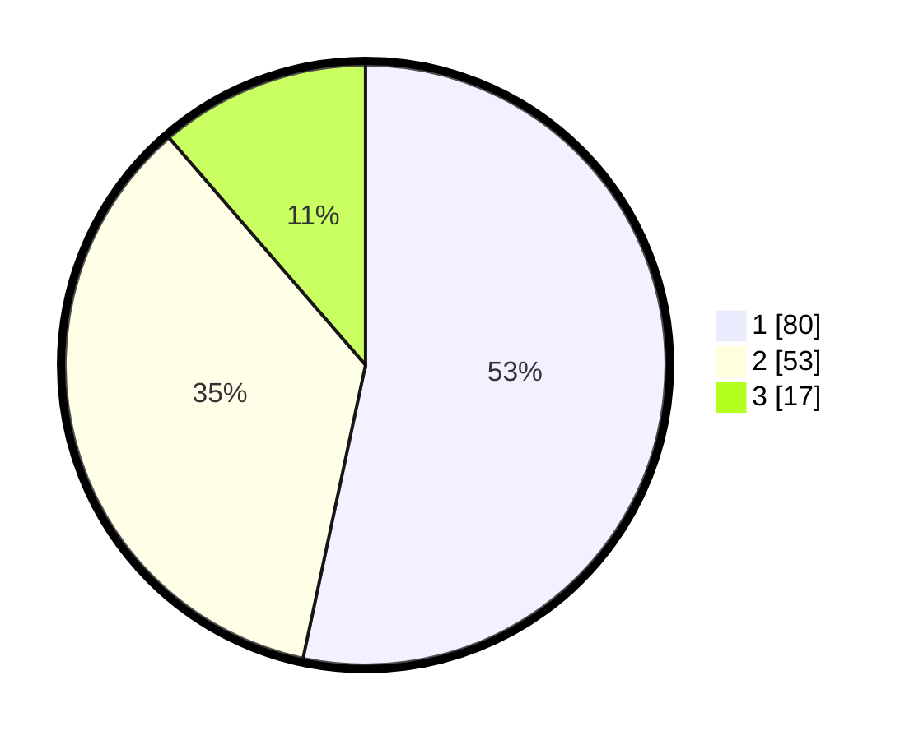

# Hasil

## Grafik

## Tabel

| No.    | Nama Paslon    | Suara | Suara (raw) | Persentase |
|:------ |:-------------- | -----:| -----------:| ----------:|
| 100025 | ANIES MUHAIMIN | 80    | [80][p-1]   | 53,33      |
| 100026 | PRABOWO GIBRAN | 53    | [53][p-2]   | 35,33      |
| 100027 | GANJAR MAHFUD  | 17    | [17][p-3]   | 11,33      |

[p-1]: https://github.com/gigit-pemilu/pemilu-2024/blob/main/pilpres/hitung-suara/sub/31-dki-jakarta/sub/73-jakarta-barat/sub/03-taman-sari/sub/1002-krukut/sub/026-tps/sub/paslon-1.txt
[p-2]: https://github.com/gigit-pemilu/pemilu-2024/blob/main/pilpres/hitung-suara/sub/31-dki-jakarta/sub/73-jakarta-barat/sub/03-taman-sari/sub/1002-krukut/sub/026-tps/sub/paslon-2.txt
[p-3]: https://github.com/gigit-pemilu/pemilu-2024/blob/main/pilpres/hitung-suara/sub/31-dki-jakarta/sub/73-jakarta-barat/sub/03-taman-sari/sub/1002-krukut/sub/026-tps/sub/paslon-3.txt

## Foto C Plano

https://sirekap-obj-formc.kpu.go.id/8265/pemilu/ppwp/31/73/03/10/02/3173031002026-20240215-005725--dce85cc0-1a16-407e-a933-946c6bc7e176.jpg

https://sirekap-obj-formc.kpu.go.id/8265/pemilu/ppwp/31/73/03/10/02/3173031002026-20240215-005846--81b89020-a00c-48ef-9d77-86fdb6915c2b.jpg

https://sirekap-obj-formc.kpu.go.id/8265/pemilu/ppwp/31/73/03/10/02/3173031002026-20240215-005953--002a169b-d7e6-488b-ae0b-cc2a7ca579f2.jpg

## Metadata

| Key        | Value               |
| ---------- | ------------------- |
| Time Stamp | 2024-02-17 16:36:25 |

