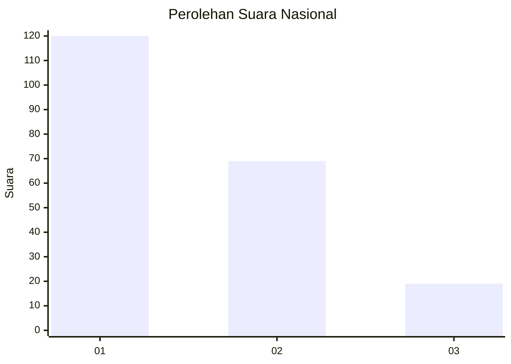
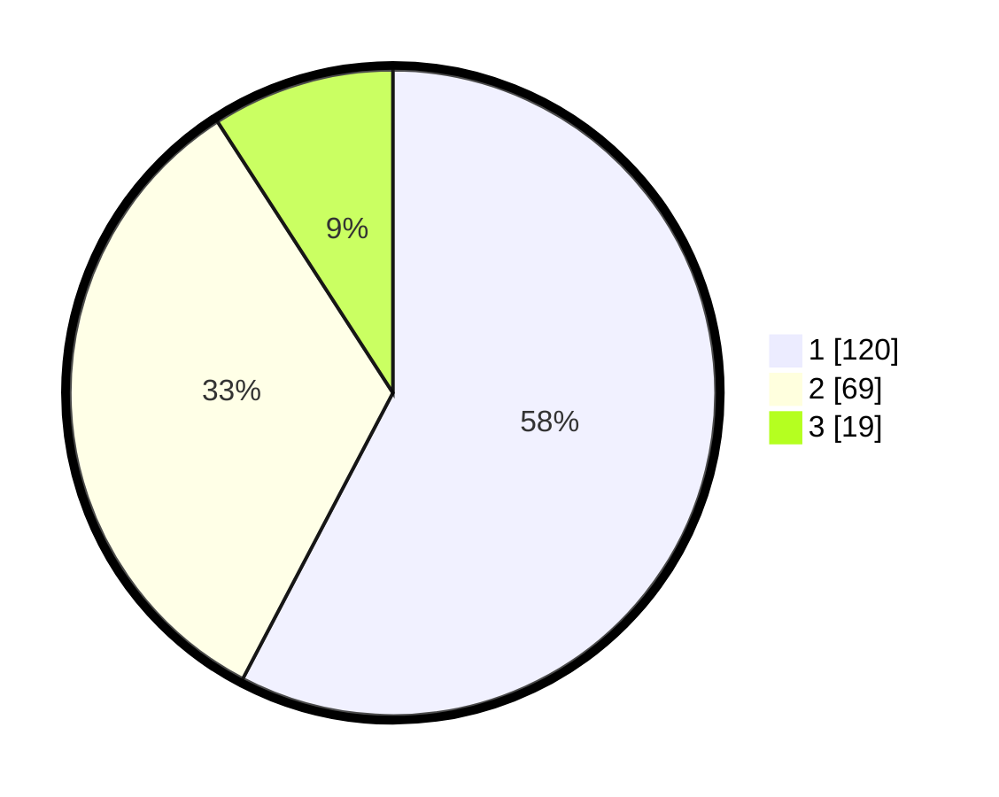

# Hasil

## Grafik

## Tabel

| No.    | Nama Paslon    | Suara | Suara (raw) | Persentase |
|:------ |:-------------- | -----:| -----------:| ----------:|
| 100025 | ANIES MUHAIMIN | 120   | [120][p-1]  | 57,69      |
| 100026 | PRABOWO GIBRAN | 69    | [69][p-2]   | 33,17      |
| 100027 | GANJAR MAHFUD  | 19    | [19][p-3]   | 9,13       |

[p-1]: https://github.com/gigit-pemilu/pemilu-2024/blob/main/pilpres/hitung-suara/sub/31-dki-jakarta/sub/73-jakarta-barat/sub/03-taman-sari/sub/1002-krukut/sub/030-tps/sub/paslon-1.txt
[p-2]: https://github.com/gigit-pemilu/pemilu-2024/blob/main/pilpres/hitung-suara/sub/31-dki-jakarta/sub/73-jakarta-barat/sub/03-taman-sari/sub/1002-krukut/sub/030-tps/sub/paslon-2.txt
[p-3]: https://github.com/gigit-pemilu/pemilu-2024/blob/main/pilpres/hitung-suara/sub/31-dki-jakarta/sub/73-jakarta-barat/sub/03-taman-sari/sub/1002-krukut/sub/030-tps/sub/paslon-3.txt

## Foto C Plano

https://sirekap-obj-formc.kpu.go.id/1766/pemilu/ppwp/31/73/03/10/02/3173031002030-20240221-163052--d3c064d4-5200-4951-ab3b-97824ede9cde.jpg

https://sirekap-obj-formc.kpu.go.id/1766/pemilu/ppwp/31/73/03/10/02/3173031002030-20240221-163133--df59b76a-dd9c-4899-9032-04fbd6dcb3dd.jpg

https://sirekap-obj-formc.kpu.go.id/1766/pemilu/ppwp/31/73/03/10/02/3173031002030-20240221-163204--4d6d26f0-fc86-4a90-9c83-47dff50c827d.jpg

## Metadata

| Key        | Value               |
| ---------- | ------------------- |
| Time Stamp | 2024-02-21 18:00:00 |

