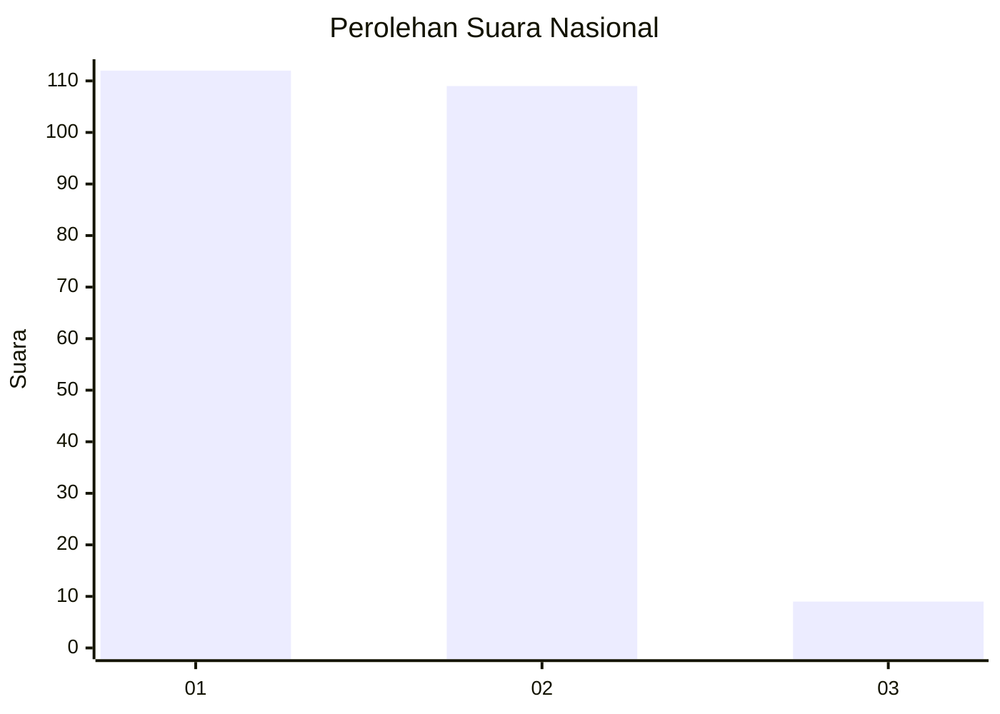
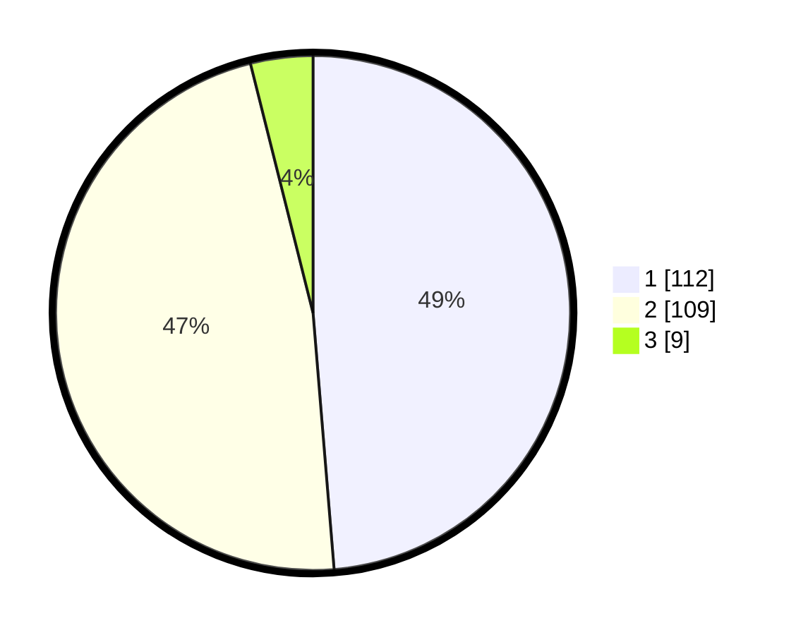

# Hasil

## Grafik

## Tabel

| No.    | Nama Paslon    | Suara | Suara (raw) | Persentase |
|:------ |:-------------- | -----:| -----------:| ----------:|
| 100025 | ANIES MUHAIMIN | 112   | [112][p-1]  | 48,70      |
| 100026 | PRABOWO GIBRAN | 109   | [109][p-2]  | 47,39      |
| 100027 | GANJAR MAHFUD  | 9     | [9][p-3]    | 3,91       |

[p-1]: https://github.com/gigit-pemilu/pemilu-2024/blob/main/pilpres/hitung-suara/sub/31-dki-jakarta/sub/73-jakarta-barat/sub/03-taman-sari/sub/1002-krukut/sub/032-tps/sub/paslon-1.txt
[p-2]: https://github.com/gigit-pemilu/pemilu-2024/blob/main/pilpres/hitung-suara/sub/31-dki-jakarta/sub/73-jakarta-barat/sub/03-taman-sari/sub/1002-krukut/sub/032-tps/sub/paslon-2.txt
[p-3]: https://github.com/gigit-pemilu/pemilu-2024/blob/main/pilpres/hitung-suara/sub/31-dki-jakarta/sub/73-jakarta-barat/sub/03-taman-sari/sub/1002-krukut/sub/032-tps/sub/paslon-3.txt

## Foto C Plano

https://sirekap-obj-formc.kpu.go.id/42c0/pemilu/ppwp/31/73/03/10/02/3173031002032-20240215-021816--7dcf71c0-460f-4df6-9f7c-6994d70ea90b.jpg

https://sirekap-obj-formc.kpu.go.id/42c0/pemilu/ppwp/31/73/03/10/02/3173031002032-20240215-022009--61dc6dfc-5848-49d3-86b2-54bf93e70241.jpg

https://sirekap-obj-formc.kpu.go.id/42c0/pemilu/ppwp/31/73/03/10/02/3173031002032-20240215-022101--6138d846-ff08-43ce-bc05-088b0406138f.jpg

## Metadata

| Key        | Value               |
| ---------- | ------------------- |
| Time Stamp | 2024-02-16 02:00:27 |

