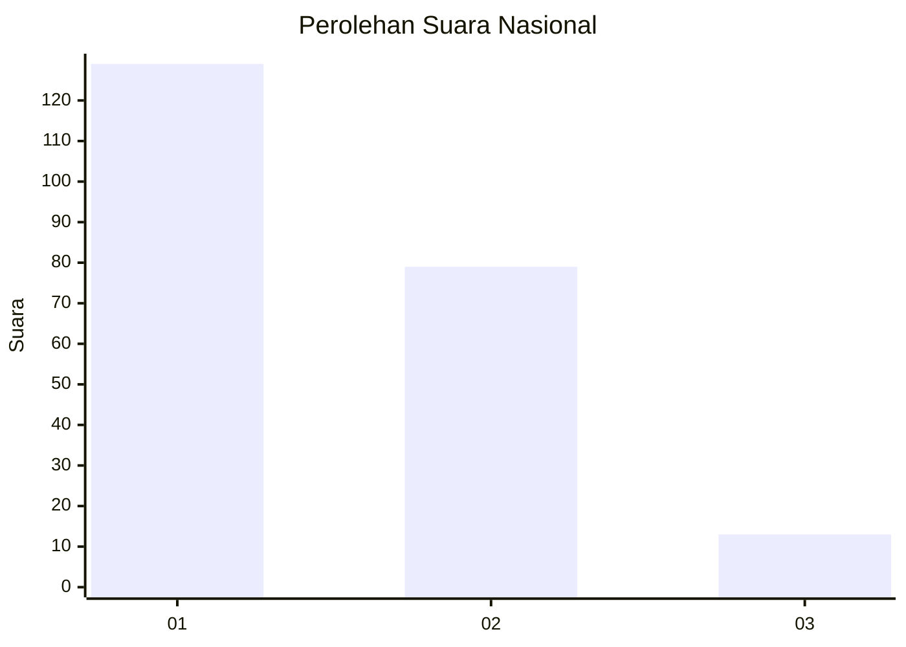
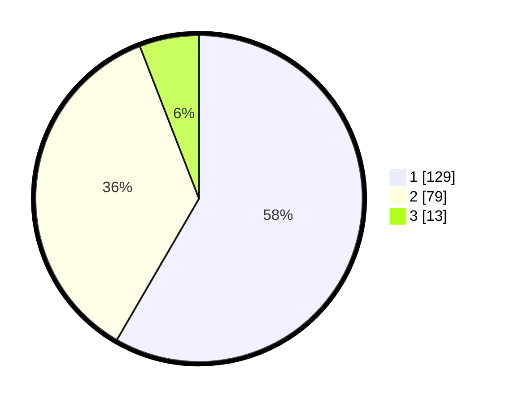

# Hasil

## Grafik

## Tabel

| No.    | Nama Paslon    | Suara | Suara (raw) | Persentase |
|:------ |:-------------- | -----:| -----------:| ----------:|
| 100025 | ANIES MUHAIMIN | 129   | [129][p-1]  | 58,37      |
| 100026 | PRABOWO GIBRAN | 79    | [79][p-2]   | 35,75      |
| 100027 | GANJAR MAHFUD  | 13    | [13][p-3]   | 5,88       |

[p-1]: https://github.com/gigit-pemilu/pemilu-2024/blob/main/pilpres/hitung-suara/sub/31-dki-jakarta/sub/73-jakarta-barat/sub/03-taman-sari/sub/1002-krukut/sub/042-tps/sub/paslon-1.txt
[p-2]: https://github.com/gigit-pemilu/pemilu-2024/blob/main/pilpres/hitung-suara/sub/31-dki-jakarta/sub/73-jakarta-barat/sub/03-taman-sari/sub/1002-krukut/sub/042-tps/sub/paslon-2.txt
[p-3]: https://github.com/gigit-pemilu/pemilu-2024/blob/main/pilpres/hitung-suara/sub/31-dki-jakarta/sub/73-jakarta-barat/sub/03-taman-sari/sub/1002-krukut/sub/042-tps/sub/paslon-3.txt

## Foto C Plano

https://sirekap-obj-formc.kpu.go.id/c3a0/pemilu/ppwp/31/73/03/10/02/3173031002042-20240221-165337--4c221d9b-c16d-4cab-ad07-767bb2d3fb71.jpg

https://sirekap-obj-formc.kpu.go.id/c3a0/pemilu/ppwp/31/73/03/10/02/3173031002042-20240214-193451--b44d5571-a279-4246-8ff0-6eed0145c8e1.jpg

https://sirekap-obj-formc.kpu.go.id/c3a0/pemilu/ppwp/31/73/03/10/02/3173031002042-20240214-193555--590082d0-b57c-461e-b5d7-758deb515ce3.jpg

## Metadata

| Key        | Value               |
| ---------- | ------------------- |
| Time Stamp | 2024-02-21 17:00:00 |

