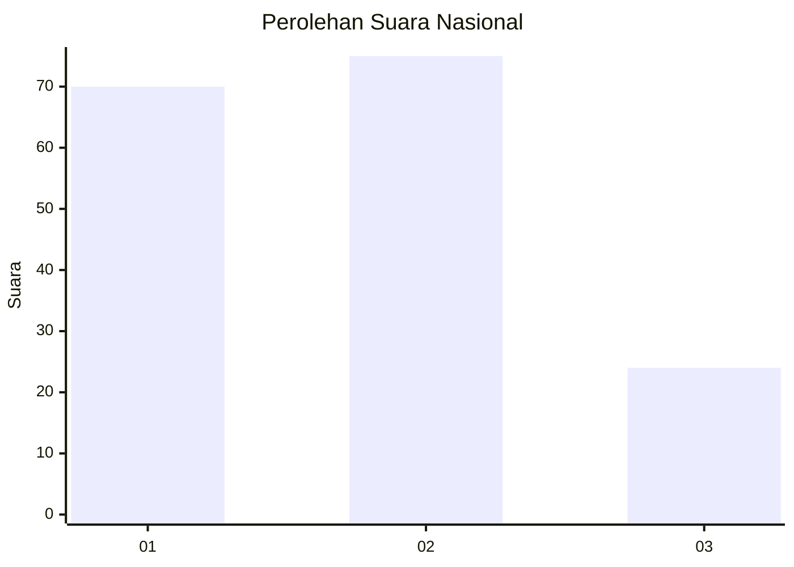
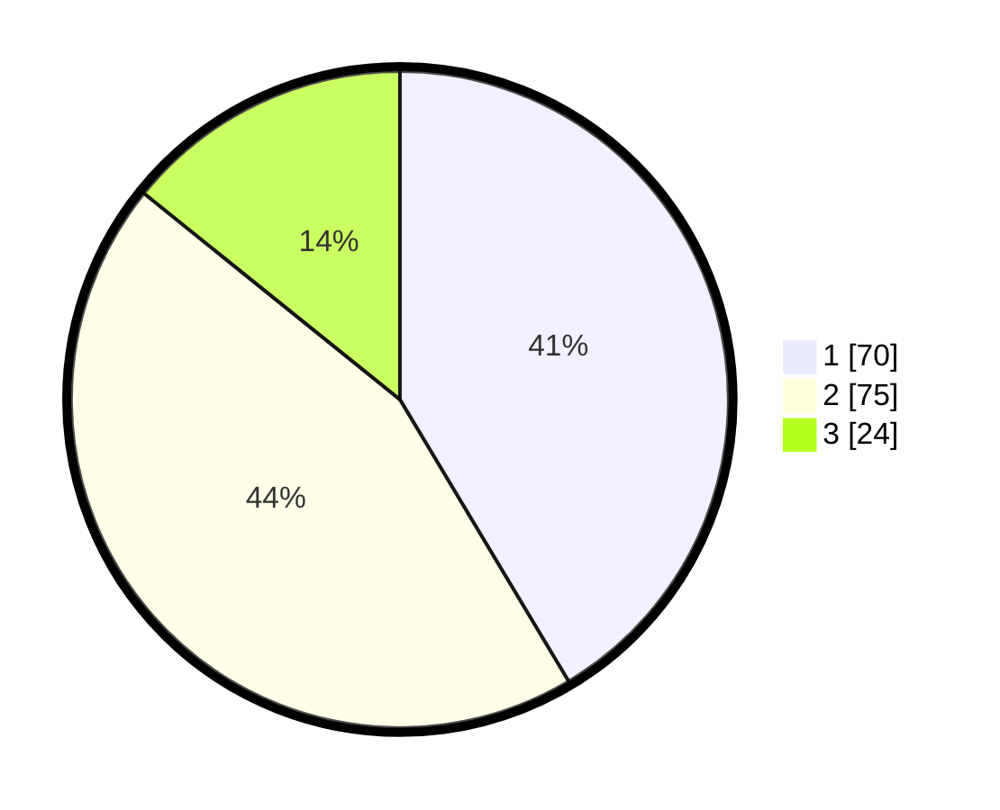

# Hasil

## Grafik

## Tabel

| No.    | Nama Paslon    | Suara | Suara (raw) | Persentase |
|:------ |:-------------- | -----:| -----------:| ----------:|
| 100025 | ANIES MUHAIMIN | 70    | [70][p-1]   | 41,42      |
| 100026 | PRABOWO GIBRAN | 75    | [75][p-2]   | 44,38      |
| 100027 | GANJAR MAHFUD  | 24    | [24][p-3]   | 14,20      |

[p-1]: https://github.com/gigit-pemilu/pemilu-2024/blob/main/pilpres/hitung-suara/sub/31-dki-jakarta/sub/73-jakarta-barat/sub/03-taman-sari/sub/1002-krukut/sub/046-tps/sub/paslon-1.txt
[p-2]: https://github.com/gigit-pemilu/pemilu-2024/blob/main/pilpres/hitung-suara/sub/31-dki-jakarta/sub/73-jakarta-barat/sub/03-taman-sari/sub/1002-krukut/sub/046-tps/sub/paslon-2.txt
[p-3]: https://github.com/gigit-pemilu/pemilu-2024/blob/main/pilpres/hitung-suara/sub/31-dki-jakarta/sub/73-jakarta-barat/sub/03-taman-sari/sub/1002-krukut/sub/046-tps/sub/paslon-3.txt

## Foto C Plano

https://sirekap-obj-formc.kpu.go.id/0483/pemilu/ppwp/31/73/03/10/02/3173031002046-20240214-203906--6190748e-f57a-4106-bf64-5984ea452f75.jpg

https://sirekap-obj-formc.kpu.go.id/0483/pemilu/ppwp/31/73/03/10/02/3173031002046-20240214-155616--8e292dfa-bd3c-43b7-a83b-b847cb4ebfb7.jpg

https://sirekap-obj-formc.kpu.go.id/0483/pemilu/ppwp/31/73/03/10/02/3173031002046-20240214-203859--eeb6bd18-3fcd-4b88-813e-f7aee22557d0.jpg

## Metadata

| Key        | Value               |
| ---------- | ------------------- |
| Time Stamp | 2024-02-17 16:36:25 |

