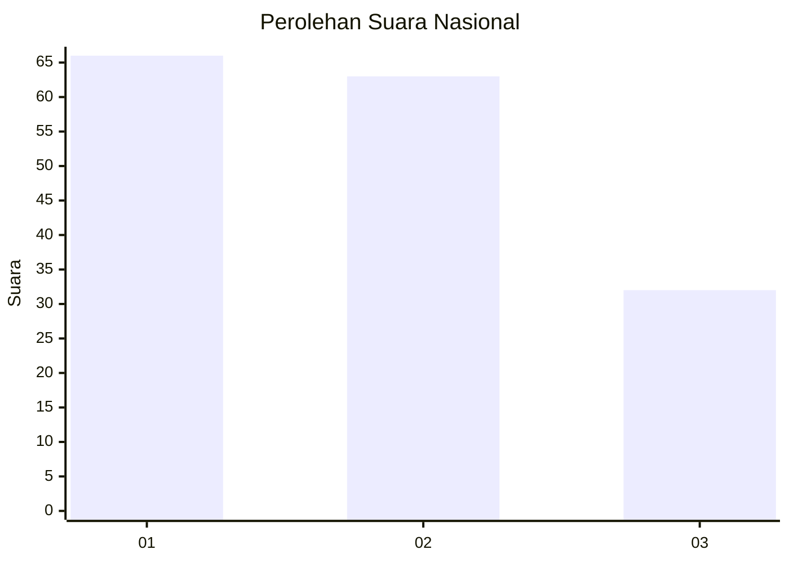
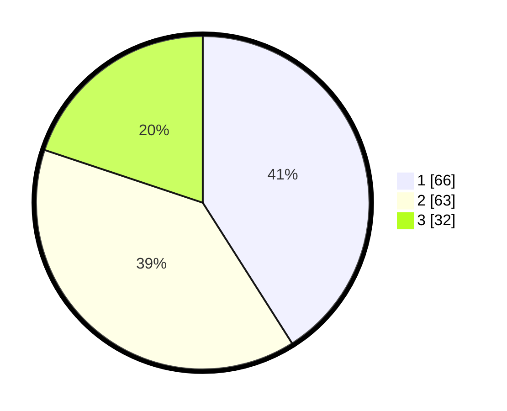

# Hasil

## Grafik

## Tabel

| No.    | Nama Paslon    | Suara | Suara (raw) | Persentase |
|:------ |:-------------- | -----:| -----------:| ----------:|
| 100025 | ANIES MUHAIMIN | 66    | [66][p-1]   | 40,99      |
| 100026 | PRABOWO GIBRAN | 63    | [63][p-2]   | 39,13      |
| 100027 | GANJAR MAHFUD  | 32    | [32][p-3]   | 19,88      |

[p-1]: https://github.com/gigit-pemilu/pemilu-2024/blob/main/pilpres/hitung-suara/sub/31-dki-jakarta/sub/73-jakarta-barat/sub/03-taman-sari/sub/1002-krukut/sub/047-tps/sub/paslon-1.txt
[p-2]: https://github.com/gigit-pemilu/pemilu-2024/blob/main/pilpres/hitung-suara/sub/31-dki-jakarta/sub/73-jakarta-barat/sub/03-taman-sari/sub/1002-krukut/sub/047-tps/sub/paslon-2.txt
[p-3]: https://github.com/gigit-pemilu/pemilu-2024/blob/main/pilpres/hitung-suara/sub/31-dki-jakarta/sub/73-jakarta-barat/sub/03-taman-sari/sub/1002-krukut/sub/047-tps/sub/paslon-3.txt

## Foto C Plano

https://sirekap-obj-formc.kpu.go.id/70f6/pemilu/ppwp/31/73/03/10/02/3173031002047-20240214-215631--e019cf8b-2724-4f6f-bd40-572419daa132.jpg

https://sirekap-obj-formc.kpu.go.id/70f6/pemilu/ppwp/31/73/03/10/02/3173031002047-20240214-215639--c75f2747-16e5-4876-9221-641abb6f61da.jpg

https://sirekap-obj-formc.kpu.go.id/70f6/pemilu/ppwp/31/73/03/10/02/3173031002047-20240214-215641--00c7980e-3f21-49b5-a08a-40efe9dc44d1.jpg

## Metadata

| Key        | Value               |
| ---------- | ------------------- |
| Time Stamp | 2024-02-21 17:00:00 |

