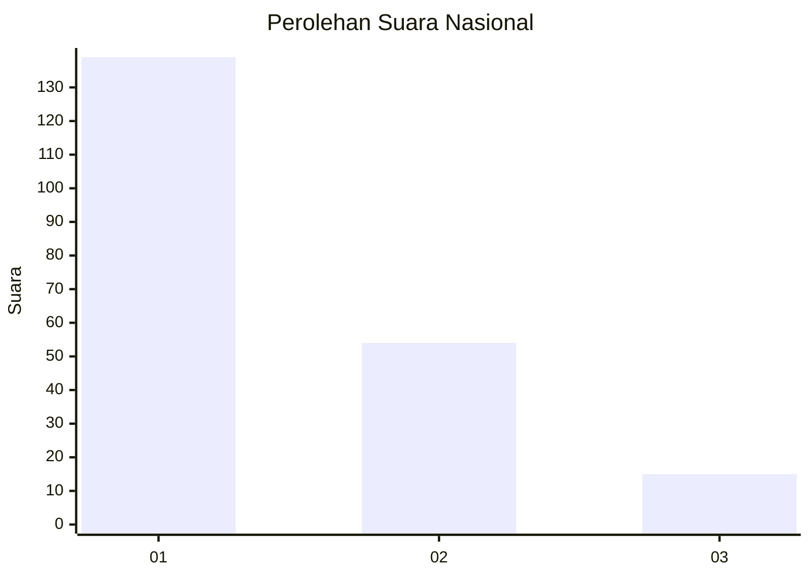
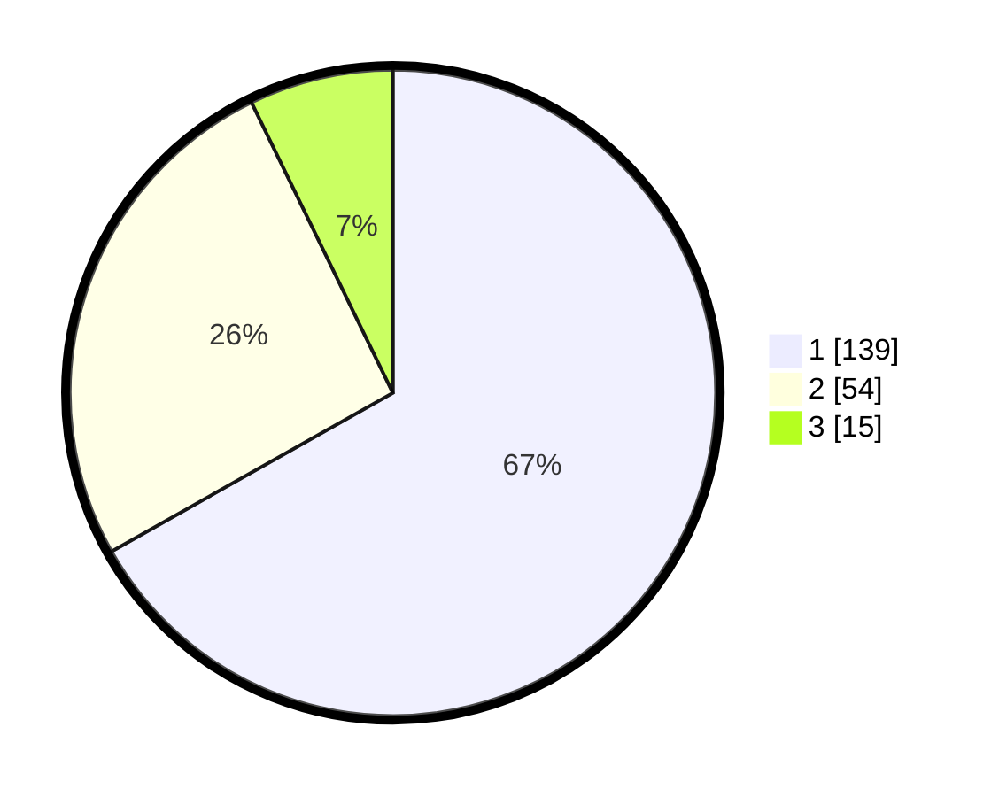

# Hasil

## Grafik

## Tabel

| No.    | Nama Paslon    | Suara | Suara (raw) | Persentase |
|:------ |:-------------- | -----:| -----------:| ----------:|
| 100025 | ANIES MUHAIMIN | 139   | [139][p-1]  | 66,83      |
| 100026 | PRABOWO GIBRAN | 54    | [54][p-2]   | 25,96      |
| 100027 | GANJAR MAHFUD  | 15    | [15][p-3]   | 7,21       |

[p-1]: https://github.com/gigit-pemilu/pemilu-2024/blob/main/pilpres/hitung-suara/sub/31-dki-jakarta/sub/73-jakarta-barat/sub/03-taman-sari/sub/1002-krukut/sub/057-tps/sub/paslon-1.txt
[p-2]: https://github.com/gigit-pemilu/pemilu-2024/blob/main/pilpres/hitung-suara/sub/31-dki-jakarta/sub/73-jakarta-barat/sub/03-taman-sari/sub/1002-krukut/sub/057-tps/sub/paslon-2.txt
[p-3]: https://github.com/gigit-pemilu/pemilu-2024/blob/main/pilpres/hitung-suara/sub/31-dki-jakarta/sub/73-jakarta-barat/sub/03-taman-sari/sub/1002-krukut/sub/057-tps/sub/paslon-3.txt

## Foto C Plano

https://sirekap-obj-formc.kpu.go.id/1411/pemilu/ppwp/31/73/03/10/02/3173031002057-20240214-211931--da5905e6-0abb-4fd4-b1c6-08507fddb339.jpg

https://sirekap-obj-formc.kpu.go.id/1411/pemilu/ppwp/31/73/03/10/02/3173031002057-20240214-192436--658f08b1-4840-44a5-8ca4-95af7e9c4697.jpg

https://sirekap-obj-formc.kpu.go.id/1411/pemilu/ppwp/31/73/03/10/02/3173031002057-20240214-192657--aa3629fe-38c1-4c88-be6f-84305723f9fa.jpg

## Metadata

| Key        | Value               |
| ---------- | ------------------- |
| Time Stamp | 2024-02-19 22:00:00 |

