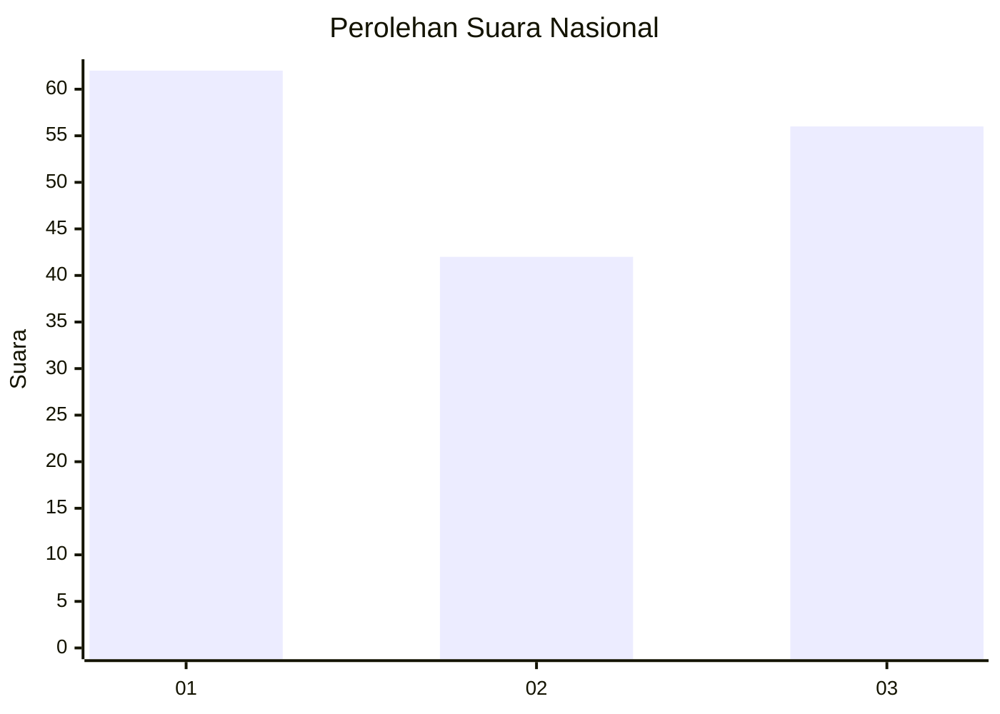
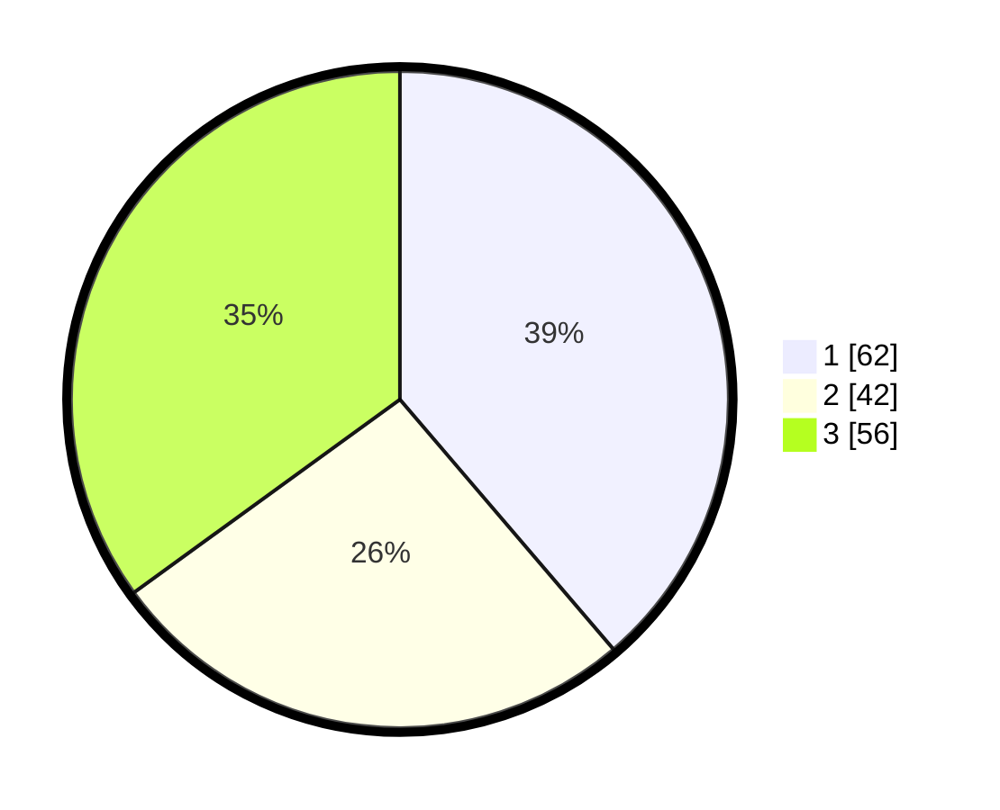

# Hasil

## Grafik

## Tabel

| No.    | Nama Paslon    | Suara | Suara (raw) | Persentase |
|:------ |:-------------- | -----:| -----------:| ----------:|
| 100025 | ANIES MUHAIMIN | 62    | [62][p-1]   | 38,75      |
| 100026 | PRABOWO GIBRAN | 42    | [42][p-2]   | 26,25      |
| 100027 | GANJAR MAHFUD  | 56    | [56][p-3]   | 35,00      |

[p-1]: https://github.com/gigit-pemilu/pemilu-2024/blob/main/pilpres/hitung-suara/sub/31-dki-jakarta/sub/73-jakarta-barat/sub/03-taman-sari/sub/1003-maphar/sub/009-tps/sub/paslon-1.txt
[p-2]: https://github.com/gigit-pemilu/pemilu-2024/blob/main/pilpres/hitung-suara/sub/31-dki-jakarta/sub/73-jakarta-barat/sub/03-taman-sari/sub/1003-maphar/sub/009-tps/sub/paslon-2.txt
[p-3]: https://github.com/gigit-pemilu/pemilu-2024/blob/main/pilpres/hitung-suara/sub/31-dki-jakarta/sub/73-jakarta-barat/sub/03-taman-sari/sub/1003-maphar/sub/009-tps/sub/paslon-3.txt

## Foto C Plano

https://sirekap-obj-formc.kpu.go.id/b586/pemilu/ppwp/31/73/03/10/03/3173031003009-20240214-212432--ff7c164f-e2a0-4b6e-820c-f3ccacde4322.jpg

https://sirekap-obj-formc.kpu.go.id/b586/pemilu/ppwp/31/73/03/10/03/3173031003009-20240214-212609--682dca2c-95f3-4809-b4a2-95afb838c027.jpg

https://sirekap-obj-formc.kpu.go.id/b586/pemilu/ppwp/31/73/03/10/03/3173031003009-20240214-213054--91ecc052-ba93-4da4-8300-1376e00b51bf.jpg

## Metadata

| Key        | Value               |
| ---------- | ------------------- |
| Time Stamp | 2024-02-16 02:30:27 |

