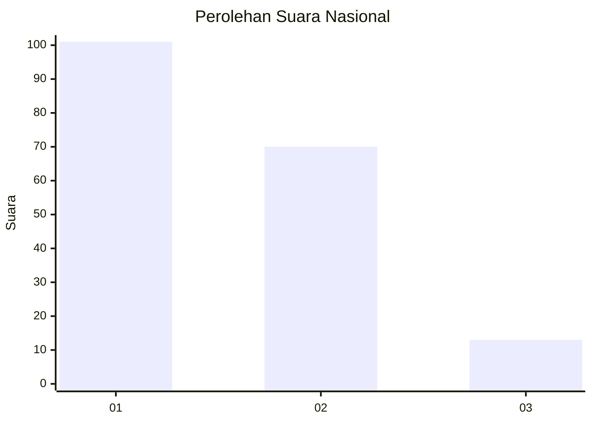
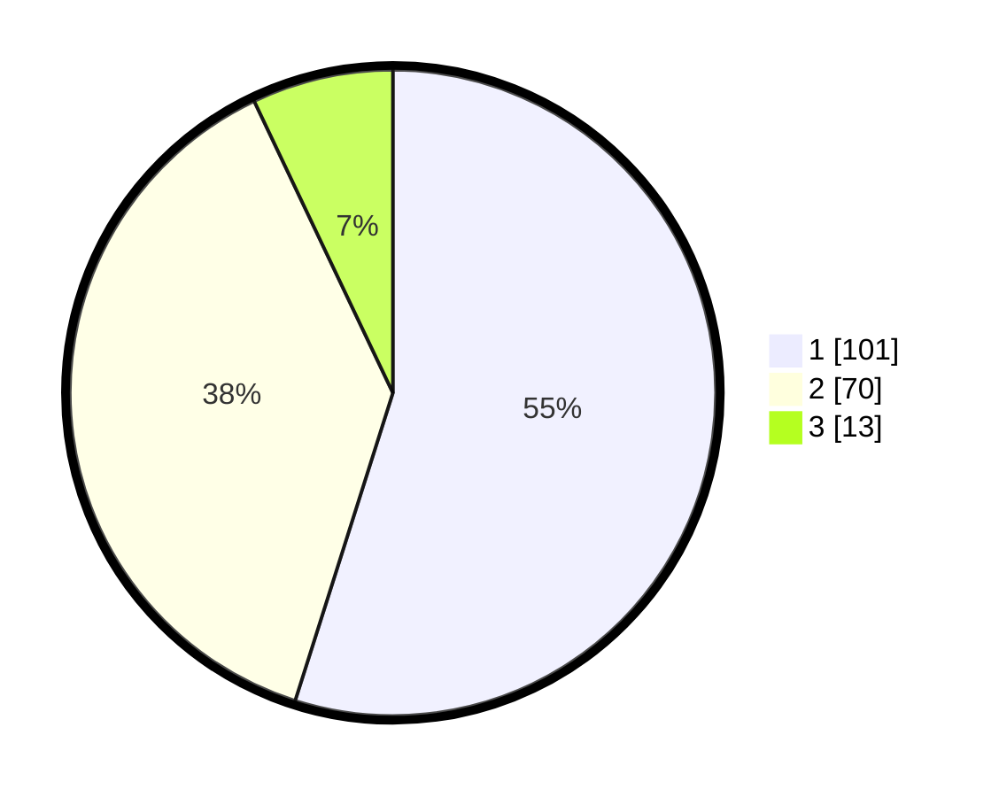

# Hasil

## Grafik

## Tabel

| No.    | Nama Paslon    | Suara | Suara (raw) | Persentase |
|:------ |:-------------- | -----:| -----------:| ----------:|
| 100025 | ANIES MUHAIMIN | 101   | [101][p-1]  | 54,89      |
| 100026 | PRABOWO GIBRAN | 70    | [70][p-2]   | 38,04      |
| 100027 | GANJAR MAHFUD  | 13    | [13][p-3]   | 7,07       |

[p-1]: https://github.com/gigit-pemilu/pemilu-2024/blob/main/pilpres/hitung-suara/sub/31-dki-jakarta/sub/73-jakarta-barat/sub/03-taman-sari/sub/1003-maphar/sub/012-tps/sub/paslon-1.txt
[p-2]: https://github.com/gigit-pemilu/pemilu-2024/blob/main/pilpres/hitung-suara/sub/31-dki-jakarta/sub/73-jakarta-barat/sub/03-taman-sari/sub/1003-maphar/sub/012-tps/sub/paslon-2.txt
[p-3]: https://github.com/gigit-pemilu/pemilu-2024/blob/main/pilpres/hitung-suara/sub/31-dki-jakarta/sub/73-jakarta-barat/sub/03-taman-sari/sub/1003-maphar/sub/012-tps/sub/paslon-3.txt

## Foto C Plano

https://sirekap-obj-formc.kpu.go.id/4548/pemilu/ppwp/31/73/03/10/03/3173031003012-20240214-212829--e85f6f55-ce93-4438-9a1d-f4fad4e21a96.jpg

https://sirekap-obj-formc.kpu.go.id/4548/pemilu/ppwp/31/73/03/10/03/3173031003012-20240214-213241--a4813e4f-e18d-4074-9496-773152e34f22.jpg

https://sirekap-obj-formc.kpu.go.id/4548/pemilu/ppwp/31/73/03/10/03/3173031003012-20240214-213341--149832de-f3bc-4781-aeb5-b867a8ecdf02.jpg

## Metadata

| Key        | Value               |
| ---------- | ------------------- |
| Time Stamp | 2024-02-16 02:30:27 |

