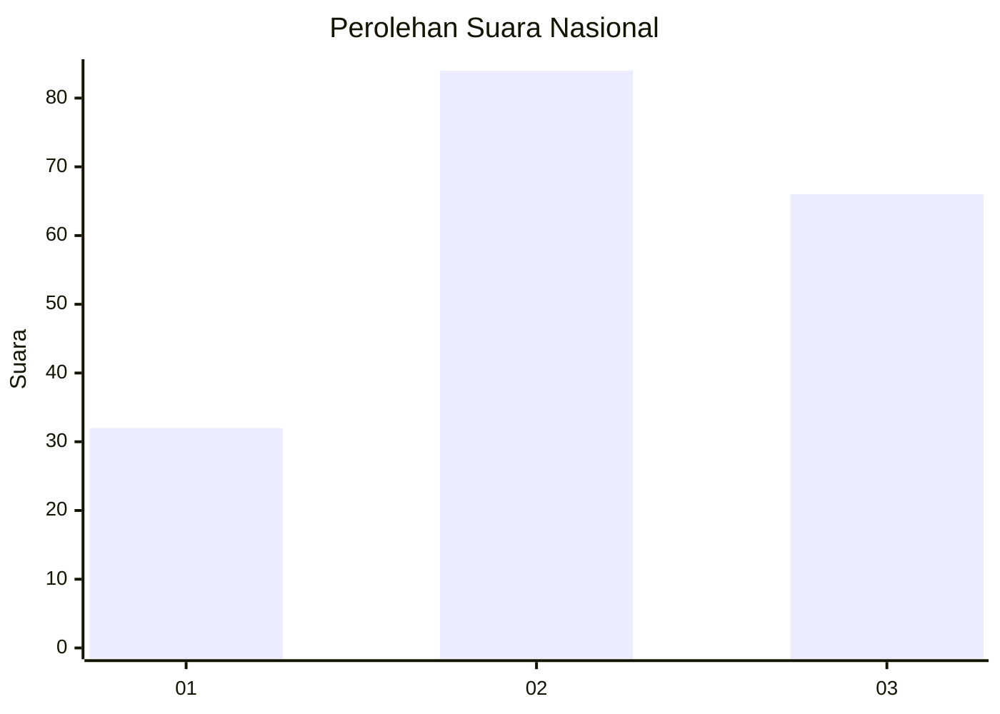
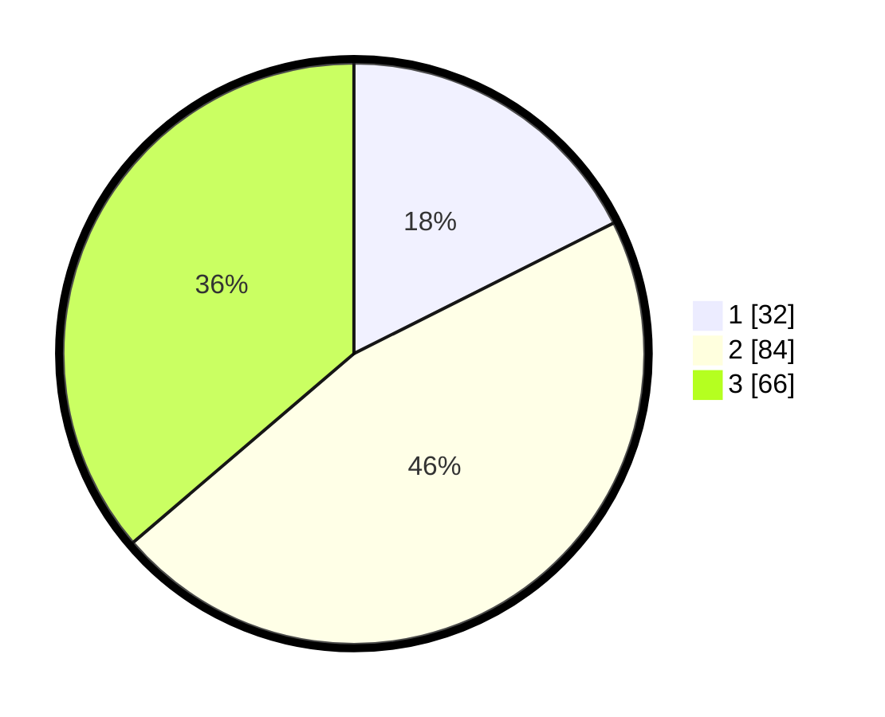

# Hasil

## Grafik

## Tabel

| No.    | Nama Paslon    | Suara | Suara (raw) | Persentase |
|:------ |:-------------- | -----:| -----------:| ----------:|
| 100025 | ANIES MUHAIMIN | 32    | [32][p-1]   | 17,58      |
| 100026 | PRABOWO GIBRAN | 84    | [84][p-2]   | 46,15      |
| 100027 | GANJAR MAHFUD  | 66    | [66][p-3]   | 36,26      |

[p-1]: https://github.com/gigit-pemilu/pemilu-2024/blob/main/pilpres/hitung-suara/sub/31-dki-jakarta/sub/73-jakarta-barat/sub/03-taman-sari/sub/1003-maphar/sub/022-tps/sub/paslon-1.txt
[p-2]: https://github.com/gigit-pemilu/pemilu-2024/blob/main/pilpres/hitung-suara/sub/31-dki-jakarta/sub/73-jakarta-barat/sub/03-taman-sari/sub/1003-maphar/sub/022-tps/sub/paslon-2.txt
[p-3]: https://github.com/gigit-pemilu/pemilu-2024/blob/main/pilpres/hitung-suara/sub/31-dki-jakarta/sub/73-jakarta-barat/sub/03-taman-sari/sub/1003-maphar/sub/022-tps/sub/paslon-3.txt

## Foto C Plano

https://sirekap-obj-formc.kpu.go.id/e73e/pemilu/ppwp/31/73/03/10/03/3173031003022-20240218-211052--42a1c261-fcd5-4a46-9fde-8532505c2d7f.jpg

https://sirekap-obj-formc.kpu.go.id/e73e/pemilu/ppwp/31/73/03/10/03/3173031003022-20240214-220220--c7b62fe1-d4e1-4232-b113-c2eb0f8ea5cb.jpg

https://sirekap-obj-formc.kpu.go.id/e73e/pemilu/ppwp/31/73/03/10/03/3173031003022-20240214-215956--c3a417cc-1abe-462f-8b18-1a32381a4618.jpg

## Metadata

| Key        | Value               |
| ---------- | ------------------- |
| Time Stamp | 2024-02-19 06:16:00 |

