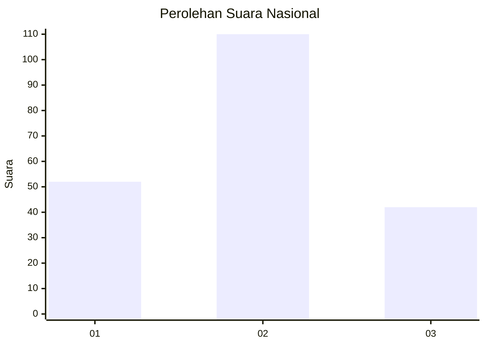
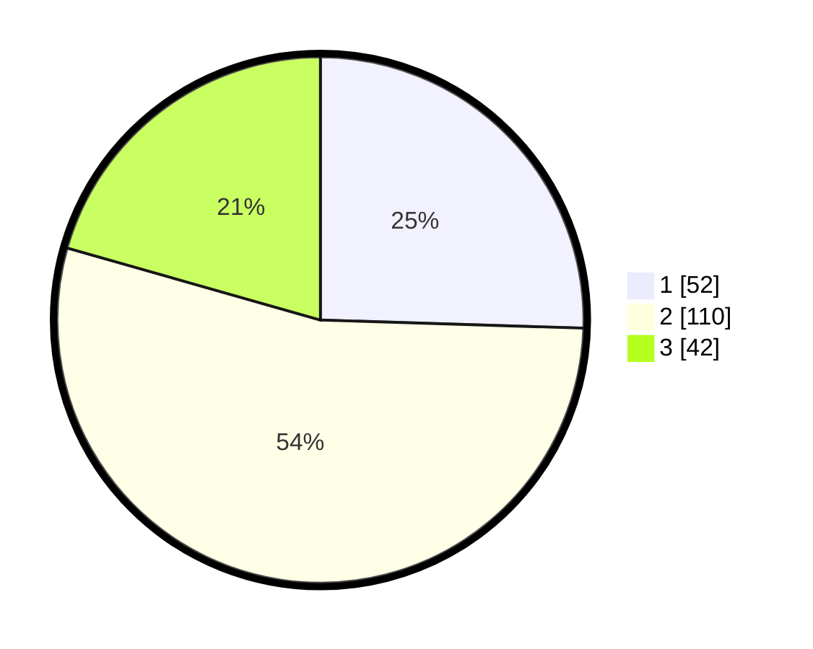

# Hasil

## Grafik

## Tabel

| No.    | Nama Paslon    | Suara | Suara (raw) | Persentase |
|:------ |:-------------- | -----:| -----------:| ----------:|
| 100025 | ANIES MUHAIMIN | 52    | [52][p-1]   | 25,49      |
| 100026 | PRABOWO GIBRAN | 110   | [110][p-2]  | 53,92      |
| 100027 | GANJAR MAHFUD  | 42    | [42][p-3]   | 20,59      |

[p-1]: https://github.com/gigit-pemilu/pemilu-2024/blob/main/pilpres/hitung-suara/sub/31-dki-jakarta/sub/73-jakarta-barat/sub/03-taman-sari/sub/1003-maphar/sub/031-tps/sub/paslon-1.txt
[p-2]: https://github.com/gigit-pemilu/pemilu-2024/blob/main/pilpres/hitung-suara/sub/31-dki-jakarta/sub/73-jakarta-barat/sub/03-taman-sari/sub/1003-maphar/sub/031-tps/sub/paslon-2.txt
[p-3]: https://github.com/gigit-pemilu/pemilu-2024/blob/main/pilpres/hitung-suara/sub/31-dki-jakarta/sub/73-jakarta-barat/sub/03-taman-sari/sub/1003-maphar/sub/031-tps/sub/paslon-3.txt

## Foto C Plano

https://sirekap-obj-formc.kpu.go.id/2dfa/pemilu/ppwp/31/73/03/10/03/3173031003031-20240214-222138--54932e70-9020-4294-98a1-a8eacc44503d.jpg

https://sirekap-obj-formc.kpu.go.id/2dfa/pemilu/ppwp/31/73/03/10/03/3173031003031-20240214-222435--25b2f3f8-260b-4459-8467-4f1c164f4d65.jpg

https://sirekap-obj-formc.kpu.go.id/2dfa/pemilu/ppwp/31/73/03/10/03/3173031003031-20240214-232506--c3d797b0-5f39-4c1c-9f34-b6efe90ee7da.jpg

## Metadata

| Key        | Value               |
| ---------- | ------------------- |
| Time Stamp | 2024-02-16 02:30:27 |

