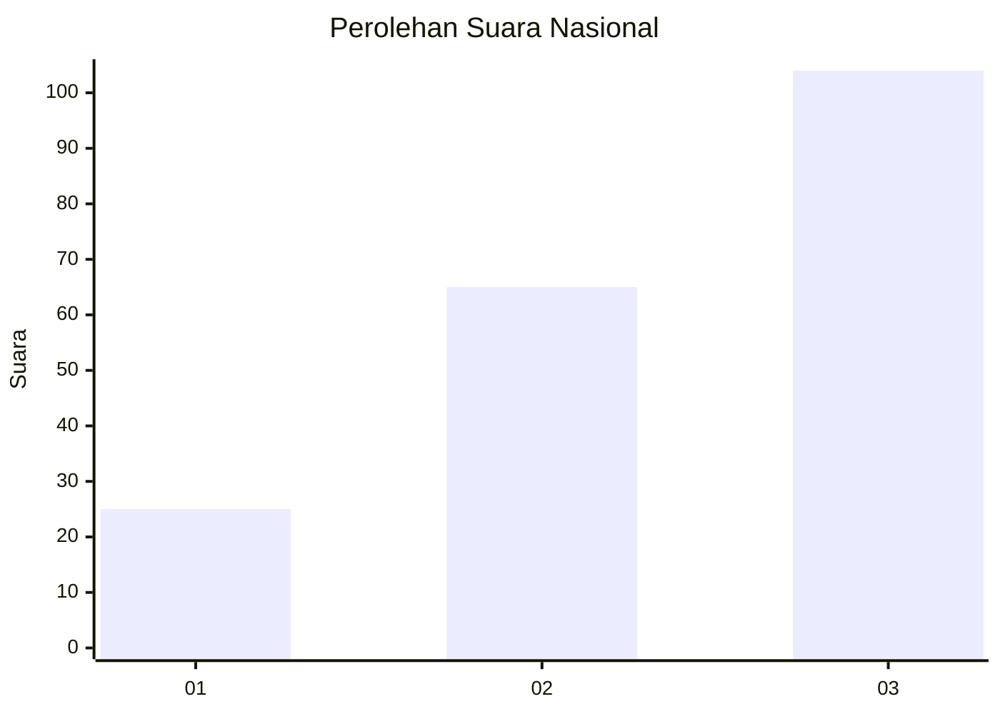
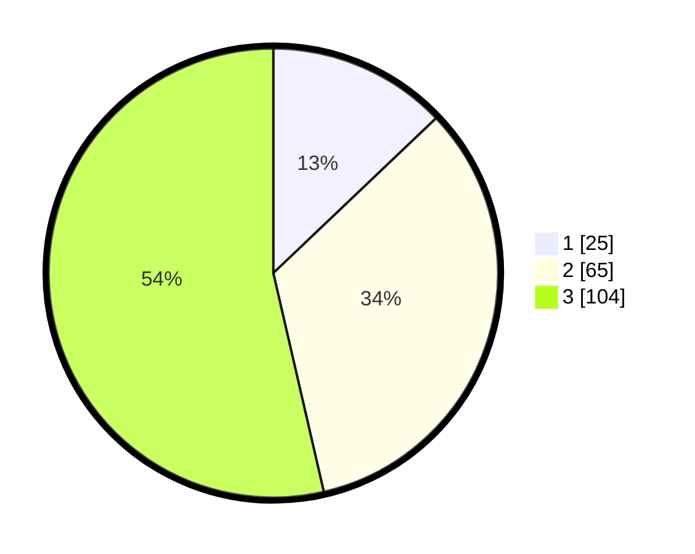

# Hasil

## Grafik

## Tabel

| No.    | Nama Paslon    | Suara | Suara (raw) | Persentase |
|:------ |:-------------- | -----:| -----------:| ----------:|
| 100025 | ANIES MUHAIMIN | 25    | [25][p-1]   | 12,89      |
| 100026 | PRABOWO GIBRAN | 65    | [65][p-2]   | 33,51      |
| 100027 | GANJAR MAHFUD  | 104   | [104][p-3]  | 53,61      |

[p-1]: https://github.com/gigit-pemilu/pemilu-2024/blob/main/pilpres/hitung-suara/sub/31-dki-jakarta/sub/73-jakarta-barat/sub/03-taman-sari/sub/1003-maphar/sub/032-tps/sub/paslon-1.txt
[p-2]: https://github.com/gigit-pemilu/pemilu-2024/blob/main/pilpres/hitung-suara/sub/31-dki-jakarta/sub/73-jakarta-barat/sub/03-taman-sari/sub/1003-maphar/sub/032-tps/sub/paslon-2.txt
[p-3]: https://github.com/gigit-pemilu/pemilu-2024/blob/main/pilpres/hitung-suara/sub/31-dki-jakarta/sub/73-jakarta-barat/sub/03-taman-sari/sub/1003-maphar/sub/032-tps/sub/paslon-3.txt

## Foto C Plano

https://sirekap-obj-formc.kpu.go.id/6428/pemilu/ppwp/31/73/03/10/03/3173031003032-20240214-224825--e0816cb5-689a-4c68-a3df-0e76ee3c7004.jpg

https://sirekap-obj-formc.kpu.go.id/6428/pemilu/ppwp/31/73/03/10/03/3173031003032-20240214-225055--6256c38f-871c-44d8-ad9c-f7d1f7b977b3.jpg

https://sirekap-obj-formc.kpu.go.id/6428/pemilu/ppwp/31/73/03/10/03/3173031003032-20240214-225205--9d4db291-1886-4afa-944b-ae7e0303cdce.jpg

## Metadata

| Key        | Value               |
| ---------- | ------------------- |
| Time Stamp | 2024-02-17 16:36:25 |

