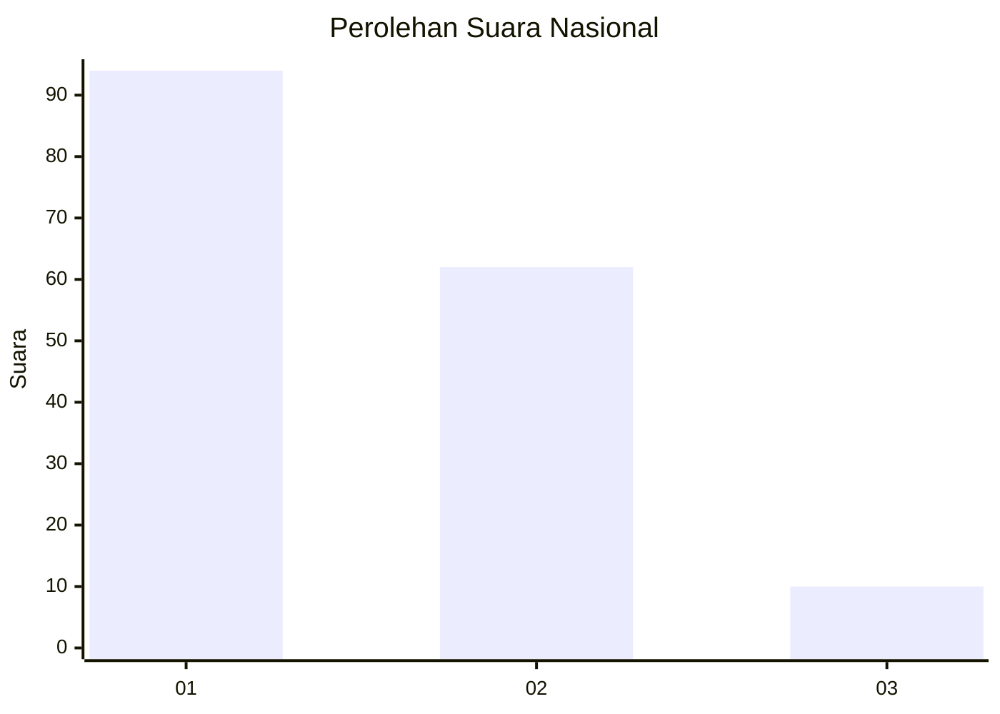
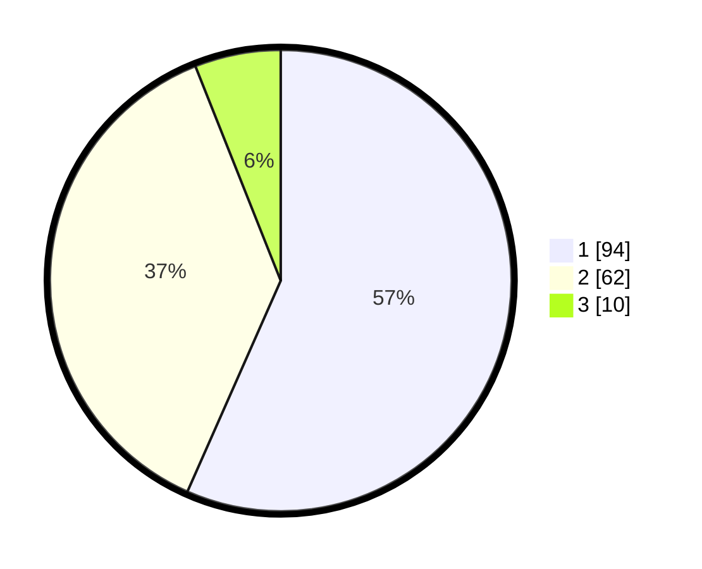

# Hasil

## Grafik

## Tabel

| No.    | Nama Paslon    | Suara | Suara (raw) | Persentase |
|:------ |:-------------- | -----:| -----------:| ----------:|
| 100025 | ANIES MUHAIMIN | 94    | [94][p-1]   | 56,63      |
| 100026 | PRABOWO GIBRAN | 62    | [62][p-2]   | 37,35      |
| 100027 | GANJAR MAHFUD  | 10    | [10][p-3]   | 6,02       |

[p-1]: https://github.com/gigit-pemilu/pemilu-2024/blob/main/pilpres/hitung-suara/sub/31-dki-jakarta/sub/73-jakarta-barat/sub/03-taman-sari/sub/1003-maphar/sub/041-tps/sub/paslon-1.txt
[p-2]: https://github.com/gigit-pemilu/pemilu-2024/blob/main/pilpres/hitung-suara/sub/31-dki-jakarta/sub/73-jakarta-barat/sub/03-taman-sari/sub/1003-maphar/sub/041-tps/sub/paslon-2.txt
[p-3]: https://github.com/gigit-pemilu/pemilu-2024/blob/main/pilpres/hitung-suara/sub/31-dki-jakarta/sub/73-jakarta-barat/sub/03-taman-sari/sub/1003-maphar/sub/041-tps/sub/paslon-3.txt

## Foto C Plano

https://sirekap-obj-formc.kpu.go.id/168c/pemilu/ppwp/31/73/03/10/03/3173031003041-20240214-232325--f795cb31-59e7-44fb-9d73-90db73b2a774.jpg

https://sirekap-obj-formc.kpu.go.id/168c/pemilu/ppwp/31/73/03/10/03/3173031003041-20240214-232042--6b1bedff-9609-4c1d-bd9a-9716f6da77f6.jpg

https://sirekap-obj-formc.kpu.go.id/168c/pemilu/ppwp/31/73/03/10/03/3173031003041-20240214-231611--25db23c4-37ea-44a4-9eca-012cf3420549.jpg

## Metadata

| Key        | Value               |
| ---------- | ------------------- |
| Time Stamp | 2024-02-21 17:00:00 |

