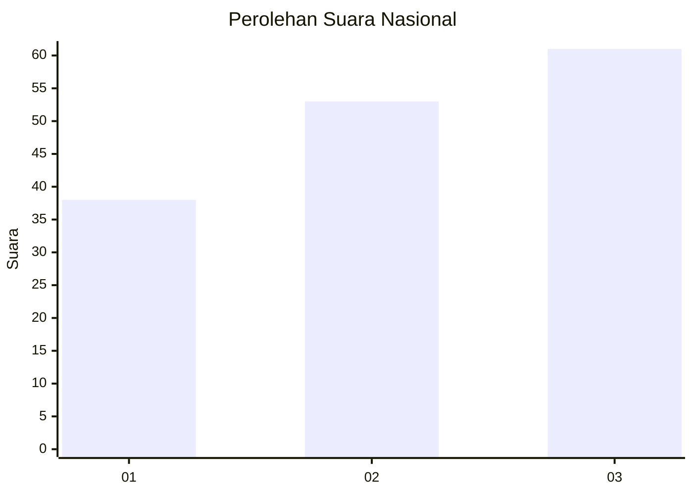
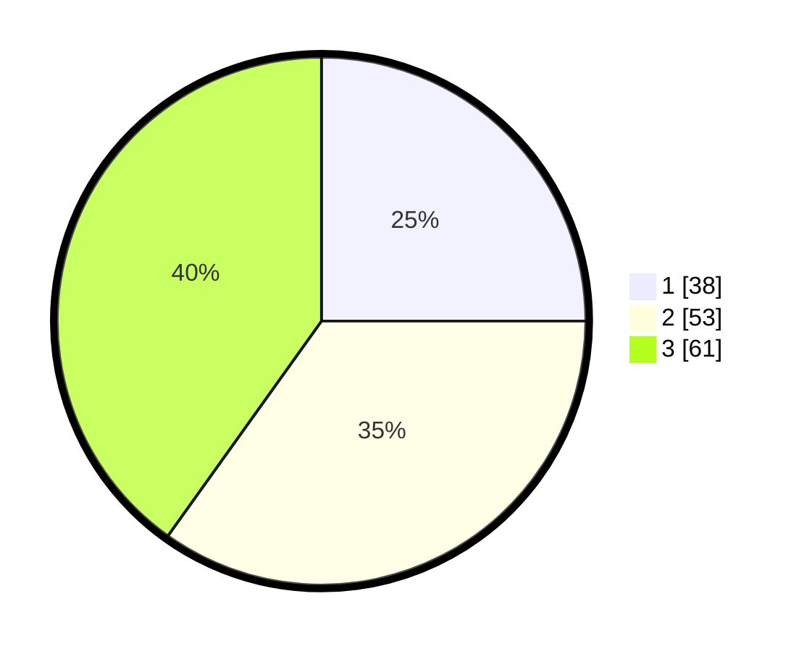

# Hasil

## Grafik

## Tabel

| No.    | Nama Paslon    | Suara | Suara (raw) | Persentase |
|:------ |:-------------- | -----:| -----------:| ----------:|
| 100025 | ANIES MUHAIMIN | 38    | [38][p-1]   | 25,00      |
| 100026 | PRABOWO GIBRAN | 53    | [53][p-2]   | 34,87      |
| 100027 | GANJAR MAHFUD  | 61    | [61][p-3]   | 40,13      |

[p-1]: https://github.com/gigit-pemilu/pemilu-2024/blob/main/pilpres/hitung-suara/sub/31-dki-jakarta/sub/73-jakarta-barat/sub/03-taman-sari/sub/1003-maphar/sub/044-tps/sub/paslon-1.txt
[p-2]: https://github.com/gigit-pemilu/pemilu-2024/blob/main/pilpres/hitung-suara/sub/31-dki-jakarta/sub/73-jakarta-barat/sub/03-taman-sari/sub/1003-maphar/sub/044-tps/sub/paslon-2.txt
[p-3]: https://github.com/gigit-pemilu/pemilu-2024/blob/main/pilpres/hitung-suara/sub/31-dki-jakarta/sub/73-jakarta-barat/sub/03-taman-sari/sub/1003-maphar/sub/044-tps/sub/paslon-3.txt

## Foto C Plano

https://sirekap-obj-formc.kpu.go.id/ba19/pemilu/ppwp/31/73/03/10/03/3173031003044-20240214-204947--5c0680cf-ed60-41a1-8126-98aa26f94a2c.jpg

https://sirekap-obj-formc.kpu.go.id/ba19/pemilu/ppwp/31/73/03/10/03/3173031003044-20240214-205112--74333f76-dd0d-4f94-a1b3-8044e87e49f4.jpg

https://sirekap-obj-formc.kpu.go.id/ba19/pemilu/ppwp/31/73/03/10/03/3173031003044-20240214-205212--ffae974c-2235-4bcc-a091-22da208471a6.jpg

## Metadata

| Key        | Value               |
| ---------- | ------------------- |
| Time Stamp | 2024-02-16 02:30:27 |

