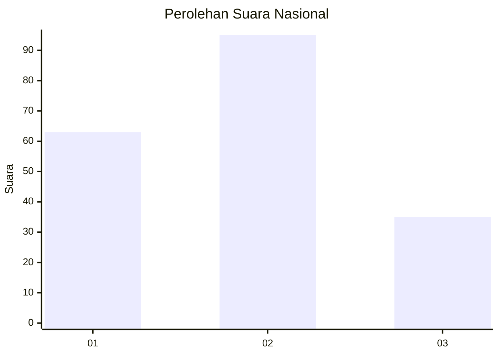
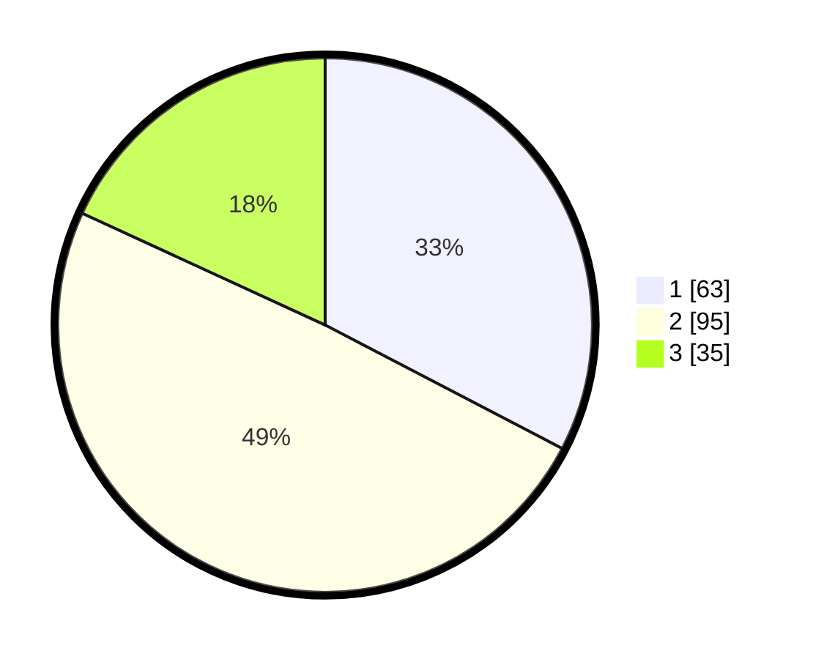

# Hasil

## Grafik

## Tabel

| No.    | Nama Paslon    | Suara | Suara (raw) | Persentase |
|:------ |:-------------- | -----:| -----------:| ----------:|
| 100025 | ANIES MUHAIMIN | 63    | [63][p-1]   | 32,64      |
| 100026 | PRABOWO GIBRAN | 95    | [95][p-2]   | 49,22      |
| 100027 | GANJAR MAHFUD  | 35    | [35][p-3]   | 18,13      |

[p-1]: https://github.com/gigit-pemilu/pemilu-2024/blob/main/pilpres/hitung-suara/sub/31-dki-jakarta/sub/73-jakarta-barat/sub/03-taman-sari/sub/1003-maphar/sub/048-tps/sub/paslon-1.txt
[p-2]: https://github.com/gigit-pemilu/pemilu-2024/blob/main/pilpres/hitung-suara/sub/31-dki-jakarta/sub/73-jakarta-barat/sub/03-taman-sari/sub/1003-maphar/sub/048-tps/sub/paslon-2.txt
[p-3]: https://github.com/gigit-pemilu/pemilu-2024/blob/main/pilpres/hitung-suara/sub/31-dki-jakarta/sub/73-jakarta-barat/sub/03-taman-sari/sub/1003-maphar/sub/048-tps/sub/paslon-3.txt

## Foto C Plano

https://sirekap-obj-formc.kpu.go.id/e5a8/pemilu/ppwp/31/73/03/10/03/3173031003048-20240214-234448--361c15d8-3934-4946-bc85-c3dfbf73d396.jpg

https://sirekap-obj-formc.kpu.go.id/e5a8/pemilu/ppwp/31/73/03/10/03/3173031003048-20240214-234644--407077ae-bf74-4545-8c48-5b5220aa6ea1.jpg

https://sirekap-obj-formc.kpu.go.id/e5a8/pemilu/ppwp/31/73/03/10/03/3173031003048-20240214-234835--eb65fc7e-241f-4f2f-a42b-6327a1fc78ec.jpg

## Metadata

| Key        | Value               |
| ---------- | ------------------- |
| Time Stamp | 2024-02-16 02:30:27 |

