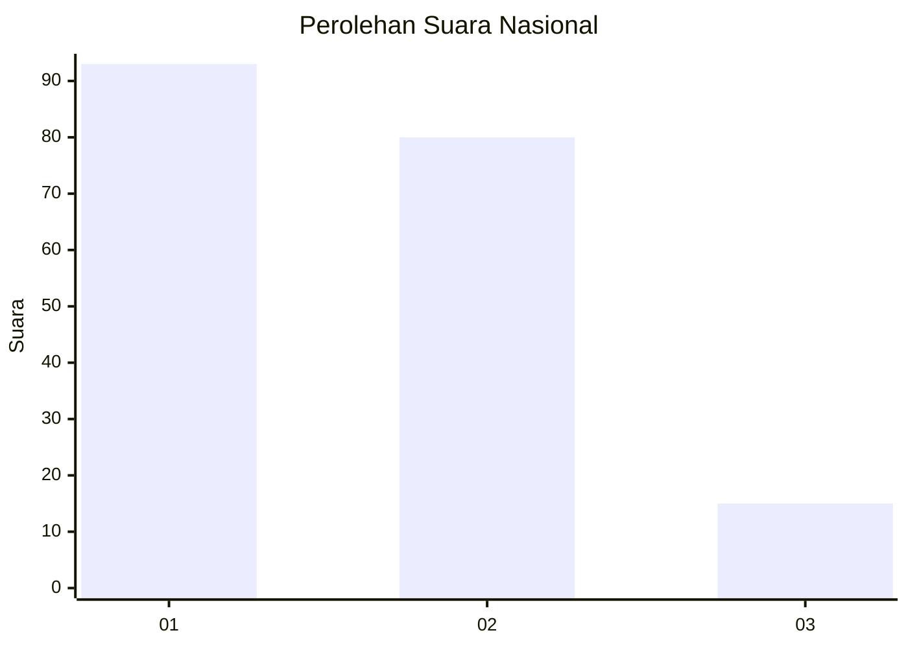
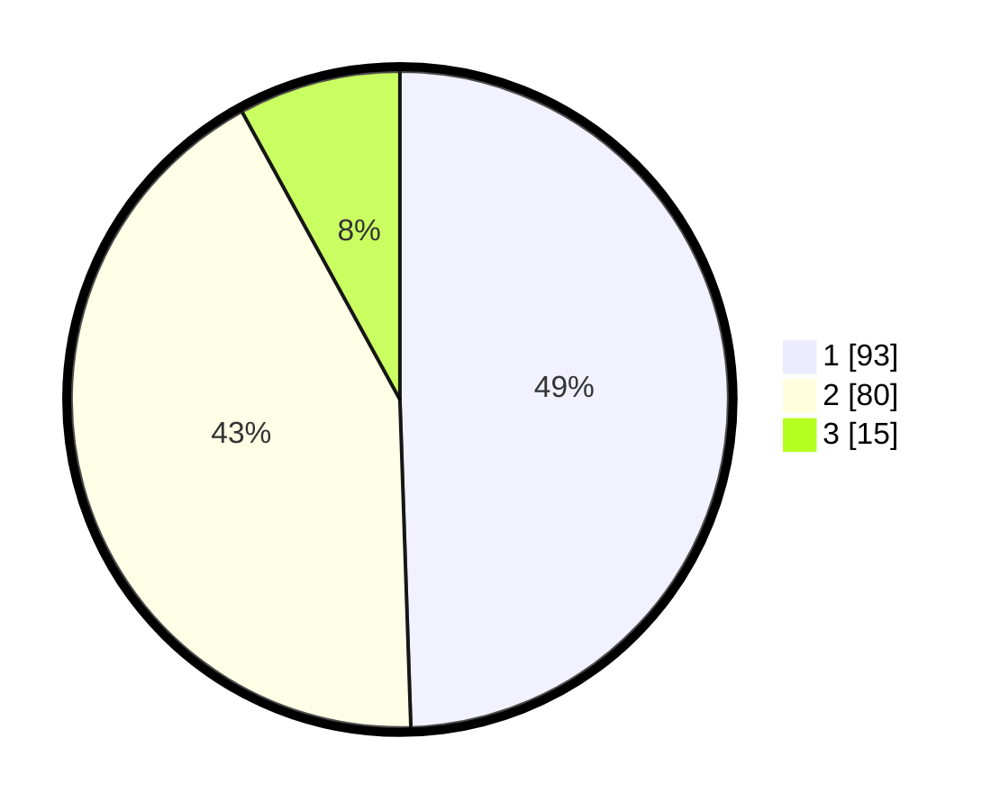

# Hasil

## Grafik

## Tabel

| No.    | Nama Paslon    | Suara | Suara (raw) | Persentase |
|:------ |:-------------- | -----:| -----------:| ----------:|
| 100025 | ANIES MUHAIMIN | 93    | [93][p-1]   | 49,47      |
| 100026 | PRABOWO GIBRAN | 80    | [80][p-2]   | 42,55      |
| 100027 | GANJAR MAHFUD  | 15    | [15][p-3]   | 7,98       |

[p-1]: https://github.com/gigit-pemilu/pemilu-2024/blob/main/pilpres/hitung-suara/sub/31-dki-jakarta/sub/73-jakarta-barat/sub/03-taman-sari/sub/1003-maphar/sub/052-tps/sub/paslon-1.txt
[p-2]: https://github.com/gigit-pemilu/pemilu-2024/blob/main/pilpres/hitung-suara/sub/31-dki-jakarta/sub/73-jakarta-barat/sub/03-taman-sari/sub/1003-maphar/sub/052-tps/sub/paslon-2.txt
[p-3]: https://github.com/gigit-pemilu/pemilu-2024/blob/main/pilpres/hitung-suara/sub/31-dki-jakarta/sub/73-jakarta-barat/sub/03-taman-sari/sub/1003-maphar/sub/052-tps/sub/paslon-3.txt

## Foto C Plano

https://sirekap-obj-formc.kpu.go.id/0ca3/pemilu/ppwp/31/73/03/10/03/3173031003052-20240214-213011--f4e2c461-f555-40de-95f4-c0612cd3dda9.jpg

https://sirekap-obj-formc.kpu.go.id/0ca3/pemilu/ppwp/31/73/03/10/03/3173031003052-20240214-222907--4dc539b0-8db5-4b32-b7d2-fd2f49f894b3.jpg

https://sirekap-obj-formc.kpu.go.id/0ca3/pemilu/ppwp/31/73/03/10/03/3173031003052-20240214-213401--7d931f2d-579a-448a-8f42-7c8cdc12b082.jpg

## Metadata

| Key        | Value               |
| ---------- | ------------------- |
| Time Stamp | 2024-02-16 02:30:27 |

