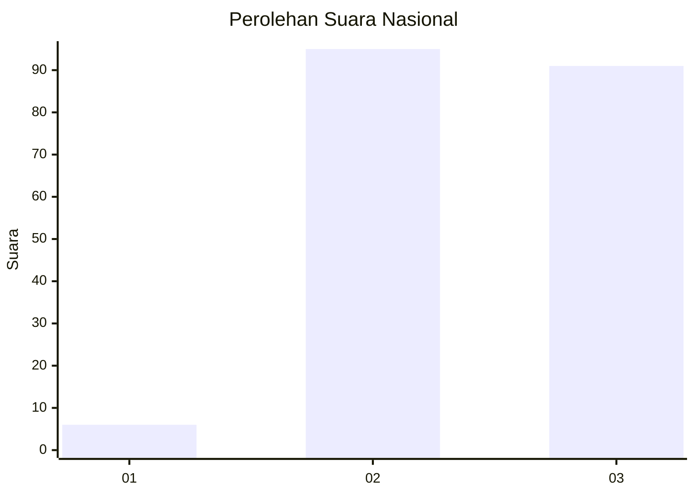
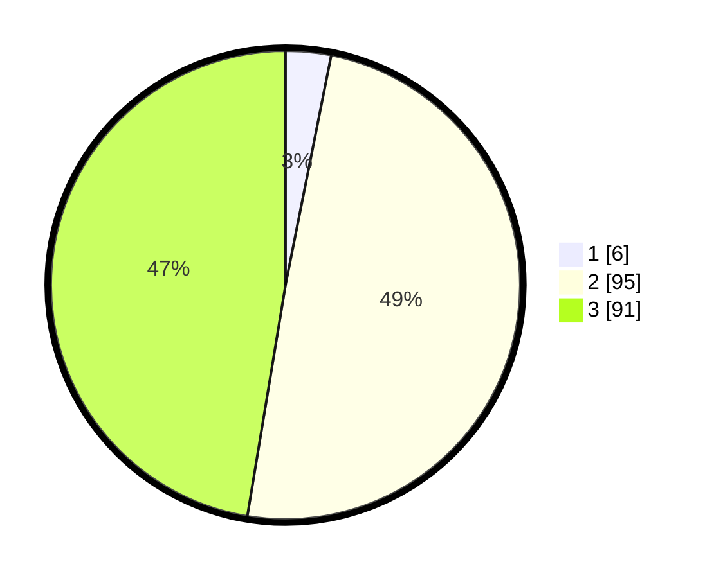

# Hasil

## Grafik

## Tabel

| No.    | Nama Paslon    | Suara | Suara (raw) | Persentase |
|:------ |:-------------- | -----:| -----------:| ----------:|
| 100025 | ANIES MUHAIMIN | 6     | [6][p-1]    | 3,13       |
| 100026 | PRABOWO GIBRAN | 95    | [95][p-2]   | 49,48      |
| 100027 | GANJAR MAHFUD  | 91    | [91][p-3]   | 47,40      |

[p-1]: https://github.com/gigit-pemilu/pemilu-2024/blob/main/pilpres/hitung-suara/sub/31-dki-jakarta/sub/73-jakarta-barat/sub/03-taman-sari/sub/1004-tangki/sub/005-tps/sub/paslon-1.txt
[p-2]: https://github.com/gigit-pemilu/pemilu-2024/blob/main/pilpres/hitung-suara/sub/31-dki-jakarta/sub/73-jakarta-barat/sub/03-taman-sari/sub/1004-tangki/sub/005-tps/sub/paslon-2.txt
[p-3]: https://github.com/gigit-pemilu/pemilu-2024/blob/main/pilpres/hitung-suara/sub/31-dki-jakarta/sub/73-jakarta-barat/sub/03-taman-sari/sub/1004-tangki/sub/005-tps/sub/paslon-3.txt

## Foto C Plano

https://sirekap-obj-formc.kpu.go.id/e0f2/pemilu/ppwp/31/73/03/10/04/3173031004005-20240215-000455--657474f3-46e6-4c5e-95ab-466e198c383e.jpg

https://sirekap-obj-formc.kpu.go.id/e0f2/pemilu/ppwp/31/73/03/10/04/3173031004005-20240215-000506--07f52d57-4411-4a9e-b8d0-09c8f86b1994.jpg

https://sirekap-obj-formc.kpu.go.id/e0f2/pemilu/ppwp/31/73/03/10/04/3173031004005-20240215-000558--0f196886-a149-46c1-a613-2c3f40adbfce.jpg

## Metadata

| Key        | Value               |
| ---------- | ------------------- |
| Time Stamp | 2024-02-15 16:00:26 |

