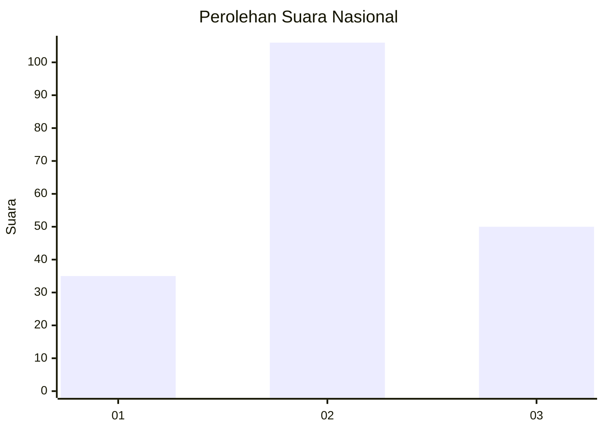
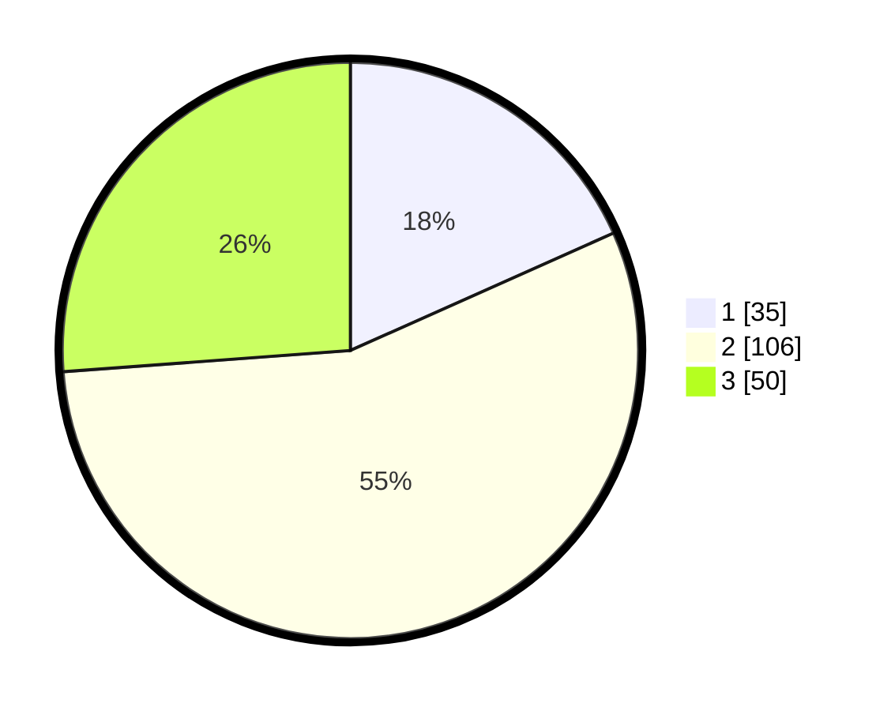

# Hasil

## Grafik

## Tabel

| No.    | Nama Paslon    | Suara | Suara (raw) | Persentase |
|:------ |:-------------- | -----:| -----------:| ----------:|
| 100025 | ANIES MUHAIMIN | 35    | [35][p-1]   | 18,32      |
| 100026 | PRABOWO GIBRAN | 106   | [106][p-2]  | 55,50      |
| 100027 | GANJAR MAHFUD  | 50    | [50][p-3]   | 26,18      |

[p-1]: https://github.com/gigit-pemilu/pemilu-2024/blob/main/pilpres/hitung-suara/sub/31-dki-jakarta/sub/73-jakarta-barat/sub/03-taman-sari/sub/1004-tangki/sub/046-tps/sub/paslon-1.txt
[p-2]: https://github.com/gigit-pemilu/pemilu-2024/blob/main/pilpres/hitung-suara/sub/31-dki-jakarta/sub/73-jakarta-barat/sub/03-taman-sari/sub/1004-tangki/sub/046-tps/sub/paslon-2.txt
[p-3]: https://github.com/gigit-pemilu/pemilu-2024/blob/main/pilpres/hitung-suara/sub/31-dki-jakarta/sub/73-jakarta-barat/sub/03-taman-sari/sub/1004-tangki/sub/046-tps/sub/paslon-3.txt

## Foto C Plano

https://sirekap-obj-formc.kpu.go.id/5954/pemilu/ppwp/31/73/03/10/04/3173031004046-20240214-195346--39ef0ba7-cbb8-462b-a6a8-704a6d228dbb.jpg

https://sirekap-obj-formc.kpu.go.id/5954/pemilu/ppwp/31/73/03/10/04/3173031004046-20240214-195515--1f16f0b6-24c0-4b85-9b4c-0135efaa0d8a.jpg

https://sirekap-obj-formc.kpu.go.id/5954/pemilu/ppwp/31/73/03/10/04/3173031004046-20240214-232944--25649110-b1ec-4ca1-b867-a8add9816a22.jpg

## Metadata

| Key        | Value               |
| ---------- | ------------------- |
| Time Stamp | 2024-02-19 22:00:00 |

