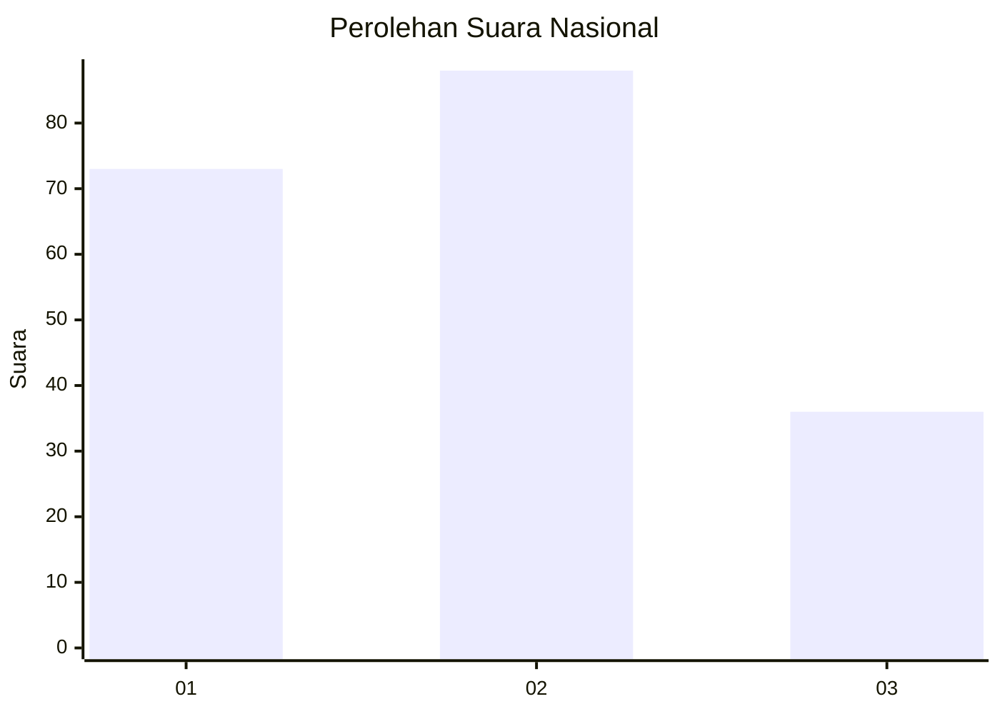
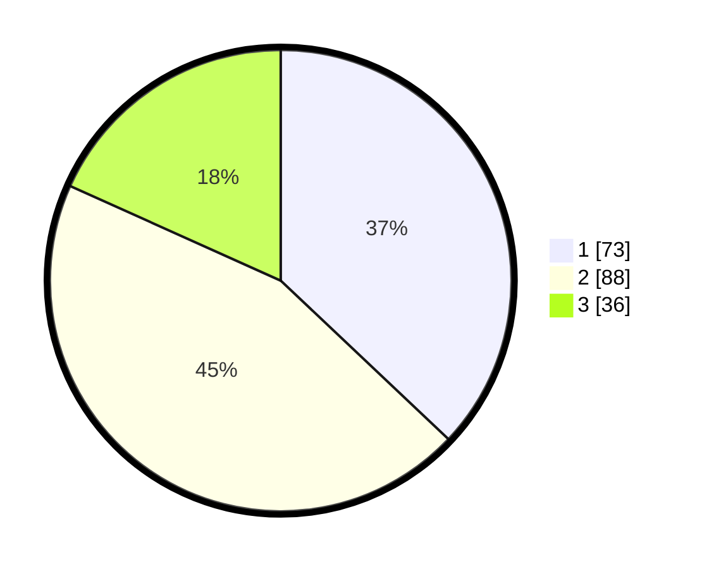

# Hasil

## Grafik

## Tabel

| No.    | Nama Paslon    | Suara | Suara (raw) | Persentase |
|:------ |:-------------- | -----:| -----------:| ----------:|
| 100025 | ANIES MUHAIMIN | 73    | [73][p-1]   | 37,06      |
| 100026 | PRABOWO GIBRAN | 88    | [88][p-2]   | 44,67      |
| 100027 | GANJAR MAHFUD  | 36    | [36][p-3]   | 18,27      |

[p-1]: https://github.com/gigit-pemilu/pemilu-2024/blob/main/pilpres/hitung-suara/sub/31-dki-jakarta/sub/73-jakarta-barat/sub/03-taman-sari/sub/1005-mangga-besar/sub/018-tps/sub/paslon-1.txt
[p-2]: https://github.com/gigit-pemilu/pemilu-2024/blob/main/pilpres/hitung-suara/sub/31-dki-jakarta/sub/73-jakarta-barat/sub/03-taman-sari/sub/1005-mangga-besar/sub/018-tps/sub/paslon-2.txt
[p-3]: https://github.com/gigit-pemilu/pemilu-2024/blob/main/pilpres/hitung-suara/sub/31-dki-jakarta/sub/73-jakarta-barat/sub/03-taman-sari/sub/1005-mangga-besar/sub/018-tps/sub/paslon-3.txt

## Foto C Plano

https://sirekap-obj-formc.kpu.go.id/b2a2/pemilu/ppwp/31/73/03/10/05/3173031005018-20240214-211625--d440ae53-13a3-4928-bb48-e2852f51e236.jpg

https://sirekap-obj-formc.kpu.go.id/b2a2/pemilu/ppwp/31/73/03/10/05/3173031005018-20240214-211148--a461f8b8-3e1f-424b-9f8a-3fc30012d6a6.jpg

https://sirekap-obj-formc.kpu.go.id/b2a2/pemilu/ppwp/31/73/03/10/05/3173031005018-20240214-211000--22396ea0-dec3-496d-a3a4-c5a160140f92.jpg

## Metadata

| Key        | Value               |
| ---------- | ------------------- |
| Time Stamp | 2024-02-16 16:25:10 |

