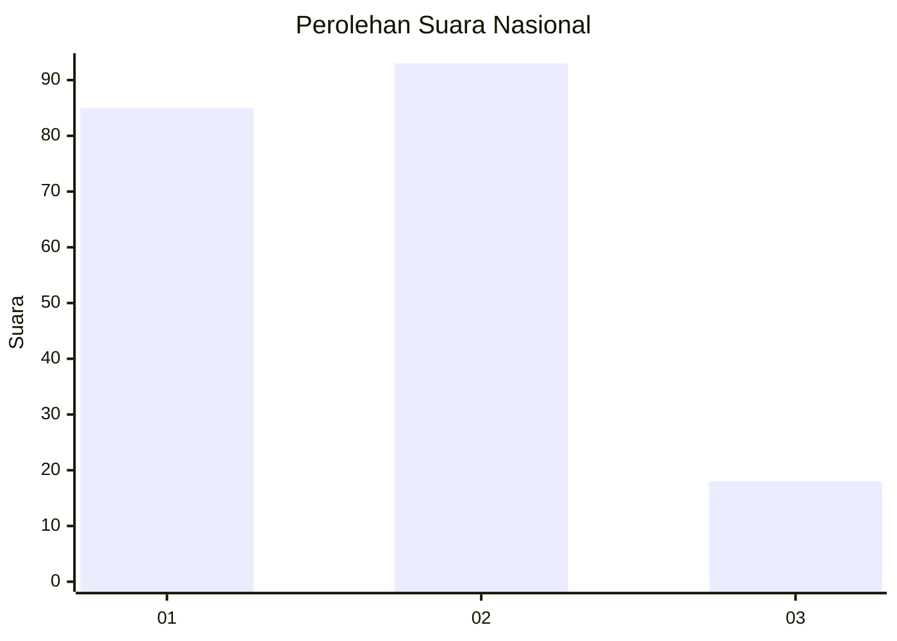
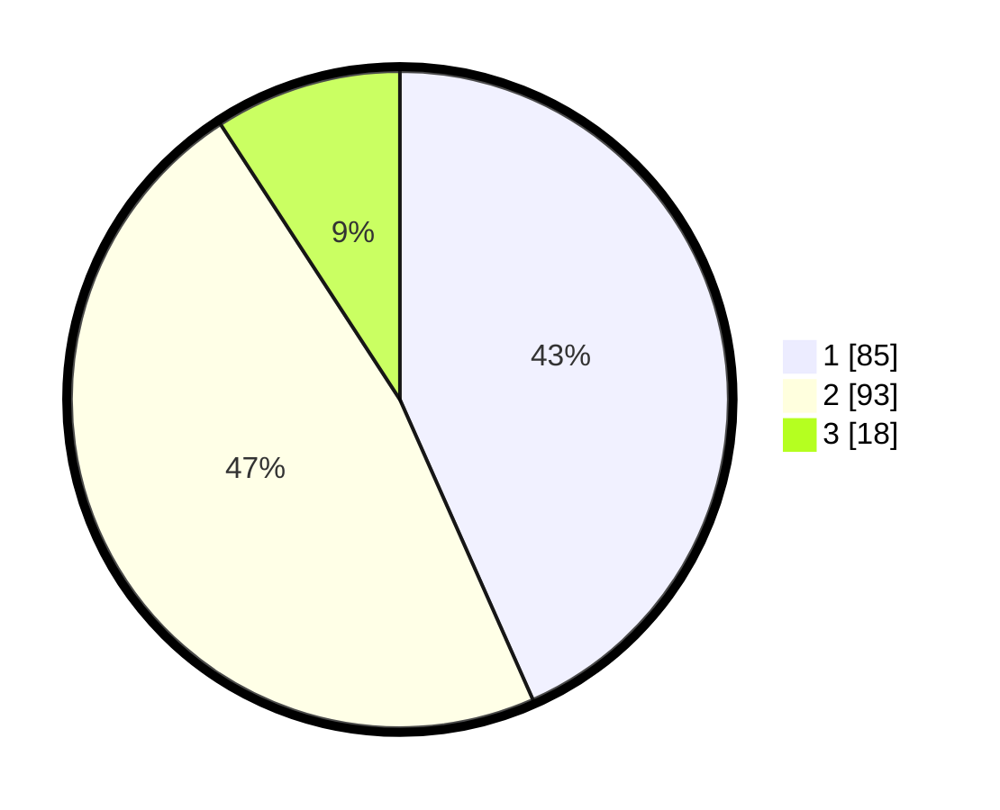

# Hasil

## Grafik

## Tabel

| No.    | Nama Paslon    | Suara | Suara (raw) | Persentase |
|:------ |:-------------- | -----:| -----------:| ----------:|
| 100025 | ANIES MUHAIMIN | 85    | [85][p-1]   | 43,37      |
| 100026 | PRABOWO GIBRAN | 93    | [93][p-2]   | 47,45      |
| 100027 | GANJAR MAHFUD  | 18    | [18][p-3]   | 9,18       |

[p-1]: https://github.com/gigit-pemilu/pemilu-2024/blob/main/pilpres/hitung-suara/sub/31-dki-jakarta/sub/73-jakarta-barat/sub/03-taman-sari/sub/1005-mangga-besar/sub/020-tps/sub/paslon-1.txt
[p-2]: https://github.com/gigit-pemilu/pemilu-2024/blob/main/pilpres/hitung-suara/sub/31-dki-jakarta/sub/73-jakarta-barat/sub/03-taman-sari/sub/1005-mangga-besar/sub/020-tps/sub/paslon-2.txt
[p-3]: https://github.com/gigit-pemilu/pemilu-2024/blob/main/pilpres/hitung-suara/sub/31-dki-jakarta/sub/73-jakarta-barat/sub/03-taman-sari/sub/1005-mangga-besar/sub/020-tps/sub/paslon-3.txt

## Foto C Plano

https://sirekap-obj-formc.kpu.go.id/91e7/pemilu/ppwp/31/73/03/10/05/3173031005020-20240214-214911--5029d669-c154-41d1-b01a-071b6617bce3.jpg

https://sirekap-obj-formc.kpu.go.id/91e7/pemilu/ppwp/31/73/03/10/05/3173031005020-20240214-215029--a4a8bcb0-7e51-461d-b6f5-a2474cfe6f2e.jpg

https://sirekap-obj-formc.kpu.go.id/91e7/pemilu/ppwp/31/73/03/10/05/3173031005020-20240214-215204--94958583-b1d3-43fb-a5c8-b36f2d3483db.jpg

## Metadata

| Key        | Value               |
| ---------- | ------------------- |
| Time Stamp | 2024-02-17 16:36:25 |

