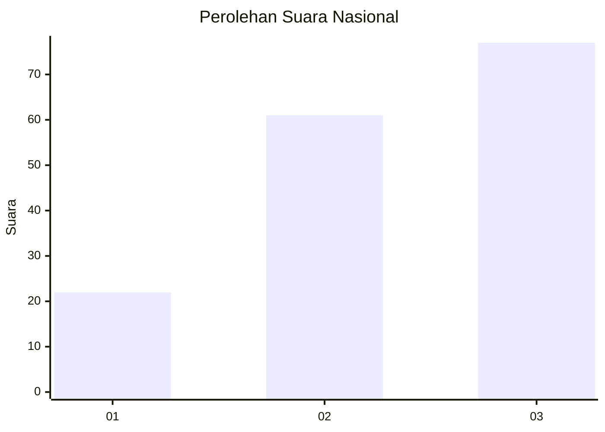
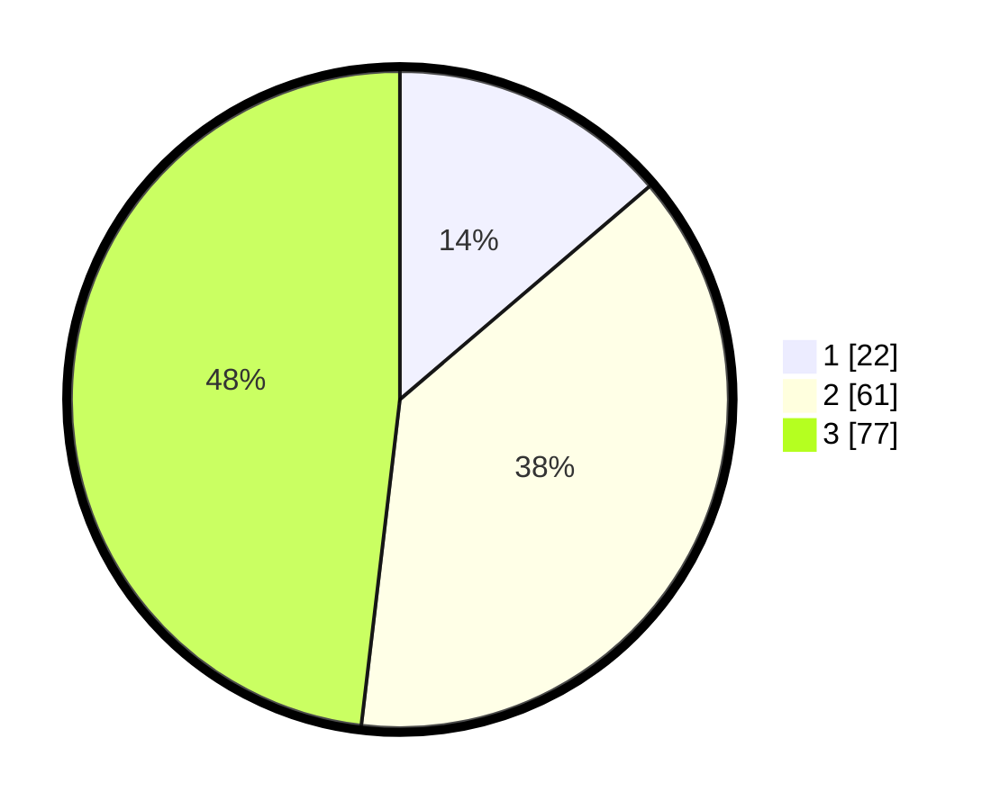

# Hasil

## Grafik

## Tabel

| No.    | Nama Paslon    | Suara | Suara (raw) | Persentase |
|:------ |:-------------- | -----:| -----------:| ----------:|
| 100025 | ANIES MUHAIMIN | 22    | [22][p-1]   | 13,75      |
| 100026 | PRABOWO GIBRAN | 61    | [61][p-2]   | 38,13      |
| 100027 | GANJAR MAHFUD  | 77    | [77][p-3]   | 48,13      |

[p-1]: https://github.com/gigit-pemilu/pemilu-2024/blob/main/pilpres/hitung-suara/sub/31-dki-jakarta/sub/73-jakarta-barat/sub/03-taman-sari/sub/1005-mangga-besar/sub/028-tps/sub/paslon-1.txt
[p-2]: https://github.com/gigit-pemilu/pemilu-2024/blob/main/pilpres/hitung-suara/sub/31-dki-jakarta/sub/73-jakarta-barat/sub/03-taman-sari/sub/1005-mangga-besar/sub/028-tps/sub/paslon-2.txt
[p-3]: https://github.com/gigit-pemilu/pemilu-2024/blob/main/pilpres/hitung-suara/sub/31-dki-jakarta/sub/73-jakarta-barat/sub/03-taman-sari/sub/1005-mangga-besar/sub/028-tps/sub/paslon-3.txt

## Foto C Plano

https://sirekap-obj-formc.kpu.go.id/5d1d/pemilu/ppwp/31/73/03/10/05/3173031005028-20240214-222100--e6c25909-82e5-4156-acdc-431efe4fab10.jpg

https://sirekap-obj-formc.kpu.go.id/5d1d/pemilu/ppwp/31/73/03/10/05/3173031005028-20240214-222246--db58c614-fbc1-4be9-ab8c-9ee0b66e60c9.jpg

https://sirekap-obj-formc.kpu.go.id/5d1d/pemilu/ppwp/31/73/03/10/05/3173031005028-20240214-222440--155244c0-b1aa-4bd9-9e36-593b4bc50ac0.jpg

## Metadata

| Key        | Value               |
| ---------- | ------------------- |
| Time Stamp | 2024-02-17 16:36:25 |

