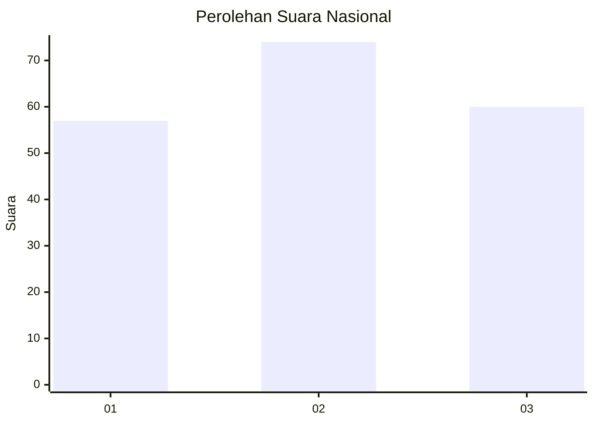
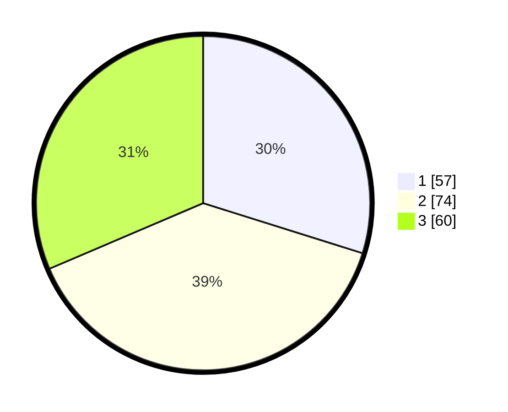

# Hasil

## Grafik

## Tabel

| No.    | Nama Paslon    | Suara | Suara (raw) | Persentase |
|:------ |:-------------- | -----:| -----------:| ----------:|
| 100025 | ANIES MUHAIMIN | 57    | [57][p-1]   | 29,84      |
| 100026 | PRABOWO GIBRAN | 74    | [74][p-2]   | 38,74      |
| 100027 | GANJAR MAHFUD  | 60    | [60][p-3]   | 31,41      |

[p-1]: https://github.com/gigit-pemilu/pemilu-2024/blob/main/pilpres/hitung-suara/sub/31-dki-jakarta/sub/73-jakarta-barat/sub/03-taman-sari/sub/1006-keagungan/sub/006-tps/sub/paslon-1.txt
[p-2]: https://github.com/gigit-pemilu/pemilu-2024/blob/main/pilpres/hitung-suara/sub/31-dki-jakarta/sub/73-jakarta-barat/sub/03-taman-sari/sub/1006-keagungan/sub/006-tps/sub/paslon-2.txt
[p-3]: https://github.com/gigit-pemilu/pemilu-2024/blob/main/pilpres/hitung-suara/sub/31-dki-jakarta/sub/73-jakarta-barat/sub/03-taman-sari/sub/1006-keagungan/sub/006-tps/sub/paslon-3.txt

## Foto C Plano

https://sirekap-obj-formc.kpu.go.id/ef04/pemilu/ppwp/31/73/03/10/06/3173031006006-20240215-031924--b2fc31f5-fc2d-4f09-9259-bc0091d95662.jpg

https://sirekap-obj-formc.kpu.go.id/ef04/pemilu/ppwp/31/73/03/10/06/3173031006006-20240215-042441--2e547298-6ece-41d7-876d-3781f176c0c1.jpg

https://sirekap-obj-formc.kpu.go.id/ef04/pemilu/ppwp/31/73/03/10/06/3173031006006-20240215-042620--6cbd18ae-2cff-4e35-a323-c5df85b3566d.jpg

## Metadata

| Key        | Value               |
| ---------- | ------------------- |
| Time Stamp | 2024-02-15 15:00:29 |

