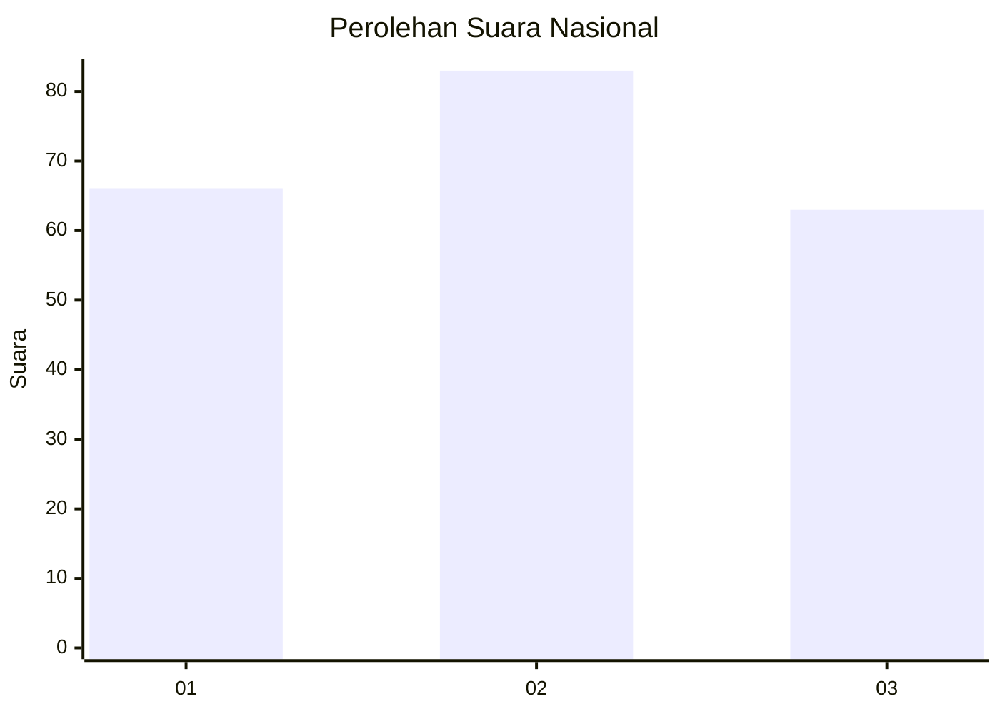
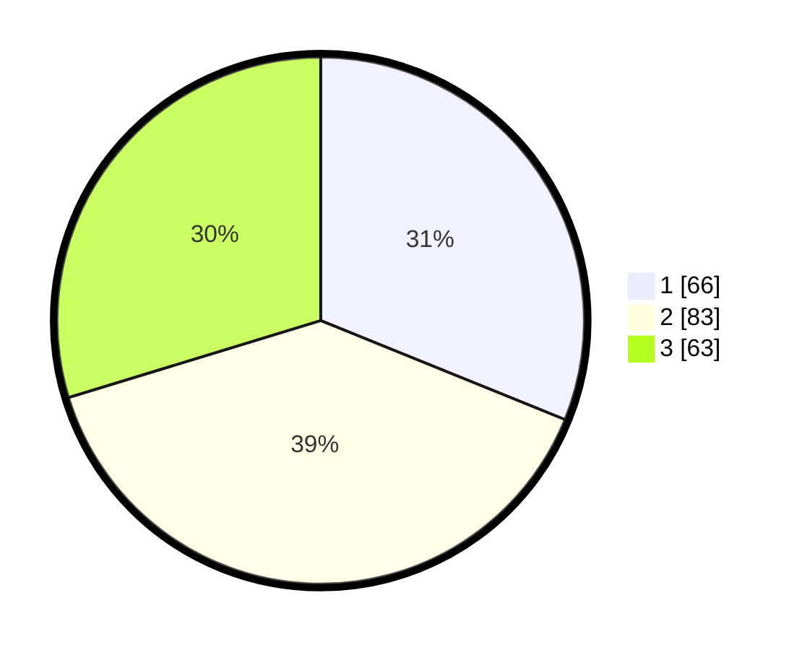

# Hasil

## Grafik

## Tabel

| No.    | Nama Paslon    | Suara | Suara (raw) | Persentase |
|:------ |:-------------- | -----:| -----------:| ----------:|
| 100025 | ANIES MUHAIMIN | 66    | [66][p-1]   | 31,13      |
| 100026 | PRABOWO GIBRAN | 83    | [83][p-2]   | 39,15      |
| 100027 | GANJAR MAHFUD  | 63    | [63][p-3]   | 29,72      |

[p-1]: https://github.com/gigit-pemilu/pemilu-2024/blob/main/pilpres/hitung-suara/sub/31-dki-jakarta/sub/73-jakarta-barat/sub/03-taman-sari/sub/1006-keagungan/sub/007-tps/sub/paslon-1.txt
[p-2]: https://github.com/gigit-pemilu/pemilu-2024/blob/main/pilpres/hitung-suara/sub/31-dki-jakarta/sub/73-jakarta-barat/sub/03-taman-sari/sub/1006-keagungan/sub/007-tps/sub/paslon-2.txt
[p-3]: https://github.com/gigit-pemilu/pemilu-2024/blob/main/pilpres/hitung-suara/sub/31-dki-jakarta/sub/73-jakarta-barat/sub/03-taman-sari/sub/1006-keagungan/sub/007-tps/sub/paslon-3.txt

## Foto C Plano

https://sirekap-obj-formc.kpu.go.id/1a04/pemilu/ppwp/31/73/03/10/06/3173031006007-20240214-211350--9287c27b-273b-4a7b-b519-2e06597b9b70.jpg

https://sirekap-obj-formc.kpu.go.id/1a04/pemilu/ppwp/31/73/03/10/06/3173031006007-20240214-212356--ebb11c8f-37cf-4434-8bed-7a8847cbd2a8.jpg

https://sirekap-obj-formc.kpu.go.id/1a04/pemilu/ppwp/31/73/03/10/06/3173031006007-20240214-212511--7c70c0a6-ecc0-49ab-b7ea-16a6343454b5.jpg

## Metadata

| Key        | Value               |
| ---------- | ------------------- |
| Time Stamp | 2024-02-16 16:25:10 |

